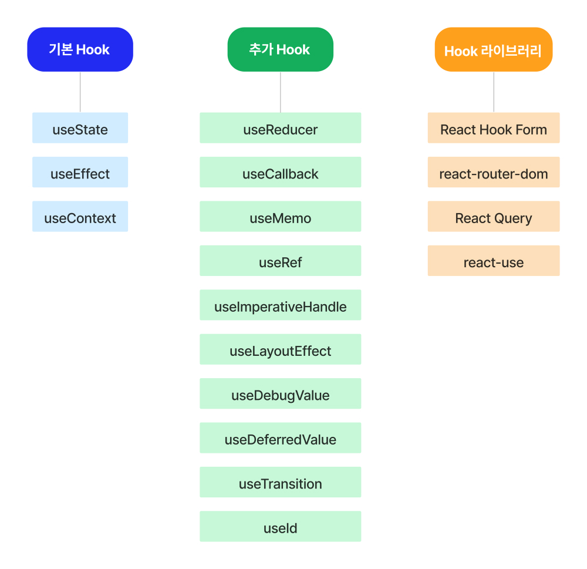

### 목차 <!-- omit in toc -->
- [1. 개념](#1-개념)
- [2. 종류](#2-종류)
- [3. API](#3-api)
- [4. 규칙](#4-규칙)

## 1. 개념
:::my-box-blue
Hook은 함수 컴포넌트에서 상태 관리와 생명주기 기능을 연동할 수 있게 해주는 함수이다.

Hook은 React 버전 16.8부터 새로 추가된 기능이다.

Hook을 사용하려면 모든 React 패키지(예: React DOM)가 16.8.0 이상이어야 한다.

패키지를 모두 업데이트하지 않으면 Hook이 작동하지 않는다.

 Hook이 등장하고 가장 달라진 점은, 클래스 컴포넌트에서만 사용할 수 있던 유용한 기능들을 함수 컴포넌트에서도 사용할 수 있게 되었다는 것이다.

함수 컴포넌트는 상태를 가질 수 없고, 메서드를 사용해 생명주기를 관리할 수 없다.

그래서 기존에는 코드의 복잡성과 낮은 재사용성 등의 여러 문제점에도 불구하고 클래스 컴포넌트를 사용해야만 했다.

하지만 Hook이 등장하면서 함수 컴포넌트를 이용해 더욱 간결하고 효율적인 코드로 상태 관리 및 생명주기 기능을 사용할 수 있게 되었다.

:::

## 2. 종류

## 3. API
[!ref target='blank' text='링크' icon='link'](https://react.dev/reference/react/hooks)

## 4. 규칙
:::comment_box {.h5}
1. 함수형 컴포넌트 내에서만 호출해야 한다.
2. 최상위에서만 Hook을 호출한다. 반복,중첩문 등 기타 다른 함수 내에서 호출 할수 없다.
:::