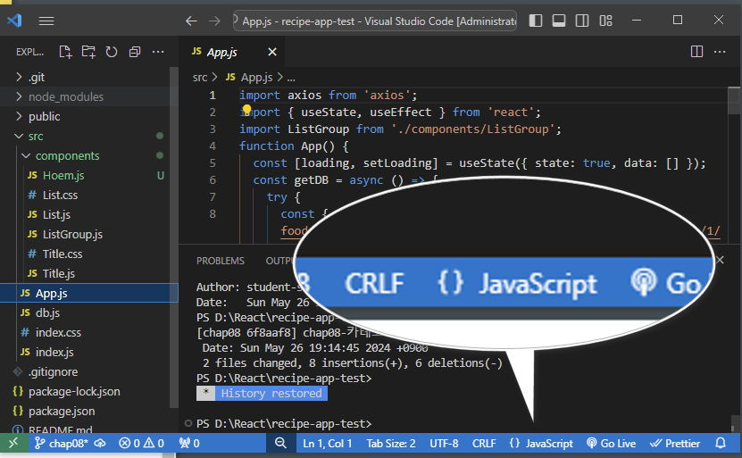
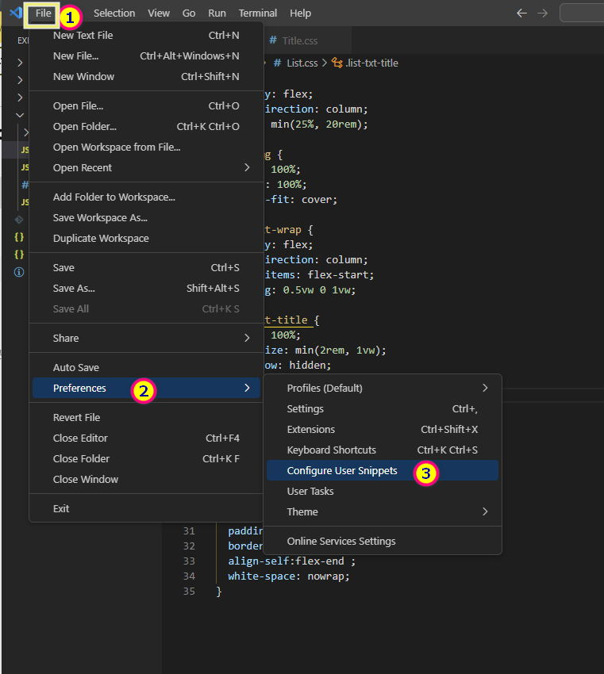
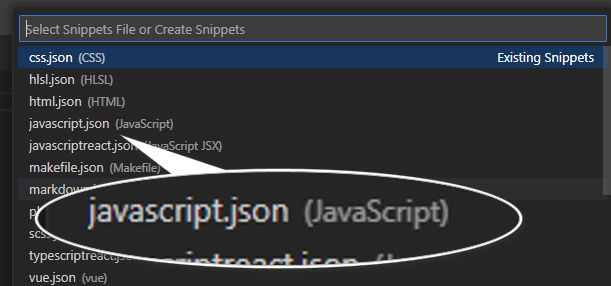
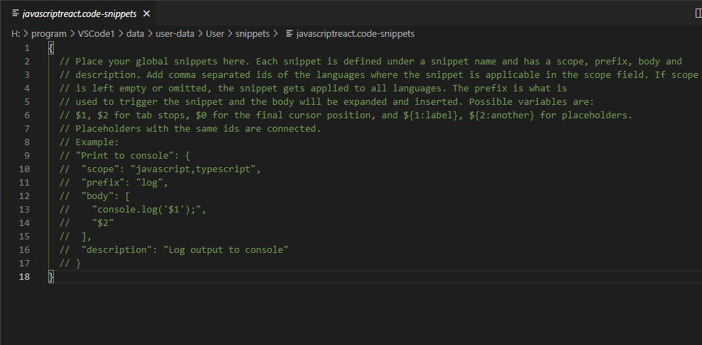
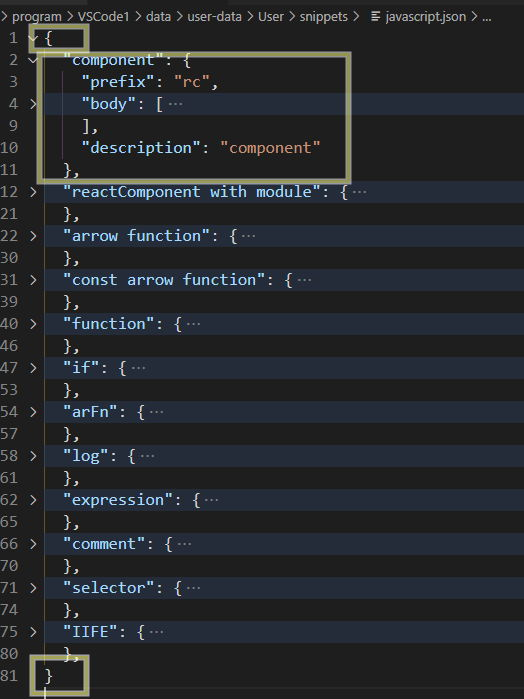

## 1. 스니펫 설정하기

1. 스니펫을 등록할 언어 확인
   {.shadow}
1. vscode 에서 아래 이미지 순서대로 메뉴를 클릭
   {.shadow}
1. 1번에서 확인한 언어를 선택
   {.shadow}
1. 아래 이미지와 같은 json 문서가 열린다.
   {.shadow}
1. 기존에 있던 코드를 모두 삭제하고 하단의 코드를 복사 하여 붙여넣기
	
   ```json #
   {
   	"react-component": {
   	"prefix": "rc",	//단축키
   	"body": [	//단축키 입력시 실행되는 명령어 , 배열
   		"import React,{$1} from 'react'",
   		"$2",
   		"const Component = (props)=>{return(<><div>Component</div></>)}",
   		"export default Component;"
   	],
   	"description": "react-component"	//단축키에 대한 설명
   },
   }
   ```
   
1. 이제 js문서에서 `rc` 키를 입력하면 리액트 컴포넌트가 생성된다.