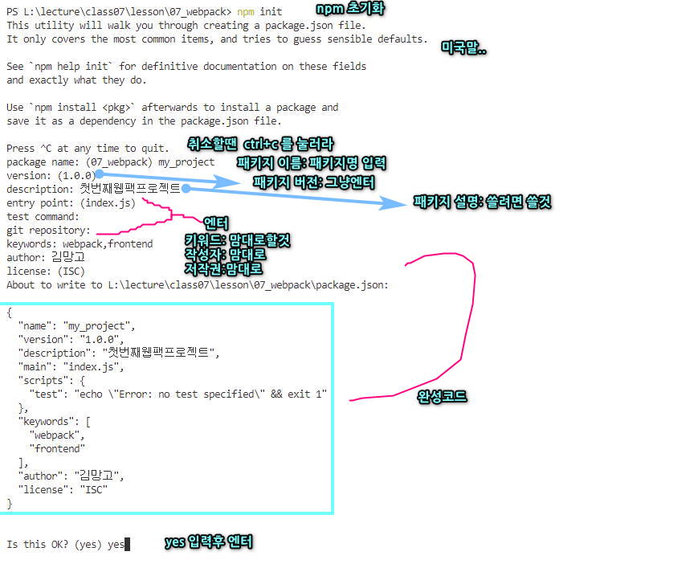
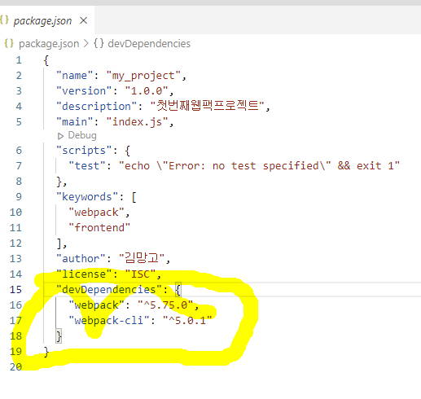

# 1. 개요

웹팩은 오픈 소스 자바스크립트 모듈 번들러입니다.
여러 개로 나누어져 있는 파일들을 하나의 자바스크립트 코드로 압축하고 최적화하는 라이브러리입니다.

[!ref target='blank' text=':icon-link:공식사이트'](https://webpack.kr/)

# 2. 구조

## 2.1. entry

- entry는 웹팩이 빌드할 파일의 시작 위치를 나타냅니다.
- entry 지점으로부터 import되어 있는 다른 모듈과 라이브러리의 연관성을 찾습니다.
- entry의 기본값은 ./src/index.js입니다.

## 2.2. output

- output은 웹팩에 의해 생성된 번들을 내보낼 위치와 파일 이름을 지정합니다.
- output의 기본값은 ./dist/main.js입니다.

## 2.3. loaders

- loaders를 통해 자바스크립트 파일이 아닌 파일들도 유효한 모듈로 변환시킵니다.
- loaders의 설정은 싱글 모듈에 대한 rules 프로퍼티를 정의해야 하며, rules 프로퍼티는 test와 use를 필수 프로퍼티로 가집니다.
- test 프로퍼티는 변환해야 하는 파일 또는 파일들을 식별하는 역할입니다.
- use 프로퍼티는 변환되어야 하는 파일에 대하여 어떤 로더를 사용해야 하는지 설정합니다.

## 2.4. plugins

- 로더가 파일 단위로 처리하는 반면 플러그인은 번들된 결과물을 처리합니다.
- 번들된 자바스크립트를 난독화하거나 특정 텍스트를 추출하는 용도로 사용할 수 있습니다.

## 2.5. mode

- mode는 웹팩을 설정함에 있어서 development, production, none 중 하나를 파라미터로 사용합니다.
- "production"은 최적화되어 빌드됩니다.
- "development"는 빠르게 빌드됩니다.
- “none”은 아무 기능 없이 웹팩으로 빌드됩니다.

---

# 3. 설치

1. 웹팩을 설치할 프로젝트 폴더로 이동한 후 vscode 터미널에 명령어를 입력합니다.
2. `npm init` 명령어를 입력하면 패키지의 옵션 설정 메시지가 나옵니다. 아래 그림을 참고하세요.

3. 2번 단계를 완료하면 폴더에 package.json 파일이 생성됩니다.
4. 웹팩은 개발 시 사용되는 에셋 파일(재료, 리소스)을 하나로 묶어서 정리해주는 라이브러리입니다.
5. 웹팩을 활용하여 개발하려면 두 가지를 설치해야 합니다.
   1. https://webpack.js.org/guides/getting-started/#basic-setup
   - 웹팩 개발환경: `npm install --save-dev webpack`
   - 웹팩 명령어 인터페이스: `npm install --save-dev webpack-cli`
6. 5번의 명령어를 실행한 후 package.json을 확인합니다. 표시된 부분이 추가된 것을 확인할 수 있습니다.

   

7. 프로젝트의 개발은 웹팩이 설치된 해당 폴더 내에서만 이루어져야 함을 기억하세요.
