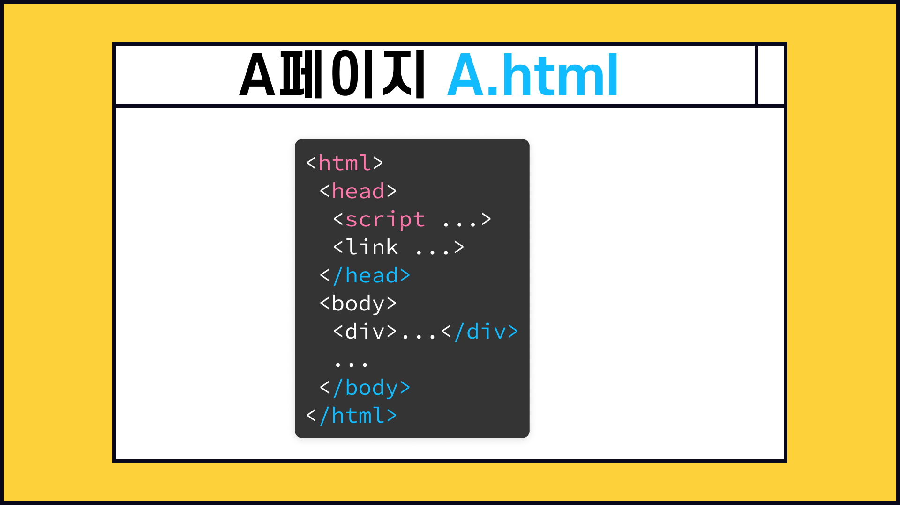
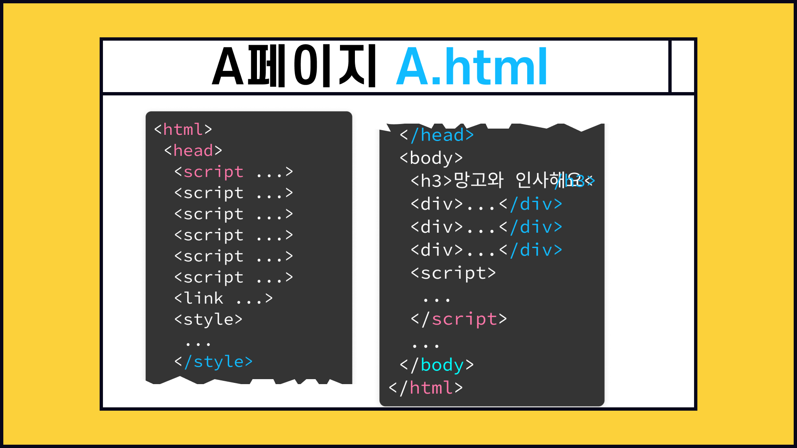
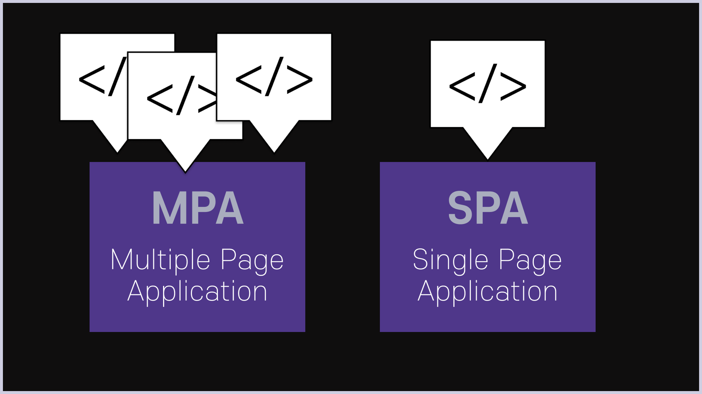
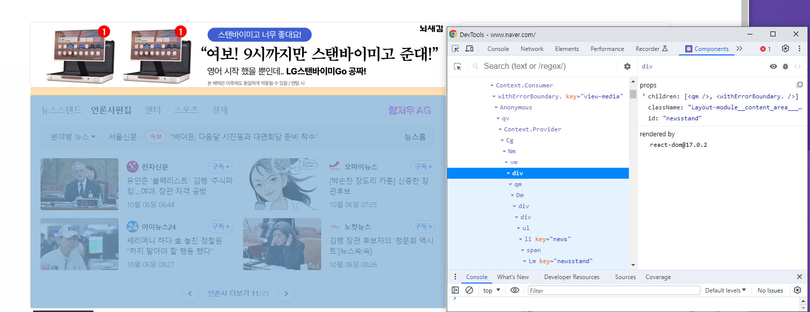

### 목차 <!-- omit in toc -->

- [1. 리액트설치](#1-리액트설치)
  - [1.1. React소개](#11-react소개)
    - [1.1.1. 리액트란?](#111-리액트란)
    - [1.1.2. 리액트](#112-리액트)
    - [1.1.3. 리액트 참조문서](#113-리액트-참조문서)
    - [1.1.4. 탄생배경](#114-탄생배경)
    - [1.1.5. SPA vs MPA](#115-spa-vs-mpa)
      - [1.1.5.1. SPA vs MPA 비교표](#1151-spa-vs-mpa-비교표)
      - [1.1.5.2. MPA 개발툴 종류](#1152-mpa-개발툴-종류)
  - [1.2. React 주요개념](#12-react-주요개념)
    - [1.2.1. 컴포넌트](#121-컴포넌트)
    - [1.2.2. 가상DOM](#122-가상dom)
    - [1.2.3. 빌드](#123-빌드)
  - [1.3. React 개발환경 설치](#13-react-개발환경-설치)
    - [1.3.1. Node 설치](#131-node-설치)
    - [1.3.2. NodeJs설치](#132-nodejs설치)

# 1. 리액트설치

## 1.1. React소개

### 1.1.1. 리액트란?

- JavaScript 라이브러리
- UI(사용자 인터페이스)를 만들기 위해 Facebook에서 개발.
- 페이스북과 개발자,기업,단체에 의해 유지보수됨.
- 리액트는 싱글 페이지 애플리케이션 이나 모바일 애플리케이션 개발에 사용되기도 함.

### 1.1.2. 리액트

- 리액트는 javascript extension JSX 라는 자바스크립트 확장문법을 사용한다.
- 웹브라우저에서는 바로 JSX를 해석할수 없으며 바벨이라는 트랜스컴파일러를 이용해서 자바스크립트로 변환후 웹 브라우저에 적용한다.
  - https://babeljs.io/repl 에서 변환되는 과정을 볼수있다

### 1.1.3. 리액트 참조문서

- [!ref target='blank' text=':icon-link:공식문서'](https://react.dev/)

### 1.1.4. 탄생배경

> 웹페이지는 HTML,CSS,JS 파일로 구성되며 일반적으로 아래와 같이 만들어 진다.



> 점점 웹이 복잡해 지면서 파일의 갯수와 코드의 수가 길어지며 **유지보수가 어려워지기 시작했다.** 오류발생시 수천 줄의 코드를 확인해야 할 경우도 있고 코드끼리 의존성<a href="./footnote.md/#1">[1]</a>이 깊어지고 복잡해졌다. 또한 수많은 javascript 라이브러리를 불러와서 사용하다 보니 라이브러리 객체들끼리 이름이 같아 충돌하는 경우도 있고 관리가 어려워 졌다.



> `React` 는 여러 html 문서를 단일 js파일을 사용해 개발할수 있어 이런 문제가 개선되었다.

### 1.1.5. SPA vs MPA

> 리액트를 접하다 보면 종종 SPA와 MPA 라는 단어를 만나게 된다.
>
> 외국어 이다 보니 굉장히 어렵고 낮설게 느껴지는데 두개의 차이점을 짚어보자.



#### 1.1.5.1. SPA vs MPA 비교표

| 구분             | SPA (싱글 페이지 애플리케이션)                                                   | MPA (멀티 페이지 애플리케이션)                                                 |
| ---------------- | -------------------------------------------------------------------------------- | ------------------------------------------------------------------------------ |
| 설명             | 단일 HTML 페이지에서 동적으로 콘텐츠를 업데이트하는 웹 애플리케이션.             | 여러 개의 HTML 페이지로 구성된 웹 애플리케이션.                                |
| 로딩 시간        | 초기 로딩 시간은 모든 리소스를 한 번에 로드하기 때문에 오래 걸릴 수 있음.        | 각각의 페이지가 독립적으로 로드되기 때문에 초기 로딩 시간이 빠름.              |
| 사용자 경험      | 전체 페이지 리로드 없이 빠른 응답 속도와 부드러운 사용자 인터랙션 제공.          | 페이지 전환 시 약간의 지연과 중단이 발생할 수 있음.                            |
| SEO              | 검색 엔진 최적화(SEO)를 위해 추가 작업 필요할 수 있음.                           | 개별 페이지를 쉽게 크롤링하고 인덱싱할 수 있어 SEO에 유리함.                   |
| 네트워크 트래픽  | 초기 로딩 이후 서버 요청을 줄여 네트워크 트래픽을 절약함.                        | 네비게이션 시 전체 페이지 리로드로 인해 서버 요청량 및 네트워크 트래픽 증가함. |
| 개발 및 유지보수 | 재사용 가능한 컴포넌트와 클라이언트 사이드 라우팅으로 개발 및 유지보수가 간단함. | 서버 쪽에서 각각의 페이지를 처리하기 때문에 복잡성과 비용 발생 가능성 있음.    |
| 성능             | 가상 DOM을 활용하여 초기 로딩 이후 성능 향상됨(메모리 사용량은 높아질 수 있음).  | 전체 페이지 리로드로 인해 성능 저하될 수 있으나 메모리 사용량은 낮아짐.        |

> SPA와 MPA는 웹 애플리케이션 프로젝트의 목적, 요구사항, 개발 리소스 등을 고려하여 선택해야 한다.

#### 1.1.5.2. MPA 개발툴 종류

1. React 리액트
2. Vue 뷰
3. Angual 앵귤러
4. ...

## 1.2. React 주요개념

1. [컴포넌트]
2. [가상DOM]
3. [빌드]

### 1.2.1. 컴포넌트

> 여러번 사용되는 UI를 태그로 만들어서 사용하는 기술
>
> 자바스크립트와 유사하게 생긴 **jsx** 라는 문법을 사용

**네이버 또한 리액트로 개발 되었으며 컴포넌트를 확인할수 있다** 아래의 블록은 네이버의 컴포넌트 단위이다. {.shadow} {.shadow}

### 1.2.2. 가상DOM

> javascript로 구현된 화면을 그리기 위해 사용하는 DOM 대신 리액트에서는 VirtualDOM 을 사용한다.

---

**우리는 Javascript 를 사용한 개발시 DOM 을 활용하였다. DOM과 VirtualDOM 은 뭐가 다를까?**

- DOM(문서 객체 모델): 웹 페이지의 객체를 표현하는 방식으로, HTML 및 XML 문서를 계층적 트리 구조로 만들어 JavaScript나 다른 프로그래밍 언어가 DOM 구조에 접근하여 문서 구조, 스타일, 내용 등을 변경할 수 있게 하는 것이다.

- 문제점: 대규모 웹 애플리케이션에서는 수많은 데이터와 요소가 동적으로 변화하며 이 때 매번 DOM 조작이 일어나면 성능상 이슈가 발생한다. 이는 브라우저가 CSS 연산, 레이아웃 구성(re-flow), 웹 페이지 다시 그리기(repaint) 등의 작업을 수행해야 하기 때문이다.

- Virtual DOM: 이러한 문제를 해결하기 위해 리액트는 가상 DOM 개념을 도입하였다. 가상 DOM은 실제 DOM의 가벼운 사본으로 메모리 상에 존재하며, 데이터 업데이트 시 실제 DOM에 직접 반영하는 대신 가상 DOM에서 처리한다.
- 동작 방식: 데이터 업데이트 시 전체 UI를 Virtual DOM에 리렌더링한다. 이전 Virtual DOM과 현재 Virtual DOM을 비교(diffing)한다. 바뀐 부분만 실제(DOM에 적용(Reconciliation)한다. 따라서 리액트는 지속적으로 데이터가 변화하는 대규모 애플리케이션 구축에 최적화되어 있다고 볼 수 있다.

### 1.2.3. 빌드

> 리액트는 자바스크립트로 웹을 개발하는 기술이다. 웹브라우저는 html만 이해할수 있으므로 결국은 리액트로 개발한 페이지는 html 형식으로 빌드하는 과정을 거쳐야 한다.
>
> 

## 1.3. React 개발환경 설치

> 앞서 설명했듯 리액트 개발시 빌드라는 과정이 필요하다.
>
> 빌드는 웹팩이라는 번들러 (자바스크립트로 개발한 웹페이지를 html로 변환해주는 툴) 를 사용하게 된다. 아래는 웹팩의 공식 문서 링크이다. [!ref target='blank' text=':icon-link:웹팩공식문서'](https://webpack.kr/) > [환경설정](https://webpack.kr/concepts/#output) 을 확인해보자. 어디에 있는 파일을 어디로 저장해야 하는지에 대한 환경 설정을 어떻게 하라고 적혀있다. 웹팩은 쉽게 말하자면 자바스크립트 문서 내에 html 뿐 아니라 웹서비스에 필요한 모든 리소스 파일을 모두 넣어 개발한후 (그것이 가능합니다) 실제 웹서비스가 가능한 html 로 해석해주는 도구이다. 아래의 그림을 보면 쉽게 이해할수 있을것이다.


**웹팩으로 개발해보면 리액트의 동작 방식이 더욱 잘 이해되므로 공부해보길 추천한다.**

### 1.3.1. Node 설치

> NodeJs 는 구글에서 개발한 자바스크립트를 웹브라우저가 아닌 다른 환경에서도 사용할수 있도록 하는 실행환경이다. NodeJs 에는 NPM(NodejsPackageManager) 이라는 모듈이 포함되어 있는데 이 모듈에 웹팩이 포함되어 있다. **또한 리액트 프로젝트 개발시 기본 환경을 설정을 쉽게 도와주는 코드(boilerplate)가 있어 1.3 과정의 웹팩 환경설정에서 본 것처럼** > **복잡한 과정을 거치지 않아도 된다.**
>
> **NODEJS 를 설치하여 진행한다.**


### 1.3.2. NodeJs설치

[!ref target='blank' text=':icon-link:nodejs'](https://nodejs.org/ko/)

**LTS 버전(가장 안전한 버전)을 설치한다.**

1.  node.js를 설치하면 npm은 같이 설치됨
2.  설치확인은 비주얼 코드 실행후 터미널을 열고 아래의 명령어를 입력한다.

```bash
npm -v
node -v
```

- [ VSCode에서 터미널 창 열기 ]
  - 윈도우 : `ctrl + j`
  - 맥 : `cmd + j`
