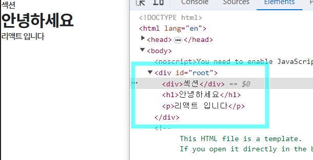
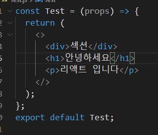

### 목차 <!-- omit in toc -->

- [1. 리액트컴포넌트](#1-리액트컴포넌트)
	- [1.1. 리액트 앱 실행명령어](#11-리액트-앱-실행명령어)
	- [1.2. 이미지 리소스 주소](#12-이미지-리소스-주소)
	- [1.3. 컴포넌트의 조건](#13-컴포넌트의-조건)
	- [1.4. 컴포넌트 만들기](#14-컴포넌트-만들기)
	- [1.5. 컴포넌트 규칙](#15-컴포넌트-규칙)
		- [1.5.1. Fragment](#151-fragment)
	- [1.6. 컴포넌트 내보내기](#16-컴포넌트-내보내기)
	- [1.7. Mission](#17-mission)
- [2. 망고회원앱 만들기](#2-망고회원앱-만들기)
	- [2.1. 스타일 파일 다운로드](#21-스타일-파일-다운로드)
	- [2.2. 작성](#22-작성)

## 1. 리액트컴포넌트

### 1.1. 리액트 앱 실행명령어

`npm start`

### 1.2. 이미지 리소스 주소

아래의 주소 중 하나를 복사해서 사용하세요

```txt
http://qwerew.cafe24.com/images/pet-1.jpg

http://qwerew.cafe24.com/images/pet-2.jpg

http://qwerew.cafe24.com/images/pet-3.jpg

http://qwerew.cafe24.com/images/pet-4.jpg

http://qwerew.cafe24.com/images/pet-5.jpg


http://qwerew.cafe24.com/images/pet-6.jpg

http://qwerew.cafe24.com/images/pet-7.jpg

http://qwerew.cafe24.com/images/pet-8.jpg
```

```text

react-test/
  |-node_modules/ # 의존성 파일을 담은 폴더
  |- src/
    |- App.js        # 최상위 컴포넌트
    |- index.js          # 앱 진입점 파일 (Entry Point)
  |- public/
    |- index.html        # HTML 템플릿 파일과 정적 리소스를 담은 폴더
  |- package.json         # 프로젝트 정보와 종속성 관리 파일

```

:::my-list

1. node_modules: 의존성 파일이 저장되는 폴더입니다.
   - package.json 에 각 파일의 정보가 기록되어 있습니다.
2. src : 실제 소스 코드가 위치하는 곳입니다
3. public : 정적인 리소스와 HTML 템플릿 파일(index.html)이 위치합니다. 이곳에 있는 파일은 빌드 시 자동으로 결과물에 포함됩니다
4. package.json : 프로젝트 정보와 종속성(dependency) 관리를 위한 설정 파일입니다.
   - package.lock.json : package.json 보다 자세한 정보가 기록된 설정파일로 시스템에서 관리하는 파일입니다. 임의로 수정하시면 오류가 발생할수 있습니다..
5. App.js : 최상위 컴포넌트
   - 리액트는 작은 컴포넌트 단위로 이루어 지는데 App 컴포넌트는 이런 작은 모듈들을 모두 모아주는 최상위 컴포넌트입니다.
6. index.js : ReactDOM.render() 함수를 사용하여 최상위 컴포넌트(App 컴포넌트)를 실제 DOM에 마운팅(mounting)합니다. 엔트리포인트는 앱의 시작점으로서, 주로 라우팅 설정, 상태 관리 등의 초기화 작업도 이곳에서 수행될 수 있습니다
   - 이 파일에서 ReactDOM.render() 함수는 public 폴더의 index.html 문서의 실제 DOM 과 리액트 DOM 과 연결하는 역할을 합니다.
   - 아래의 코드는 App 컴포넌트를 DOM에 넣어 화면에 그리겠다는 의미 입니다.
   - 

:::

### 1.3. 컴포넌트의 조건

!!!

컴포넌트가 화면에 보여지는 것을 렌더링(Rendering) 이라고 합니다

!!!

> 우선 src 폴더의 App.js 파일을 열어서 소스를 분석해 보겠습니다.

[!badge variant='primary' size='l' text='App.js' icon='file']

```js
// 동위에 위치한 logo.svg 파일을 임포트 합니다
import logo from './logo.svg';
// 동위에 위치한 App.css 파일을 임포트 합니다
import './App.css';

//App 이라는 이름의 함수형 컴포넌트를 선언합니다.
function App() {
	//컴포넌트는 UI요소를 리턴합니다.
	return (
		<div className="App">
			<header className="App-header">
				
				<p>
					Edit <code>src/App.js</code> and save to reload.
				</p>
				<a className="App-link" href="https://reactjs.org" target="_blank" rel="noopener noreferrer">
					Learn React
				</a>
			</header>
		</div>
	);
}

//App 컴포넌트를 외부에서 임포트 할수 있도록 익스포트 합니다.
export default App;
```

!!!danger

<mark>컴포넌트의 조건</mark>

1.  함수(클래스)로 구성되어 있다.
2.  반드시 UI 요소(태그랑 비슷하게 생김)를 return 해야 한다.
3.  이름이 대문자로 시작한다.
4.  외부에서 임포트 할수 있도록 반드시 `export` 한다

!!!

### 1.4. 컴포넌트 만들기

> 컴포넌트는 포함관계를 가질수 있으며 위계에 따라 부모와 자식으로 나뉘어집니다.
>
> 간단한 컴포넌트를 생성해봅시다.

1. src 폴더 하위에 Child.js 생성

   ```jsx # src/Child.js
   function Child() {
   	return <h3>나는 자식입니다.</h3>;
   }

   export default Child;
   ```

2. src / App.js 열기

   ```jsx # src/App.js
   import logo from './logo.svg';
   import './App.css';
   import Child from './Child';

   function App() {
   	return (
   		<div>
   			<h1>안녕하세요</h1>
   			<Child />
   			//컴포넌트 이므로 태그형식으로 작성
   			<Child />
   			<Child />
   			<Child />
   		</div>
   	);
   }

   export default App;
   ```

### 1.5. 컴포넌트 규칙

!!!danger

1. 컴포넌트는 다른 컴포넌트를 포함할수 있으나 컴포넌트 내부에 다른 컴포넌트를 정의하면 안됩니다.
2. 최상위 요소는 유일 해야 합니다.
3. 막음 태그가 없을 경우 `/` 를 반드시 작성합니다

!!!

#### 1.5.1. Fragment

!!!

최상위 요소를 래핑해야 하는 조건 때문에 구조가 복잡해 질수 있습니다.

이때 사용할수 있는것이 `Fragment` 입니다.

!!!

1. **ReactFragment**

||| :icon-code: ReactFragment 사용시

```jsx
import { Fragment } from 'react';
const App = (props) => {
	return (
		<Fragment>
			<div>섹션</div>
			<h1>안녕하세요</h1>
			<p>리액트 입니다</p>
		</Fragment>
	);
};
export default App;
```

컴파일 이후에도 불필요한 div 요소가 생성되지 않습니다.



Fragment 는 `<></>` 빈 태그로도 작성할수 있습니다. 

||| :icon-code: ReactFragment 미사용시

```jsx
const App = (props) => {
	return (
		<div>
			<div>섹션</div>
			<h1>안녕하세요</h1>
			<p>리액트 입니다</p>
		</div>
	);
};
export default App;
```

불필요한 div 요소가 생성 됩니다.


|||

### 1.6. 컴포넌트 내보내기

> 컴포넌트는 쉽게 태그를 함수로 만들어서 반복 사용하기 위해 개발된 기술 이라고 생각합시다.
>
> 반복 사용해야 하는 UI요소 이므로
>
> 당연히 쉽게 꺼내어 쓸수 있도록 컴포넌트를 작성해야 합니다.
>
> 이번에는 컴포넌트를 내보내는 문법을 알아보겠습니다.

!!!danger

<mark>컴포넌트 내보내는 2가지 방법</mark>

| 종류                        | 의미                                     | import 할때                                     |
| --------------------------- | ---------------------------------------- | ----------------------------------------------- |
| `export default 컴포넌트명` | 파일에서 컴포넌트를 한개만 내보내는 경우 | `import 컴포넌트명 from './컴포넌트명.js';`     |
| `export { 컴포넌트명 }`     | 파일에서 컴포넌트를 여러개 내보내는 경우 | `import { 컴포넌트명 } from './컴포넌트명.js';` |

[!ref target='blank' text=':icon-link:모던자바스크립트튜토리얼'](https://ko.javascript.info/import-export)

!!!

1. Member 컴포넌트를 외부로 내보내기

   ```js
   const Member = () => {
   	return (
   		<>
   			<span> 이름: </span>
   			<span> 김망고</span>
   		</>
   	);
   };
   export default Member;
   ```

2. Picture 컴포넌트를 작성후 외부로 내보내기

   ```js
   const Picture = () => {
   	return (
   		<>
   			<span> 사진: </span>
   			;
   		</>
   	);
   };

   export { Picture };
   ```

3. App 컴포넌트에서 임포트 하기

   ```js
   import './styles.css';
   import { Picture } from './Picture';
   import Member from './Member';

   export default function App() {
   	return (
   		<div className="App">
   			<Member />
   			<Picture />
   		</div>
   	);
   }
   ```

### 1.7. Mission

자신만의 컴포넌트를 만들어보세요

```txt

http://qwerew.cafe24.com/images/pet-2.jpg
http://qwerew.cafe24.com/images/pet-3.jpg
http://qwerew.cafe24.com/images/pet-4.jpg

```

<iframe src="https://codesandbox.io/embed/2-1-zy4n5c?fontsize=14&hidenavigation=1&theme=dark"
     style="width:100%; height:500px; border:0; border-radius: 4px; overflow:hidden;"
     title="2-1"
     allow="accelerometer; ambient-light-sensor; camera; encrypted-media; geolocation; gyroscope; hid; microphone; midi; payment; usb; vr; xr-spatial-tracking"
     sandbox="allow-forms allow-modals allow-popups allow-presentation allow-same-origin allow-scripts"
   ></iframe>

## 2. 망고회원앱 만들기

### 2.1. 스타일 파일 다운로드

[!ref target='blank' text=':icon-download:css파일다운로드'](./assets/files/2/styles.zip)


### 2.2. 작성

:::my-list

1. 스타일 파일을 다운로드 하여 src 폴더 하위에 압축을 풉니다.
2. index.css 파일을 열고 코드를 수정합니다.
   ```css # index.css
   @import url(./styles/common.css);
   ```
3. src 폴더에 MemberItem.js 파일을 생성후 아래의 코드를 작성합니다.

   ```js # MemberItem.js
   import './MemberItem.css';

   const MemberItem = () => {
   	return (
   		<ul className="list_body">
   			<li className="list_item">
   				<div className="list_img">
   					
   				</div>
   				<div className="list_desc">
   					<span className="title">이름</span>
   					<span className="text">머리묶은 김망고</span>
   				</div>
   				<div className="list_desc">
   					<span className="title">이메일</span>
   					<span className="text">abc@de.com</span>
   				</div>
   			</li>
   			<li className="list_item">
   				<div className="list_img">
   					
   				</div>
   				<div className="list_desc">
   					<span className="title">이름</span>
   					<span className="text">머리묶은 김망고</span>
   				</div>
   				<div className="list_desc">
   					<span className="title">이메일</span>
   					<span className="text">abc@de.com</span>
   				</div>
   			</li>
   		</ul>
   	);
   };
   export default MemberItem;
   ```

4. src 폴더에 MemberItem.css 파일을 생성후 아래의 코드를 작성합니다.

   ```css  # MemberItem.css
   .list_body {
   	padding: 2vw;
   	display: flex;
   	gap: 2rem;
   }
   .list_item {
   	padding: 2vw;
   	border-radius: 1vw;
   	box-shadow: 0 0 2rem rgba(0, 0, 0, 0.2);
   }
   .list_img {
   	max-width: 15vw;
   	margin-bottom: 1.5rem;
   }
   .list_desc {
   	margin-bottom: 1.5rem;
   	color: var(--tone-2);
   	line-height: 1.7;
   	display: flex;
   	gap: 2rem;
   }
   .title {
   	font-size: 1.4rem;
   	font-weight: 900;
   	color: var(--tint-2);
   }
   .text {
   	font-size: 1.6rem;
   	font-weight: 400;
   }
   img {
   	width: 100%;
   }
   ```

5. src 폴더의 App.js 파일을 열고 코드를 수정합니다.

	```js # App.js
	import MemberItem from './components/MemberItem';
	function App() {
		return (
			<div className="App">
				<MemberItem />
			</div>
		);
	}

	export default App;
	```

:::
