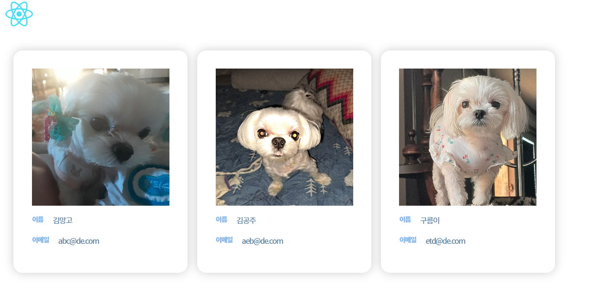
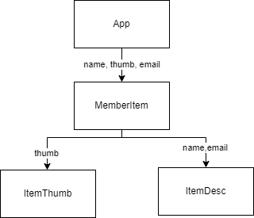
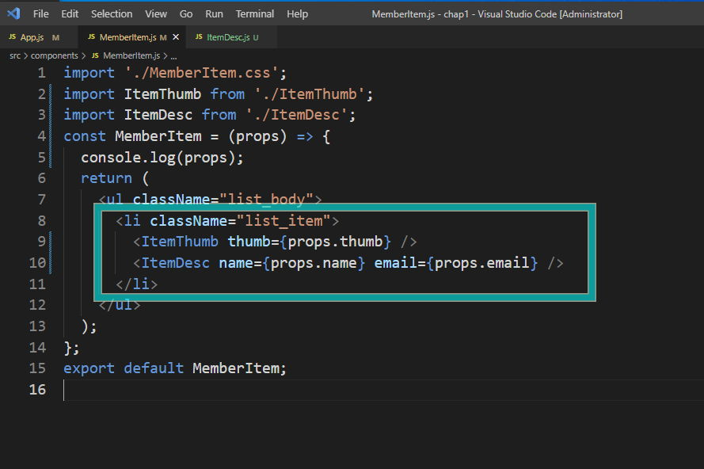
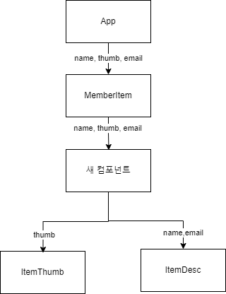

### 목차 <!-- omit in toc -->

## 1. 리액트 props

### 1.1. 데이터의 동적출력

> 리액트에서 컴포넌트를 생성하는 문법을 JSX(JavaScript XML: Javascript에 XML을 추가한 확장한 문법) 라고 합니다.
>
> jsx 에는 `{}` 기호 안에 자바스크립트 를 작성하면 자바스크립트 코드를 실행할수 있습니다.
>
> MemberItem 컴포넌트에서 사용하고 있는 데이터를 자바스크립트의 표현식으로 변경하여 작성해보겠습니다.

#### 1.1.1. 작성

:::my-list

1. components/MemberItem.js 를 수정합니다.

```js # MemberItem.js
import './MemberItem.css';
const MemberItem = () => {
	const member = {
		img: ['http://qwerew.cafe24.com/images/pet-1.jpg', 'http://qwerew.cafe24.com/images/pet-2.jpg', 'http://qwerew.cafe24.com/images/pet-3.jpg'],
		name: ['김망고', '김공주', '구름이'],
		email: ['abc@de.com', 'aeb@de.com', 'etd@de.com'],
	};

	return (
		<ul className='list_body'>
			<li className='list_item'>
				<div className='list_img'>
					
				</div>
				<div className='list_desc'>
					<span className='title'>이름</span>
					<span className='text'>{member.name[0]}</span>
				</div>
				<div className='list_desc'>
					<span className='title'>이메일</span>
					<span className='text'>{member.email[0]}</span>
				</div>
			</li>
			<li className='list_item'>
				<div className='list_img'>
					
				</div>
				<div className='list_desc'>
					<span className='title'>이름</span>
					<span className='text'>{member.name[1]}</span>
				</div>
				<div className='list_desc'>
					<span className='title'>이메일</span>
					<span className='text'>{member.email[1]}</span>
				</div>
			</li>
			<li className='list_item'>
				<div className='list_img'>
					
				</div>
				<div className='list_desc'>
					<span className='title'>이름</span>
					<span className='text'>{member.name[2]}</span>
				</div>
				<div className='list_desc'>
					<span className='title'>이메일</span>
					<span className='text'>{member.email[2]}</span>
				</div>
			</li>
		</ul>
	);
};
export default MemberItem;
```

매번 긴 속성을 작성하지 않아도 되니 정말 편리하죠?

 :::

## 2. Props

> 만약 App.js에서 MemberItem 컴포넌트를 여러번 사용한다면 어떻게 해야할까요?

### 2.1. App.js

```js
import logo from './logo.svg';
import MemberItem from './components/MemberItem1';
function App() {
	return (
		<div className='App'>
			
			<MemberItem />
			<MemberItem />
		</div>
	);
}

export default App;
```

여러번 같은 리스트를 반복할수 있습니다 너무 편리하죠?


> 하지만 MemberItem 컴포넌트의 콘텐츠의 내용이 다를 경우 어떻게 해야 할까요?
>
> props 라는 기능을 사용하면 됩니다.
>
> props 란 부모 컴포넌트가 자식 컴포넌트에게 전달하는 데이터를 의미하는데요.
>
> props 를 사용하면 컴포넌트간의 데이터를 공급할수 있습니다.
>
> 지금부터 props를 사용하여 목록마다 다른 데이터를 출력해보도록 하겠습니다.

### 2.2. 2.2.

#### 2.2.1. App.js

:::my-list

1. props 를 진행하기 위해 앱의 구조를 변경하겠습니다.
2. App.js 에 MemberDB 변수를 생성하고 회원정보를 넣어 초기화 합니다

```js #src/App.js
import logo from './logo.svg';
import MemberItem from './components/MemberItem';
function App() {
	const MemberDB = [
		{ id: 'm1', name: '김경아', thumb: 'http://qwerew.cafe24.com/images/pet-1.jpg', email: 'abc@defg.com' },
		{ id: 'm2', name: '김망고', thumb: 'http://qwerew.cafe24.com/images/pet-2.jpg', email: 'efg@defg.com' },
		{ id: 'm3', name: '김민정', thumb: 'http://qwerew.cafe24.com/images/pet-3.jpg', email: 'hij@defg.com' },
		{ id: 'm4', name: '윤현선', thumb: 'http://qwerew.cafe24.com/images/pet-4.jpg', email: 'lmn@defg.com' },
		{ id: 'm4', name: '이소정', thumb: 'http://qwerew.cafe24.com/images/pet-5.jpg', email: 'opq@defg.com' },
	];
	return (
		<div className='App'>
			
			<MemberItem />
			<MemberItem />
			<MemberItem />
			<MemberItem />
		</div>
	);
}

export default App;
```

3. 하위 컴포넌트에 데이터를 전달합니다.
   1. MemberItem 컴포넌트를 한개만 남기고 삭제합니다.
   2. Props 를 작성합니다.

```js
<MemberItem name={MemberDB[0].name} thumb={MemberDB[0].thumb} email={MemberDB[0].email} />
```

:::

#### 2.2.2. MemberItem.js

:::my-list

1. 데이터의 구조가 변경 되었으므로 components 폴더의 MemberList 컴포넌트의 코드를 수정합니다.
   - 변수 member 삭제 합니다
   - `ul.list_body>li.list_item>((.list_img>img)+(.list_desc>span.title+span+text))` 의 구조만 남기고 모두 삭제 합니다
   -
2. 부모컴포넌트가 전달하는 데이터를 매개변수로 전달 받습니다.
   - 이때 작성한 `props` 는 리액트에서 제공하는 기능으로 상위 요소가 전달하는 모든 데이터를 공급받을수 있습니다.

```js # components/MemberList.js
import './MemberItem.css';
const MemberItem = (props) => {
	console.log(props);
	return (
		<ul className='list_body'>
			<li className='list_item'>
				<div className='list_img'>
					
				</div>
				<div className='list_desc'>
					<span className='title'>이름</span>
					<span className='text'>{props.name}</span>
				</div>
				<div className='list_desc'>
					<span className='title'>이메일</span>
					<span className='text'>{props.email}</span>
				</div>
			</li>
		</ul>
	);
};
export default MemberItem;
```

 :::

#### 2.2.3. App.js

> 다음 데이터를 전달합니다.

```js # src/App.js
import logo from './logo.svg';
import MemberItem from './components/MemberItem';
function App() {
	const MemberDB = [
		{ id: 'm1', name: '김경아', thumb: 'http://qwerew.cafe24.com/images/pet-1.jpg', email: 'abc@defg.com' },
		{ id: 'm2', name: '김망고', thumb: 'http://qwerew.cafe24.com/images/pet-2.jpg', email: 'efg@defg.com' },
		{ id: 'm3', name: '김민정', thumb: 'http://qwerew.cafe24.com/images/pet-3.jpg', email: 'hij@defg.com' },
		{ id: 'm4', name: '윤현선', thumb: 'http://qwerew.cafe24.com/images/pet-4.jpg', email: 'lmn@defg.com' },
		{ id: 'm4', name: '이소정', thumb: 'http://qwerew.cafe24.com/images/pet-5.jpg', email: 'opq@defg.com' },
	];
	return (
		<div className='App'>
			
			<MemberItem name={MemberDB[0].name} thumb={MemberDB[0].thumb} email={MemberDB[0].email} />
			<MemberItem name={MemberDB[1].name} thumb={MemberDB[1].thumb} email={MemberDB[1].email} />
			<MemberItem name={MemberDB[2].name} thumb={MemberDB[2].thumb} email={MemberDB[2].email} />
			<MemberItem name={MemberDB[3].name} thumb={MemberDB[3].thumb} email={MemberDB[3].email} />
			<MemberItem name={MemberDB[4].name} thumb={MemberDB[4].thumb} email={MemberDB[4].email} />
		</div>
	);
}

export default App;
```

## 3. 컴포넌트 분할하기

> MemberItem 컴포넌트를 아래의 이미지처럼 두개로 나누어 보겠습니다.
>
> 
>
> 리액트의 앱은 기존 html 문서처럼 하나의 페이지로 구성되는 것이 아니라 컴포넌트가 모여서 페이지를 구성하는 방식입니다.
>
> 그렇기 때문에 컴포넌트를 세분화 하여 개발하게 될 경우 각 컴포넌트의 독립성을 유지하게 되며 코드의 재사용성이 높아집니다.

### 3.1. ItemThumb.js 생성

:::my-box

1. `components/ItemThumb.js` 를 생성하고 함수형 컴포넌트로 만듭니다. 이때 매개변수에 props 를 작성합니다.
2. `components/ItemThumb.css` 를 생성하고 임포트 합니다.
3. `components/MemberItem.js` 에서 이미지를 표시하는 코드를 잘라 붙입니다.
4. `components/MemberItem.css` 에서 이미지를 표시하는 css를 잘라 붙입니다.
5.

```js # components/ItemThumb.js
import './ItemThumb.css';

const ItemThumb = (props) => {
	return (
		<div className='list_img'>
			
		</div>
	);
};
export default ItemThumb;
```

```css # components/ItemThumb.css
.list_img {
	max-width: 15vw;
	margin-bottom: 1.5rem;
}
img {
	width: 100%;
}
```

### 3.2. ItemDesc.js 생성

:::my-box

2. `components/ItemDesc.js` 를 생성하고 함수형 컴포넌트로 만듭니다. 이때 매개변수에 props 를 작성합니다.
3. `components/MemberItem.js` 에서 설명을 표시하는 코드를 잘라 붙입니다.
4. `components/MemberItem.css` 에서 설명을 표시하는 css를 잘라 붙입니다.

```js #components/ItemDesc.js
import './ItemDesc.css';

const ItemDesc = (props) => {
	return (
		<div className='list_desc'>
			<span className='title'>이름</span>
			<span className='text'>{props.name}</span>
		</div>
	);
};
export default ItemDesc;
```

```css #components/ItemDesc.css
.list_desc {
	margin-bottom: 1.5rem;
	color: var(--tone-2);
	line-height: 1.7;
	display: flex;
	gap: 2rem;
}
.title {
	font-size: 1.4rem;
	font-weight: 900;
	color: var(--tint-2);
}
.text {
	font-size: 1.6rem;
	font-weight: 400;
}
```

### 3.3. 데이터 전달

> App에서 전달받은 데이터는 MemberItem 컴포넌트에서 각각 자식 컴포넌트로 나누어 전달하게 됩니다.
>
> 

### 3.4. MemberItem.js

:::my-list

1. MemberItem 컴포넌트에 ItemThumb,ItemDesc 컴포넌트를 임포트 합니다.
2. 각 컴포넌트로 App 에서 공급받은 데이터를 다시 전달합니다.
   1. 콘솔로그를 보면 App 에서 전달하고 있는 데이터가 확인됩니다.

```js
import './MemberItem.css';
import ItemThumb from './ItemThumb';
import ItemDesc from './ItemDesc';
const MemberItem = (props) => {
	console.log(props);
	return (
		<ul className='list_body'>
			<li className='list_item'>
				<ItemThumb thumb={props.thumb} />
				<ItemDesc name={props.name} email={props.email} />
			</li>
		</ul>
	);
};
export default MemberItem;
```

3. 여기까지 작성시 이메일은 렌더되지 않습니다.

	  

:::

### 3.5. ItemDesc.js

:::my-box

1. itemDesc 컴포넌트에서 props를 확인해봅시다.
2. 전달되는 데이터를 확인후 email 을 추가합니다.
3. 최상위 요소는 한개만 반환해야 하므로 빈 태그를 추가합니다.

```js
import './ItemDesc.css';

const ItemDesc = (props) => {
	console.log('여기는 ItemDesc', props);
	return (
		<>
			<div className='list_desc'>
				<span className='title'>이름</span>
				<span className='text'>{props.name}</span>
			</div>
			<div className='list_desc'>
				<span className='title'>이름</span>
				<span className='text'>{props.email}</span>
			</div>
		</>
	);
};
export default ItemDesc;
```

:::

## 4. Misson
>
> item목록을 표시하는 컴포넌트를 생성하세요
>
>	> 아래의 표시된 부분을 컴포넌트로 분리하세요
> > 
> > App 컴포넌트의 데이터를 생성한 컴포넌트로 전달하세요
> > 