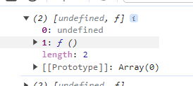

## 1. event

<iframe width="560" height="315" src="https://www.youtube.com/embed/CUM3iv9f88g?si=1D1i5QHZLX8ScfFs" title="YouTube video player" frameborder="0" allow="accelerometer; autoplay; clipboard-write; encrypted-media; gyroscope; picture-in-picture; web-share" allowfullscreen></iframe>

### 1.1. React Event Listener

| 이벤트리스너 | 설명                                                              |
| ------------ | ----------------------------------------------------------------- |
| onClick      | 마우스 클릭 이벤트를 처리합니다.                                  |
| onChange     | 인풋 필드나 셀렉트 박스와 같은 폼 요소 값이 변경될 때 발생합니다. |
| onSubmit     | 폼이 제출될 때 발생합니다.                                        |
| onFocus      | 요소가 포커스를 받았을 때 발생합니다.                             |
| onBlur       | 요소가 포커스를 잃었을 때 발생합니다.                             |
| onKeyDown    | 키보드의 키를 누르는 이벤트를 처리합니다.                         |
| onKeyUp      | 키보드의 키를 떼는 이벤트를 처리합니다.                           |
| onScroll     | 스크롤 이벤트를 처리합니다.                                       |
| onMouseOver  | 요소 위로 마우스 커서가 올라갈 때 발생합니다.                     |
| onMouseLeave | 요소에서 마우스 커서가 벗어날 때 발생합니다.                      |

### 1.2. syntax


## 2. 버튼추가

### 2.1. src\components\MemberItemList.js

```js
import ItemThumb from './ItemThumb';
import ItemDesc from './ItemDesc';

const MemberItemList = (props) => {
	return (
		<li className='list_item'>
			<ItemThumb thumb={props.thumb} />
			<ItemDesc name={props.name} email={props.email} />
			<button>클릭</button>
		</li>
	);
};
export default MemberItemList;
```

:::comment_box

버튼을 클릭 이벤트를 작성합시다.

JSX에서의 이벤트는 onClick 과 같이 on 접두사에 카멜케이스로 이벤트 내용을 작성합니다.

자바스크립트의 onclick 함수와는 다른 react 만의 이벤트 props 입니다.

[!ref target='blank' text=':icon-link:MDN'](https://developer.mozilla.org/en-US/docs/Learn/Tools_and_testing/Client-side_JavaScript_frameworks/React_interactivity_events_state#callback_props)

:::

#### [함수 실행방식으로 작성하기] <!-- omit in toc -->

```js
<button
	onClick={() => {
		console.log('hey');
	}}>
	이름변경
</button>
```

버튼을 클릭하면 hey 라는 콘솔 메시지를 확인할수 있습니다.

> 작성한 코드는 아래의 그림처럼 요약할수 있습니다.
>
> 

#### [함수 호출방식으로 작성하기] <!-- omit in toc -->

1. 함수를 작성합니다.

   - 컴포넌트는 UI요소만을 즉 태그만을 반환해야 합니다. 지금 작성할 함수는 UI요소가 아니므로 리턴함수는 실행후 다음 라인부터 실행을 하지 않으므로 리턴문 윗줄에 작성합니다. 이벤트 발생시 실행되는 함수이므로 이름을 clickHandler 라고 작성합니다.

   ```js
   const MemberItemList = (props) => {
   	function clickHandler() {
   		console.log('hey');
   	}
   ```

2. 이벤트 발생시 함수를 호출합니다.
   - 이벤트 발생시 clickHandler 함수를 호출하므로 소괄호를 넣지 않습니다.

```js
<button onClick={clickHandler}>이름변경</button>
```

3. 버튼 클릭시 콘솔메시지를 확인할수 있습니다. 

#### [왜 소괄호를 하면 안될까요?] <!-- omit in toc -->

많은 분들이 이벤트 함수 호출시 소괄호를 붙이는지에 대해 헷갈려 합니다.

소괄호를 할경우 실행화면을 살펴보겠습니다.

```js
<button onClick={clickHandler()}>이름변경</button>
```

 버튼을 클릭하지 않아도 콘솔 메시지가 출력됩니다. 오히려 클릭할 경우 함수의 호출이 되지 않습니다.

자바스크립트의 경우는 어떨까요? 실행문의 alert 함수로 변경하여 온라인 에디터에서 확인해 보겠습니다.

<iframe width="100%" height="300" src="//jsfiddle.net/qwerew0/7acmu9fL/5/embedded/result,js,html/dark/" allowfullscreen="allowfullscreen" allowpaymentrequest frameborder="0"></iframe>
보시는것 처럼 소괄호가 있어도  버튼 클릭시에만 실행됩니다.

그럼 리액트는 왜 다른걸까요?

리액트의 태그는 자바스크립트 문법으로 작성되기 때문에 jsx코드가 반환될때 코드의 라인들이 웹브라우저의 해석기에 의해 평가되기 때문입니다.

여기서 평가란 자바스크립트 해석기가 작성된 코드를 분석하여 화면에 표시하거나 오류메시지를 표시하는 과정을 말합니다. 웹브라우저에서 코드를 실행하는 단계와 같습니다.

쉽게 말해 버튼 태그는 자바스크립트에서 html로 해석되는 과정을 거치며 버튼태그에 우리가 작성한 이벤트 함수도 이때 함께 평가 되는 것이죠. 그래서 클릭하지 않아도 실행되는 것입니다.

소괄호를 붙이지 않을경우 clickHandler 함수를 호출하는것이 아닌 버튼에 클릭 이벤트 발생시 clickHandler 함수라는 포인터를 전달하고 리액트에서 기억했다가 클릭할 때마다 함수를 실행하게 됩니다.

그래서 평가될 때 실행되는 것이 아니라 클릭했을 때 실행되게 됩니다.


### 2.2. 이름 변경

#### 2.2.1. 작성

#### src\components\Expenses\ExpenseItem.js <!-- omit in toc -->

1. 이름을 저장할 변수 선언하고 props.name 을 할당합니다.
   - 콘솔메시지를 확인하여 데이터가 변수에 저장되었는지 확인합니다
   ```js
   let name = props.name;
   console.log(name);
   ```
2. clickHandler 함수 호출시 변수 name 의 값을 변경합니다.
   - 클릭시 콘솔창에 새로 변경된 값이 출력되는지 확인합니다
   ```js
   function clickHandler() {
   	console.log('hey');
   	name = '새이름';
   	console.log(name);
   }
   ```
3. jsx 문장내의 props.name 을 새 변수로 변경합니다.

   ```js
   <ItemDesc name={name} email={props.email} />
   ```

버튼 클릭시 콘솔창은 새 값이 반환 되는데 왜 화면에는 name의 값이 렌더 되지 않을까요?

이유는 리액트의 컴포넌트 자체가 함수이기 때문입니다.

현재 우리가 작성하고 있는 MemberItemList 컴포넌트 는 함수이며 함수는 호출해야 실행됩니다.

MemberItemList 컴포넌트는 MemberItem 컴포넌트에서 호출하고 있으므로 실행이 되었으며 MemberItemList 내부에서 사용중인 모든 변수나 함수들이 첫 렌더시의 값으로 실행된 것을 볼수 있습니다.


이벤트 함수 호출시 MemberItemList 컴포넌트에서 사용중인 데이터를 변경해서 렌더링 시키려면 MemberItemList 를 한번더 호출해야 합니다.

:::red

리액트는 응용프로그램이 처음 렌더링되었을 때 그 모든 과정을 실행하고 그 후에는 끝입니다.

:::

## 3. useState

:::comment_box

리액트의 useState 훅을 사용하여 컴포넌트 내의 값이 변경되면 컴포넌트를 리렌더 할수 있습니다.

:::

> useState 처럼 시작단어가 use 로 시작하는 것들을 리액트 HOOK 이라고 합니다.
>
> 프로그래밍에서의 후크(Hook), 훅킹(Hooking)이란 이미 작성되어 있는 코드의 특정 지점을 가로채서 동작 방식에 변화를 주는 방식이나 코드를 의미합니다.
>
> 리액트의 훅은 클래스 컴포넌트에서 사용하던 기능을 함수형 컴포넌트 에서도 사용할수 있도록 개발된 기능인데요.
>
> 제 강의에서는 클래스 컴포넌트를 다루지 않으므로 쉽게 설명 드리자면
>
> 컴포넌트에 필요한 복잡한 기능을 리액트에서 쉽게 작성할수 있도록 도와 주는 문법이며 이 문법은 함수형 컴포넌트에만 사용할수 있습니다. 리액트에서는 여러가지 훅을 제공하는데 추후 HOOK만 다룬 강의영상에서 다루기로 하겠습니다.
>
> 이번 강의에서는 useState 라는 훅이 있고 이 훅은 함수형 컴포넌트에만 사용할수 있으며 기능은 컴포넌트 내 값 변경시 컴포넌트를 리렌더 할수 있는 기능을 갖고 있다는 점에 집중 하겠습니다.

### 3.1. 기본문법

useState 훅은 아래와 같은 문법을 사용하여 작성합니다.

```js
const [<상태 값 저장 변수>, <상태 값 갱신 함수>] = useState(<상태 초기 값>);
```

### 3.2. 작성

:::my-list

1. react 모듈로 부터 useState 훅을 임포트 합니다.
2. useState 는 함수를 호출합니다.

   - 컴포넌트 함수 내부에 작성
   - return 에 작성불가 (UI요소만 리턴가능)

   ```js
   const MemberItemList = (props) => {
   console.log(useState());
   ```

   - ctrl 키를 누르고 useState함수의 이름을 클릭하면 리액트 모듈에 작성되어 있는 useState 함수가 확인됩니다.
     - 
   - 콘솔창을 확인하면 배열자료형에 두개의 값이 반환되는 것이 보입니다.
     - 

3. useState와 반환값을 변수로 저장합니다

   ```js
   const changeName = useState();
   const newName = changeName[0];
   const newNameFn = changeName[1];
   console.log(changeName, newName, newNameFn);
   ```

4. 위의 문장을 디스트럭처링으로 줄여서 작성할수 있습니다.
   1. 배열로 변수의 이름을 작성하고 useState 함수를 할당합니다.
   2. useState 함수에 인자로 초기값을 전달하면 변수 name 에 할당됩니다.
   3. 콘솔창을 확인하면 props 의 name 이 name 변수에 저장 되었습니다.
   4. setName 함수는 name변수의 값을 변경하는 함수입니다.
   ```js
   const [name, setName] = useState(props.name);
   console.log(name, setName);
   ```
5. clickHandler 의 실행문을 작성합니다.

   ```js
   function clickHandler() {
   	setName('윤나기');
   }
   ```

6. 이제 버튼을 클릭하면 이름이 변경됩니다.

:::

:::red

useState 는 단순히 state 의 값 을 업데이트 하는 것 뿐아니라 값이 변경될때 해당 데이터를 갖고 있는 컴포넌트를 리렌더 하여 화면의 상태에도 변화를 준다는 것을 기억해 주세요

:::

## Mission

> 잠깐 영상을 멈추고 버튼을 토글로 구현해 보세요.
>
> 한번 클릭시 변경된 값으로 다시한번 클릭시 예전의 값으로 표시해 보십시오.

==- Solution

```js
const initName = props.name;
const [name, setName] = useState(props.name);
const [count, setCount] = useState(0);

function clickHandler() {
	setCount(1);
	if (count == 1) {
		setName('변경');
		setCount(0);
	} else {
		setName(initName);
	}
}
```

===
