### 목차 <!-- omit in toc -->

- [1. 중첩 컴포넌트(composition)](#1-중첩-컴포넌트composition)
  - [1.1. 중첩컴포넌트를 왜 쓰는가?](#11-중첩컴포넌트를-왜-쓰는가)
  - [1.2. 컴포지션 연습](#12-컴포지션-연습)
    - [1.2.1. src\\Box.js](#121-srcboxjs)
    - [1.2.2. src\\CompAA.js](#122-srccompaajs)
  - [1.3. props.children](#13-propschildren)
    - [1.3.1. src\\Box.js](#131-srcboxjs)
- [2. Composition 실전예제](#2-composition-실전예제)
    - [2.0.1. 예제](#201-예제)
    - [2.0.2. STEP1-index.js수정](#202-step1-indexjs수정)
    - [2.0.3. STEP2-컴포넌트 구조 준비](#203-step2-컴포넌트-구조-준비)
    - [2.0.4. STEP3-List 작성](#204-step3-list-작성)
    - [2.0.5. STEP4-Items 작성](#205-step4-items-작성)
    - [2.0.6. STEP5-ItemEl 작성](#206-step5-itemel-작성)
    - [2.0.7. STEP6-ui 작성](#207-step6-ui-작성)
    - [2.0.8. STEP7-composition 작성](#208-step7-composition-작성)
    - [2.0.9. STEP6-layout 작성](#209-step6-layout-작성)
- [3. composition 심화](#3-composition-심화)
    - [완료코드](#완료코드)

## 1. 중첩 컴포넌트(composition)

<details markdown='block' class="scenario">
  <summary>
  영상자막
  </summary>

안녕하세요 코알라 코딩입니다. 이번 시간에는 리액트의 중첩컴포넌트에 대해 학습하겠습니다. 중첩 컴포넌트란 컴포넌트 내에 다른 컴포넌트를 감싸는 것 (영어로 래핑 한다라고 도 합니다)을 의미합니다.

지금 까지 우리는 import 문을 사용하여 컴포넌트 내에 다른 컴포넌트를 포함하는 방식을 학습했는데요. 리액트 앱은 작은 컴포넌트들로 구성되므로 앱의 규모가 커질수록 컴포넌트를 구성하는 파일의 갯수도 늘어납니다. 이는 잘못된것이 아니고 너무 당연한 것인데요.

지금까지 작성한 컴포넌트를 살펴보면 컴포넌트에서 화면에 표시하는 콘텐츠를 우리는 props 라는 속성을 만들고 전달했습니다.

컴포넌트를 이루는 코드를 살펴보면 비단 데이터를 표시하는 것 뿐 아니라 화면에 사용자인터페이스를 담당하는 코드도 확인 할수 있습니다.

예를 들면 레이아웃 정렬 이나 글자의 색상, 크기 등 외형을 담당하는 코드도 컴포넌트에 포함되어 있으며 그에 따른 html 태그도 작성되어 있습니다.

조금더 들여다 보면 태그 요소나 스타일 코드의 중복을 확인할수 있는데요.

이런 데이터가 아닌 화면의 외형을 담당하는 코드의 불필요한 중복을 컴포지션을 사용하여 개선할수 있습니다.

간단한 예시로 컴포지션을 학습후 앱에 적용 해보겠습니다.

해당 예제는 코드 샌드박스에 업로드 되어 있습니다. 코드 샌드박스는 다양한 프레임워크를 지원하는 온라인 에디터입니다.

아래의 코드는 index.js에서 App 컴포넌트 대신 Comp 컴포넌트를 임포트 합니다.

</details>

### 1.1. 중첩컴포넌트를 왜 쓰는가?

> 리액트 앱은 수많은 컴포넌트를 가지게 됩니다.
>
> 컴포넌트간의 주고받는 데이터 뿐만 아니라 박스나 컨테이너에서 사용하는 스타일코드의 중복까지도 최소화 하려면 props 만으로는 한계가 있는데요.
>
> 이때 사용할수 있는것이 composition(합성) 입니다.
>
> 앱에서 반복 사용되는 UI 디자인 코드를 별도의 컴포넌트로 생성하여 합성하는 학습을 해보겠습니다.

### 1.2. 컴포지션 연습

> 아래의 코드는 index.js에서 App 컴포넌트 대신 Comp 컴포넌트를 임포트 한 예제입니다.
>
> 또한 컴포넌트 내부에 style 을 객체로 작성하여 적용하였습니다.
>
> 에디터 우측하단의 Open Sandbox 버튼을 클릭하면 예제 코드를 내려 받으시거나 바로 온라인에서 편집하실수 있습니다.

<iframe src="https://codesandbox.io/embed/vmqn3k?view=Editor+%2B+Preview&module=%2Fsrc%2FCompA.js&expanddevtools=1"
     style="width:100%; height: 500px; border:0; border-radius: 4px; overflow:hidden;"
     title="composition"
     allow="accelerometer; ambient-light-sensor; camera; encrypted-media; geolocation; gyroscope; hid; microphone; midi; payment; usb; vr; xr-spatial-tracking"
     sandbox="allow-forms allow-modals allow-popups allow-presentation allow-same-origin allow-scripts"
   ></iframe>

> 컴포넌트는 아래의 그림과 같은 구조로 이루어져 있으며 동일한 스타일을 중복하여 사용하고 있습니다. 중복되는 스타일을 컴포지션으로 수정해 봅시다.
>
> 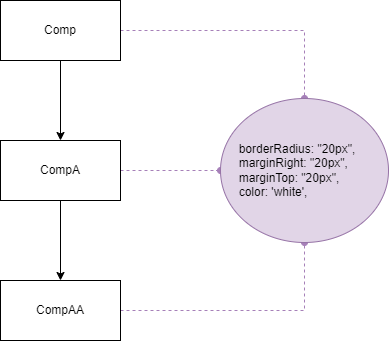

#### 1.2.1. src\Box.js

```js
const style = {
	marginRight: '20px',
	marginTop: '20px',
	borderRadius: '20px',
};
const Box = (props) => {
	return <div style={style}></div>;
};
export default Box;
```

#### 1.2.2. src\CompAA.js

```js
import Box from './Box';
const style = {
	color: 'white',
	background: '#a5b1b1',
	textAlign: 'center',
	display: 'inline-block',
	padding: '20px',
};
const CompAA = (props) => {
	return (
		<>
			<Box style={style}>CompAA</Box>
			<Box style={style}>CompAA</Box>
			<Box style={style}>CompAA</Box>
		</>
	);
};
export default CompAA;
```

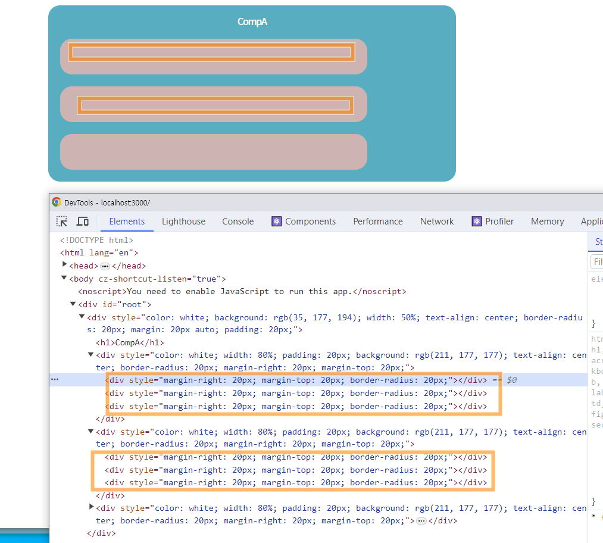

**개발자 모드에서 소스코드를 확인해보면 Box 컴포넌트의 스타일 속성이 적용된것은 보이나 기존 CompAA 의 스타일과 데이터가 보이지 않습니다.** {.red}

왜그럴까요? CompAA 의 UI는 Box 컴포넌트가 임포트 된것이며 Box 컴포넌트는 다른 함수이기 때문에 CompAA 의 값을 전달하려면 인자와 매개변수를 활용해야 하기 때문입니다. 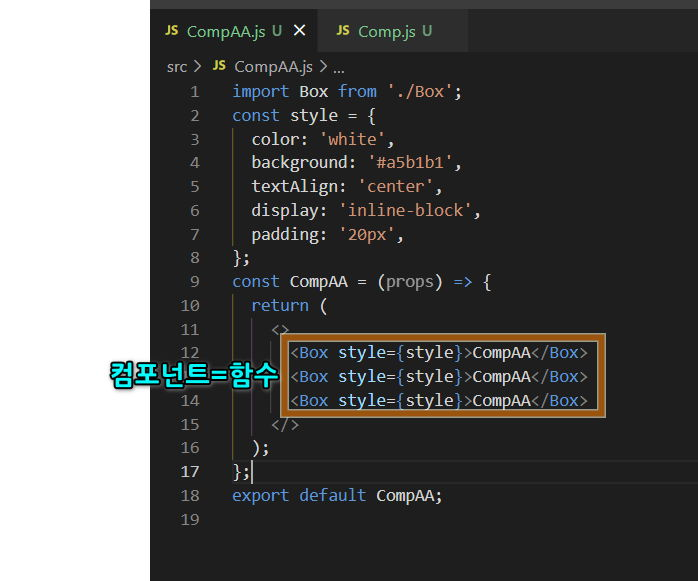

어떻게 해야 할까요?

### 1.3. props.children

우리의 컴포넌트는 함수입니다함수는 인수와 매개변수의 형태로 서로 값을 전달할수 있죠.

#### 1.3.1. src\Box.js

```js
const style = {
	marginRight: '20px',
	marginTop: '20px',
	borderRadius: '20px',
};
const Box = (props) => {
	console.log(props);
	return <div style={style}></div>;
};
export default Box;
```

리액트에서는 하위 컴포넌트에 매개변수 를 작성하면 기본적으로 상위 컴포넌트에서 전달하는 값 (인수) 을 받을수 있습 니다. 이때 매개변수의 이름은 abc, def 등 여러분이 마음대로 지정하셔도 되나 일반적으로 props 로 작성합니다. 코드를 작성후 콘솔창을 열어보면 props 매개변수에 저장된 값이 확인됩니다.

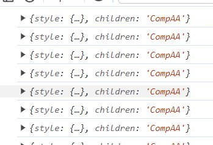

이제 Box 컴포넌트에 전달받은 값을 적용해 보겠습니다.

#### 콘텐츠 합성 <!-- omit in toc -->

props.children은 React에서 사용되는 특별한 속성으로이 속성을 통해 부모 컴포넌트에서 자식 컴포넌트로 전달된 모든 컨텐츠를 참조할 수 있습니다.

```js
const style = {
	marginRight: '20px',
	marginTop: '20px',
	borderRadius: '20px',
};
const Box = (props) => {
	console.log(props);
	return <div style={style}>{props.children}</div>;
};
export default Box;
```

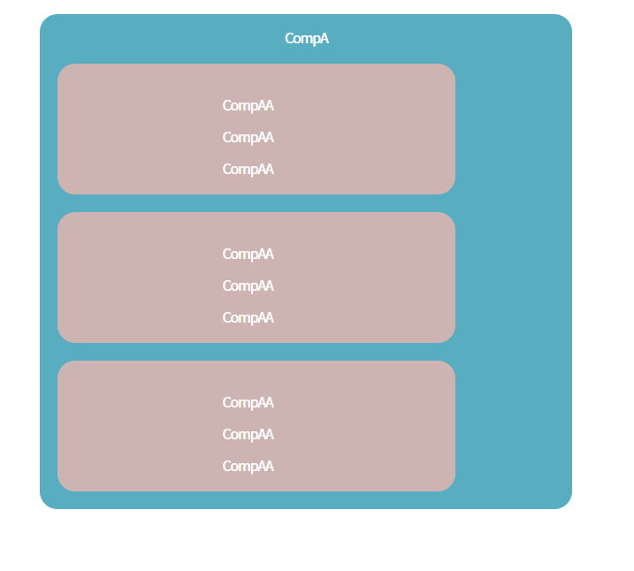

#### 스타일 합성 <!-- omit in toc -->

스타일은 객체형태로 전달받고 있으므로 전개연산자를 사용하여 새 변수에 Box컴포넌트의 속성과 부모컴포넌트의 속성을 연결합니다.

그다음 엘리먼트에는 새 변수의 이름을 넣어줍니다.

```js
const newStyle = { ...style, ...props.style };
return <div style={newStyle}>{props.children}</div>;
```

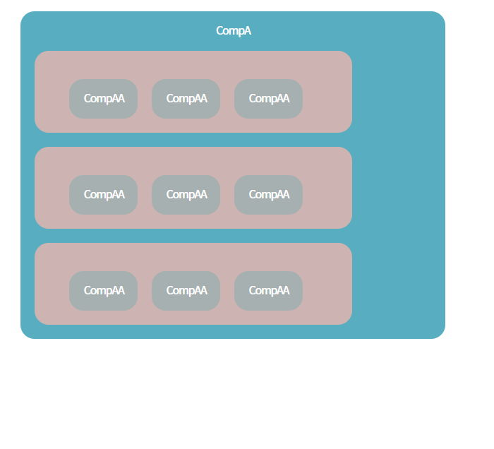

잠시 영상을 정지하시고 남머지 컴포넌트도 모두 Box 컴포넌트와 합성해보세요.

==- Solution

||| :icon-code: Code

```js # Comp.js
import Box from './Box';
import CompA from './CompA';
const style = {
	color: 'white',
	background: '#23b1c2',
	width: '50%',
	textAlign: 'center',
	margin: '20px auto',
	padding: '20px',
};
const Comp = (props) => {
	return (
		<Box style={style}>
			<CompA />
		</Box>
	);
};
export default Comp;
```

||| :icon-code: Code

```js #CompA.js
import Box from './Box';
import CompAA from './CompAA';

const style = {
	color: 'white',
	width: '80%',
	padding: '20px',
	background: '#d3b1b1',
	textAlign: 'center',
};
const CompA = (props) => {
	return (
		<>
			<h1>CompA</h1>
			<Box style={style}>
				<CompAA />
			</Box>
			<Box style={style}>
				<CompAA />
			</Box>
			<Box style={style}>
				<CompAA />
			</Box>
		</>
	);
};
export default CompA;
```

|||

===

## 2. Composition 실전예제

#### 2.0.1. 예제

이제 멤버앱에 적용해보겠습니다.

영상을 보고 바로 코드를 따라 치시기 보다는 일시정지 하시고여러분이 스스로 컴포지션을 해보시고 제 방식을 참고하셔야 실력이 향상됩니다.

아래의 그림에 표시된 부분을 컴포넌트로 분리하고 합성해보시기 바랍니다.

:::shadow

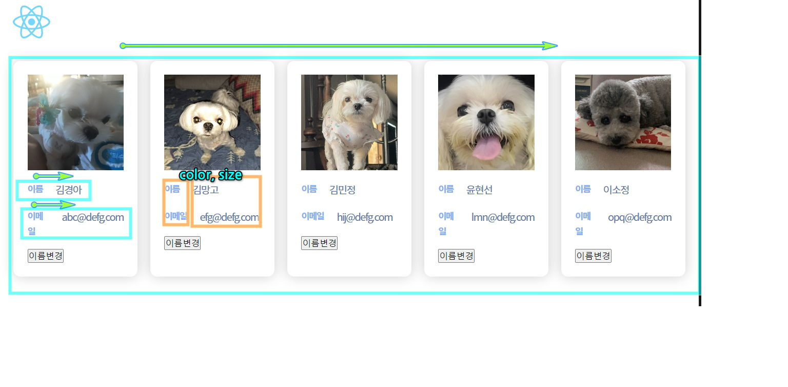

:::

#### 2.0.2. STEP1-index.js수정

1. index.js 파일을 열고 App 컴포넌트를 다시 임포트 합니다

##### src\index.js <!-- omit in toc -->

```js #5,11
import React from 'react';
import ReactDOM from 'react-dom/client';
import './index.css';
import Comp from './Comp';
import App from './App';
import reportWebVitals from './reportWebVitals';

const root = ReactDOM.createRoot(document.getElementById('root'));
root.render(
	<React.StrictMode>
		<App />
		{/* <Comp /> */}
	</React.StrictMode>
);

// If you want to start measuring performance in your app, pass a function
// to log results (for example: reportWebVitals(console.log))
// or send to an analytics endpoint. Learn more: https://bit.ly/CRA-vitals
reportWebVitals();
```

#### 2.0.3. STEP2-컴포넌트 구조 준비

리액트의 앱은 컴포넌트 파일이 정말 많아집니다.

많은 컴포넌트 파일을 어떻게 관리 하는지에 대한 방법론도 제시되고 있으며 관리하는 프레임워크가 존재하는 정도입니다.

가장 기본적인 방법은 컴포넌트의 역할별로 폴더를 나누어 보는것인데요.

우리의 앱은 아래의 구조로 컴포넌트를 관리하겠습니다.

:::shadow

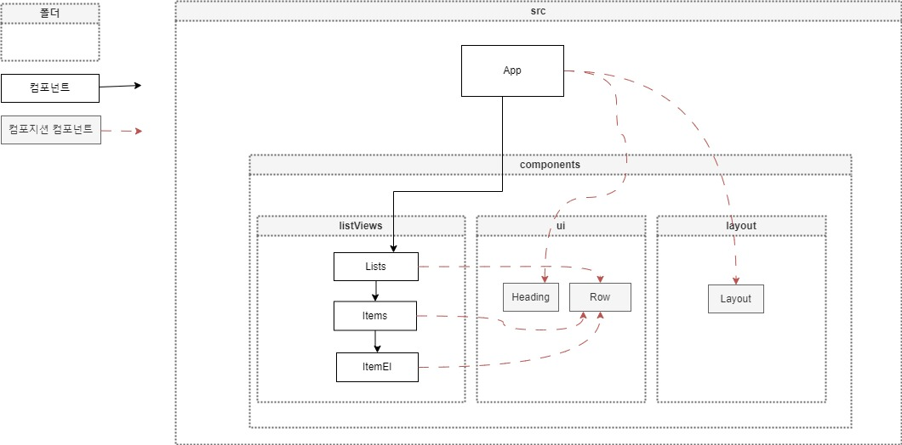

:::

:::my-list

1. src/component 폴더에 아래의 폴더를 생성 합니다
   - components/listViews
     - 리스트를 구성하는 컴포넌트 폴더
   - components/ui
     - UI 스타일을 구성하는 컴포넌트 폴더
   - components/layout
     - 전체 레이아웃을 구성하는 컴포넌트 폴더
2. 각 폴더에 컴포넌트 파일과 스타일 파일을 생성합니다.
3. App 컴포넌트에 임포트 한 MemberItem 컴포넌트를 수정합니다.

   - MemberItem 컴포넌트의 코드는 listViews 폴더의 Lists 로 옮깁니다.
   - 로고도 삭제합니다.

4. 완료코드
   - 아래의 OpenSandbox 를 클릭하면 시작코드를 받을수 있습니다.
   <iframe src="https://codesandbox.io/embed/cmqz2q?view=Editor+%2B+Preview&module=%2Fsrc%2FApp.js"
        style="width:100%; height: 500px; border:0; border-radius: 4px; overflow:hidden;"
        title="5-1-start"
        allow="accelerometer; ambient-light-sensor; camera; encrypted-media; geolocation; gyroscope; hid; microphone; midi; payment; usb; vr; xr-spatial-tracking"
        sandbox="allow-forms allow-modals allow-popups allow-presentation allow-same-origin allow-scripts"
      ></iframe>

:::

#### 2.0.4. STEP3-List 작성

1. MemberItem 컴포넌트의 코드를 잘라내어 Lists 컴포넌트에 붙여넣습니다.
2. List 컴포넌트의 최상위 요소를 div 로 변경합니다. 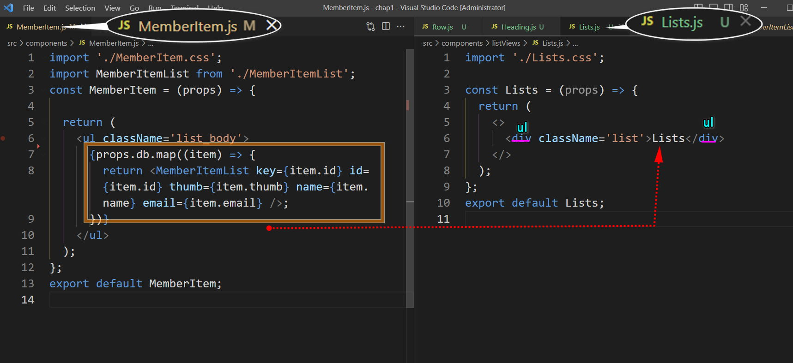
3. MemberItemList 컴포넌트 임포트를 Items로 변경합니다. 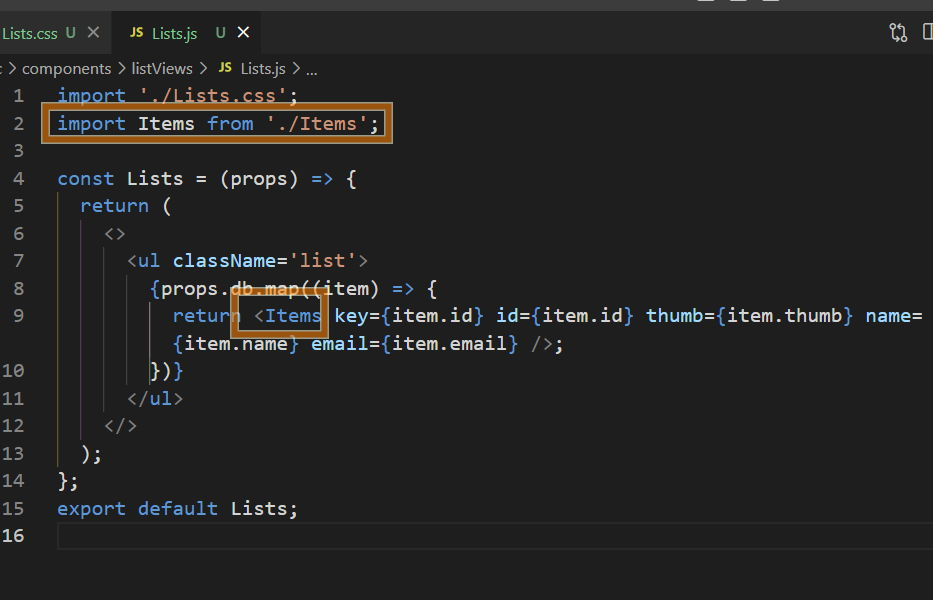

#### 2.0.5. STEP4-Items 작성

1. MemberItemList 컴포넌트의 코드를 잘라내어 Items 컴포넌트에 붙여넣습니다. 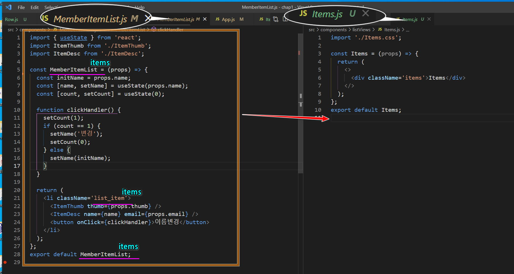
2. Item.js 에서 MemberItemList 단어를 모두 Items 로 치환합니다.
3. `import './Items.css';` 를 잊지 말고 작성합니다.
4. `import ItemThumb from './ItemThumb'; import ItemDesc from './ItemDesc';` 라인을 삭제후 `import ItemEl from './ItemEl';` 로 수정합니다.
5. Item.css 를 수정합니다

   ```css
   .items {
   	box-shadow: rgba(0, 0, 0, 0.15) 0px 0px 18px 0px;
   	padding: 3vw;
   	margin: 5rem auto;
   	border-radius: 2rem;
   }

   img {
   	width: 25rem;
   }
   ```

#### 2.0.6. STEP5-ItemEl 작성

1. 아래와 같이 작성합니다.

```js
import './ItemEl.css';

const ItemEl = (props) => {
	return (
		<div className='item_el'>
			<span className='title'></span>
			<span className='content'></span>
		</div>
	);
};
export default ItemEl;
```

2. Items 컴포넌트로 이동하여 ItemEl 컴포넌트로 표시할 props 를 전달합니다.

```js
return (
	<li className='items'>
		
		<ItemEl title='이름' content={props.name} />
		<ItemEl title='이메일' content={props.email} />
	</li>
);
```

3. ItemEl 컴포넌트에서 props를 적용합니다.

   ```js
    <span className='title'>{props.title}</span>
    <span className='content'>{props.content}</span>
   ```

   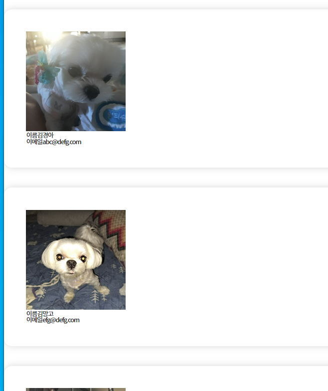

4. ItemEl.css 를 작성합니다

   ```css
   .title {
   	color: var(--tone-1);
   	font-weight: 900;
   	margin-right: 2rem;
   	width: 6rem;
   	text-align: justify;
   	font-size: 1.4rem;
   	letter-spacing: 0.5px;
   }
   .content {
   	font-size: 1.8rem;
   	letter-spacing: -0.8px;
   	font-size: 1.4rem;
   	color: var(--shade-2);
   	border-radius: 25rem;
   	padding: 0.4rem 1rem;
   	box-shadow: 2px 2px 1px #3a54771a, 0px 0px 2px #3a547769;
   	box-shadow: 0px 0px 3px var(--blue);
   	margin-right: 0.6rem;
   	background-color: #2ea2cc33;
   }
   ```

#### 2.0.7. STEP6-ui 작성

##### Row <!-- omit in toc -->

1. Row 컴포넌트는 박스 정렬 관련 속성을 갖고 있습니다. 부모 컴포넌트의 콘텐츠를 표시할수 있도록 props를 넣습니다.

```js
import './Row.css';

const Row = (props) => {
	return <div className='row'>{props.children}</div>;
};
export default Row;
```

2. Row.css 를 작성합니다.

```js
.row {
	display: flex;
	box-sizing: border-box;
	margin-top: 0.5rem;
}
@media screen and (max-width: 900px) {
	.row {
		flex-direction: column;
		gap:2vw;
	}
}

```

##### Heading <!-- omit in toc -->

1. Heading 컴포넌트는 제목의 스타일을 갖고 있습니다. 부모 컴포넌트의 콘텐츠를 표시할수 있도록 props를 넣습니다.

```js
import './Heading.css';

const Heading = (props) => {
	return (
		<>
			<h2 className='heading'>{props.content}</h2>
		</>
	);
};
export default Heading;
```

2. Heading.css 를 작성합니다.

```js
.heading {
	padding: 4rem 10% 2rem;
	text-align: center;
  font-size:4rem;
  text-transform:uppercase;
}

```

#### 2.0.8. STEP7-composition 작성

##### List.js<!-- omit in toc -->

1. Row,Heading 컴포넌트를 임포트 합니다.
2. 컴포넌트에 적용합니다. 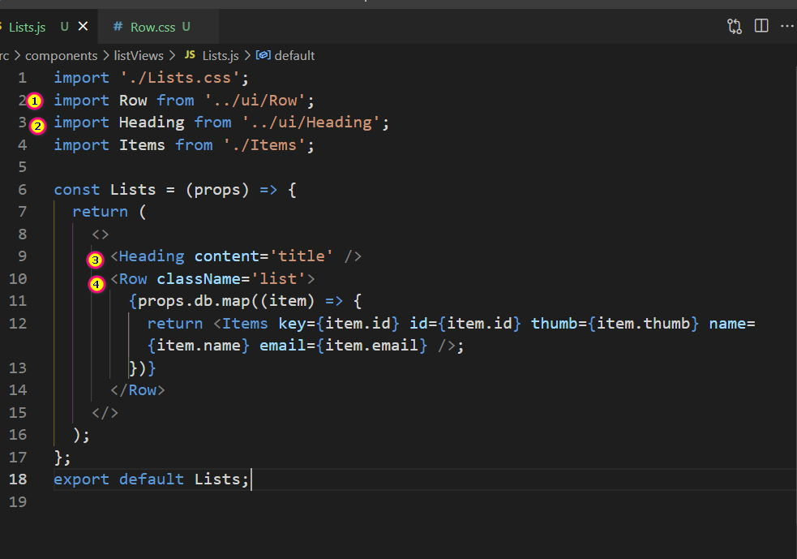 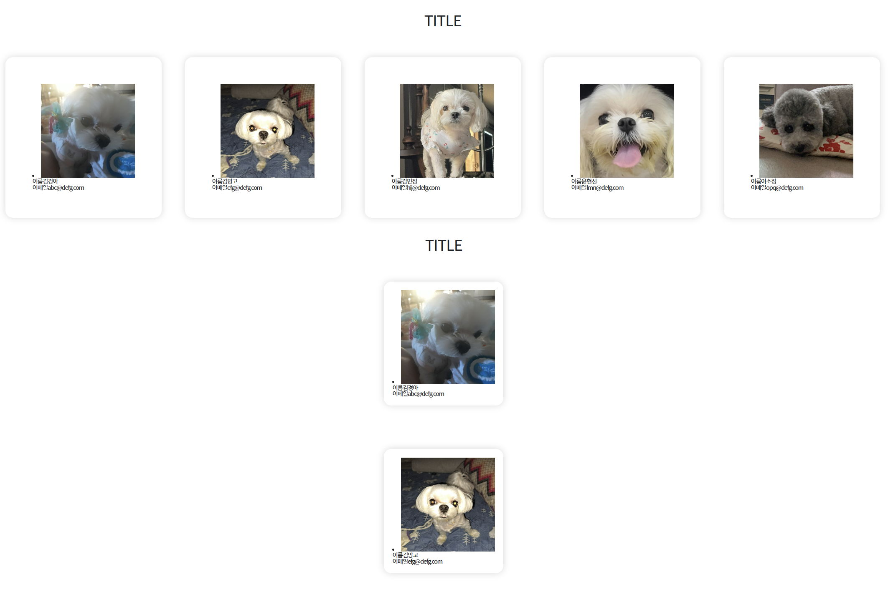

##### Items.js<!-- omit in toc -->

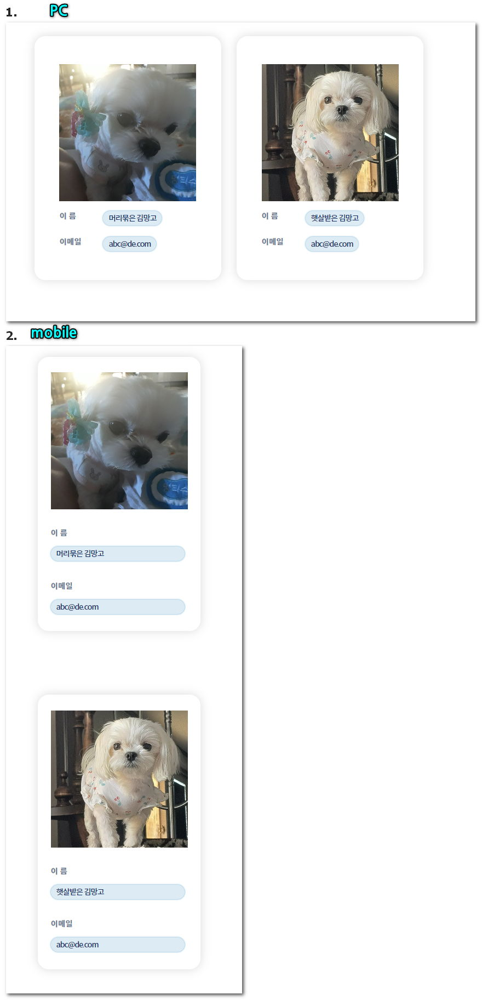

1. Row,Heading 컴포넌트를 임포트 합니다.
2. 최상위 요소를 div로 수정합니다
3. ItemEl 컴포넌트를 Row 컴포넌트로 래핑합니다.
   ```js
   return (
   	<div className='items'>
   		
   		<Row>
   			<ItemEl title='이름' content={props.name} />
   			<ItemEl title='이메일' content={props.email} />
   		</Row>
   	</div>
   );
   ```

##### ItemEl.js<!-- omit in toc -->

#### 2.0.9. STEP6-layout 작성

1.  layout.css

```css
.main {
	margin: 3rem auto;
	width: 90%;
	max-width: calc(100vw - 10rem);
	padding: 2vw 20vw;
}
@media screen and (max-width: 1300px) {
	.main {
		padding: 2vw 10vw;
	}
}
@media screen and (max-width: 700px) {
	.main {
		padding: 2vw 4vw;
	}
}
```

2. main.js

```js
import './Layout.css';

const Layout = (props) => {
	return <div className='main'>{props.children}</div>;
};
export default Layout;
```

3. App.js

```js
import Layout from './components/layout/Layout';
return (
	<div className='App'>
		<Layout>
			<Lists db={MemberDB} />
		</Layout>
	</div>
);
```

## 3. composition 심화

만약 특정 컴포넌트에서 Row 컴포넌트의 속성을 변형 하려면 어떻게 해야할까요?

예를 들면 Lists 컴포넌트에 적용된 Row 만 `flex-wrap:warp` 로 수정하여 레이아웃의 너비보다 넓을 경우 레이아웃을 개행하고 싶습니다.

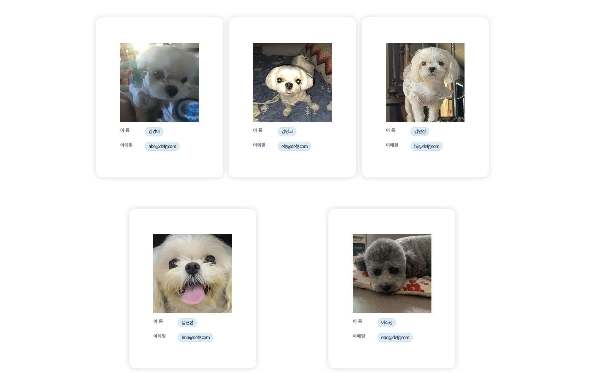

적용된 Row 컴포넌트에 class 와 속성을 추가허고 부모컴포넌트에서 클래스를 조정하여 모양을 바꿀수는 없을까요?

List 컴포넌트에는 Row 컴포넌트에 className 속성을 작성한 코드가 있습니다. css 로 이동하여 list 클래스의 속성을 정의 합니다.

```css #src\components\listViews\Lists.css
.list {
	flex-wrap: wrap;
}
```

실행 화면이 변경되지 않았습니다.

이것이 실제 적용이 되었는지 개발자모드에서 살펴보면 row 에는 list 클래스가 적용되지 않았습니다.

Row 컴포넌트에 클래스를 추가하는 코드가 없기 때문인데요 Row 컴포넌트로 이동하여 수정해보겠습니다.

:::my-list

1. Row 컴포넌트에서 콘솔로그로 props 의 값을 확인합니다. 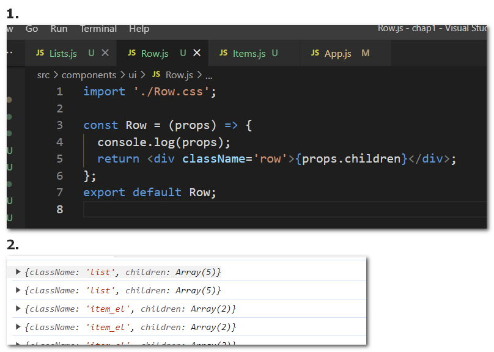

2. 변수를 만들고 props.className 을 할당합니다

```js
import './Row.css';

const Row = (props) => {
	console.log(props);
	const addCls = props.className;
	return <div className='row'>{props.children}</div>;
};
export default Row;
```

3. div className 을 자바스크립트 표현식으로 변경합니다.

```js
return <div className={`row ${addCls}`}>{props.children}</div>;
```

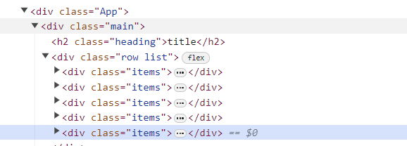

4. 이제 Row를 임포트 하는 컴포넌트에서 클래스를 추가하면 개별적인 스타일링을 할수 있습니다.

:::

#### 완료코드

<iframe src="https://codesandbox.io/embed/5nd9kw?view=Editor+%2B+Preview&module=%2Fsrc%2FApp.js&expanddevtools=1"
     style="width:100%; height: 500px; border:0; border-radius: 4px; overflow:hidden;"
     title="5-1-final"
     allow="accelerometer; ambient-light-sensor; camera; encrypted-media; geolocation; gyroscope; hid; microphone; midi; payment; usb; vr; xr-spatial-tracking"
     sandbox="allow-forms allow-modals allow-popups allow-presentation allow-same-origin allow-scripts"
   ></iframe>
