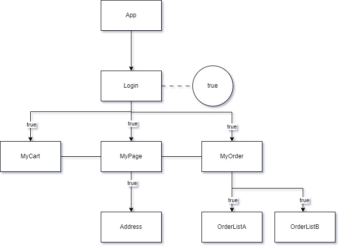
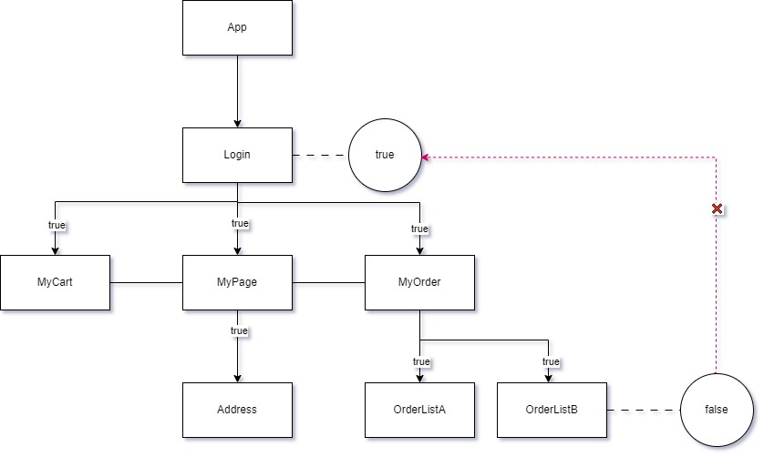
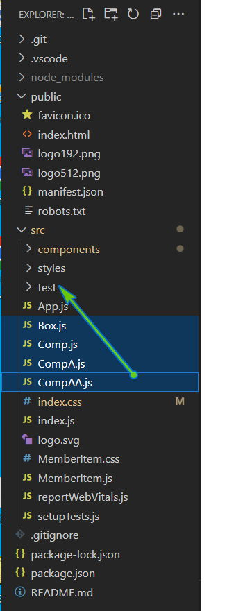

### 목차 <!-- omit in toc -->

- [1. 상태올리기-Lifting State Up](#1-상태올리기-lifting-state-up)
- [2. 기초](#2-기초)
    - [2.0.1. 시작코드](#201-시작코드)
    - [2.0.2. 완료코드](#202-완료코드)
- [3. 심화](#3-심화)
    - [3.0.1. 시작코드](#301-시작코드)
    - [3.0.2. 완료코드](#302-완료코드)

## 1. 상태올리기-Lifting State Up

<iframe width="560" height="315" src="https://www.youtube.com/embed/mRxIZRU_JV0?si=hvCHBCzjah5RCUy2" title="YouTube video player" frameborder="0" allow="accelerometer; autoplay; clipboard-write; encrypted-media; gyroscope; picture-in-picture; web-share" allowfullscreen></iframe>

[!ref target='blank' text=':icon-link:설명PPT링크'](https://docs.google.com/presentation/d/1svGnWI4GaPCc86YsbIXgjYRewZoTV4MwkxfxLdC5jo0/edit?usp=sharing)

[!ref target='blank' text=':icon-link:공식문서'](https://legacy.reactjs.org/docs/lifting-state-up.html)

> 리액트는 데이터 흐름은 단방향 하향식 데이터 구조를 가집니다.
>
> 부모컴포넌트로 부터 자식컴포넌트로의 데이터 전달만 가능하죠.
>
> 앱을 개발하게 되면 하나의 데이터를 여러 컴포넌트에서 동시에 다뤄야 하는 경우가 발생합니다. 예를 들면 회원로그인 후 로그인상태의 값의 경우 모든 컴포넌트에서 상태 데이터를 공유해야겠죠.
>
> 아래의 그림 처럼 리액트 앱에서 컴포넌트가 공통적으로 사용하는 로그인 상태값을 가진 로그인 컴포넌트를 상위컴포넌트로 설계 할 경우 모든 하위컴포넌트에 같은 데이터가 전달되는 것을 볼수 있습니다. 이런 경우는 문제가 없겠죠.
>
> 
>
> 하지만 하위 컴포넌트에서 로그인 상태값을 바꿔야 하는 경우에는 어떨까요?
>
> 사용자가 로그인후 myorder 컴포넌트의 order-list 를 확인 후 로그아웃을 한다면 로그인 상태값은 false 로 수정되어야 할 것 입니다.
>
> 
>
> 데이터변경이 일어난 listB 컴포넌트는 Login 컴포넌트의 2뎁스 하위에 위치하고 있기때문에 상위 요소로 데이터를 전달해야 하는데 리액트에서는 방법이 없습니다.
>
> 이때 사용할수 있는 방법이 부모와 자식의 상향식 데이터 전달이며 이 방법을 Lifting State 라고 합니다.
>
> 간단한 예제로 학습 한 후 제작중인 회원가입 앱에 적용해보겠습니다.

## 2. 기초

- src 폴더정리 
- test 폴더를 만들고 간단한 예제를 진행했던 파일을 옮깁니다.
- test/6/폴더를 생성하고 Accordian 컴포넌트를 생성합니다.
-
- index.js 로 이동하여 App 컴포넌트 대신 test/Accordian 컴포넌트를 임포트합니다.

#### 2.0.1. 시작코드

<iframe src="https://codesandbox.io/embed/k36flm?view=Editor+%2B+Preview&module=%2Fsrc%2FPanel.js"
     style="width:100%; height: 500px; border:0; border-radius: 4px; overflow:hidden;"
     title="stateLifting (forked)"
     allow="accelerometer; ambient-light-sensor; camera; encrypted-media; geolocation; gyroscope; hid; microphone; midi; payment; usb; vr; xr-spatial-tracking"
     sandbox="allow-forms allow-modals allow-popups allow-presentation allow-same-origin allow-scripts"
   ></iframe>

#### 2.0.2. 완료코드

<iframe src="https://codesandbox.io/embed/7b3tg5?view=Editor+%2B+Preview&module=%2Fsrc%2FPanel.js"
     style="width:100%; height: 500px; border:0; border-radius: 4px; overflow:hidden;"
     title="stateLifting-finished"
     allow="accelerometer; ambient-light-sensor; camera; encrypted-media; geolocation; gyroscope; hid; microphone; midi; payment; usb; vr; xr-spatial-tracking"
     sandbox="allow-forms allow-modals allow-popups allow-presentation allow-same-origin allow-scripts"
   ></iframe>

## 3. 심화

#### 3.0.1. 시작코드

<iframe src="https://codesandbox.io/embed/5nd9kw?view=Editor+%2B+Preview&module=%2Fsrc%2FApp.js&expanddevtools=1"
     style="width:100%; height: 500px; border:0; border-radius: 4px; overflow:hidden;"
     title="5-1-final"
     allow="accelerometer; ambient-light-sensor; camera; encrypted-media; geolocation; gyroscope; hid; microphone; midi; payment; usb; vr; xr-spatial-tracking"
     sandbox="allow-forms allow-modals allow-popups allow-presentation allow-same-origin allow-scripts"
   ></iframe>

#### 3.0.2. 완료코드

<iframe src="https://codesandbox.io/embed/f6mng7?view=Editor+%2B+Preview&module=%2Fsrc%2Fcomponents%2Fui%2FHeading.css"
     style="width:100%; height: 500px; border:0; border-radius: 4px; overflow:hidden;"
     title="6-finished"
     allow="accelerometer; ambient-light-sensor; camera; encrypted-media; geolocation; gyroscope; hid; microphone; midi; payment; usb; vr; xr-spatial-tracking"
     sandbox="allow-forms allow-modals allow-popups allow-presentation allow-same-origin allow-scripts"
   ></iframe>
