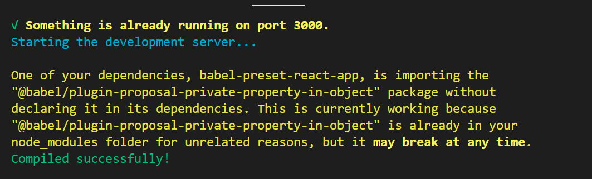

### 목차 <!-- omit in toc -->

## Case1 @babel/plugin-proposal-private-property-in-object

아래와 같은 메시지가 터미널창에 보일때

> One of your dependencies, babel-preset-react-app, is importing the "@babel/plugin-proposal-private-property-in-object" package without declaring it in its dependencies. This is currently working because "@babel/plugin-proposal-private-property-in-object" is already in your node_modules folder for unrelated reasons, but it may break at any time.
>
> 

### Cause

:::comment_box

해당 오류는 프로젝트의 종속성 중 하나인 babel-preset-react-app이 "@babel/plugin-proposal-private-property-in-object" 패키지를 따로 선언하지 않고 사용하고 있기 때문에 발생하는 문제입니다. 현재는 해당 패키지가 다른 이유로 이미 node_modules 폴더에 있어서 문제가 없지만, 잠재적으로 문제를 야기할 요인이 됩니다

:::

### Solution

:::my-list

1. 터미널에  "@babel/plugin-proposal-private-property-in-object" 패키지를 프로젝트의 종속성으로 추가하고 node_modules 폴더에 설치하는 명령어 입력합니다
  `npm install --save @babel/plugin-proposal-private-property-in-object`

2. package.json 파일을 열어 "dependencies" 섹션에 "@babel/plugin-proposal-private-property-in-object" 패키지가 추가된 것을 확인합니다.

:::
