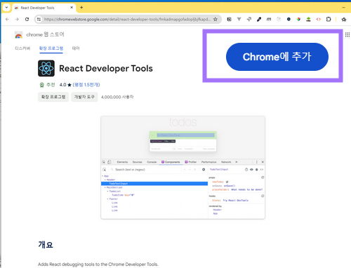
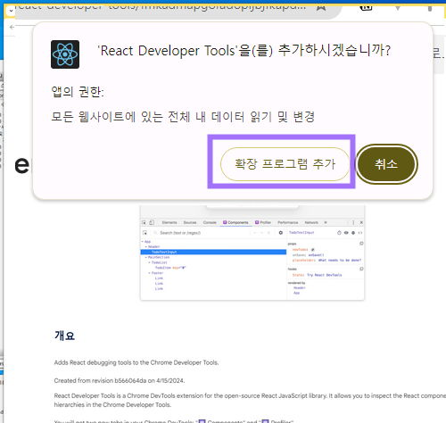
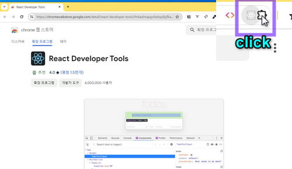
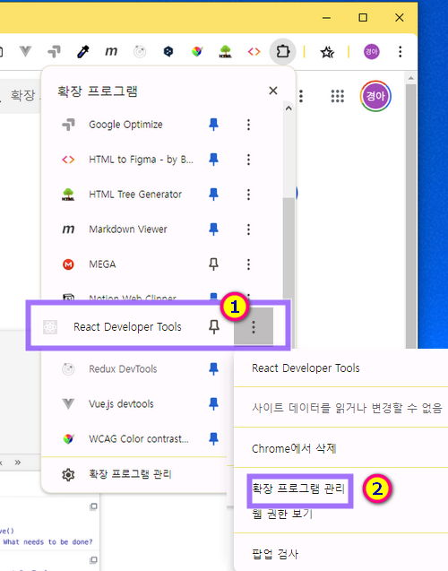
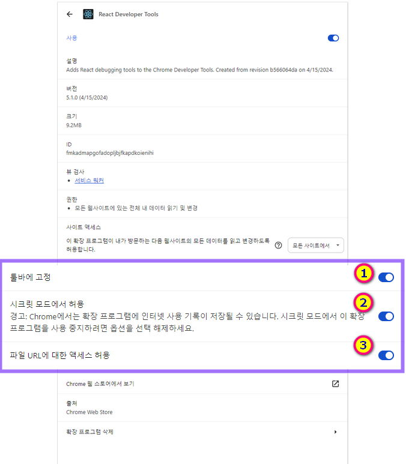
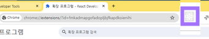
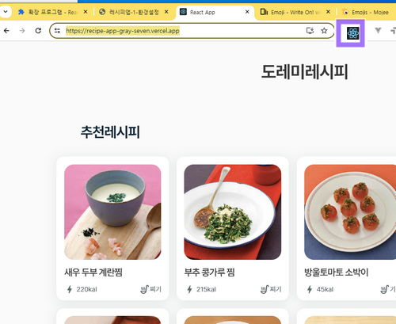
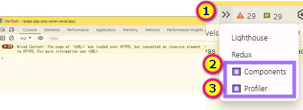
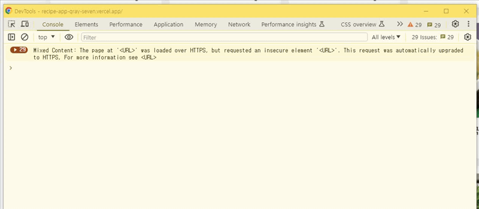
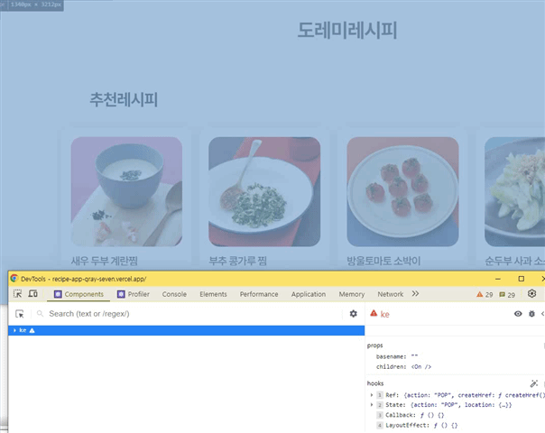

### 목차 <!-- omit in toc -->

- [1. 레시피 앱 소개](#1-레시피-앱-소개)
- [2. 개발 환경설정](#2-개발-환경설정)
- [3. 깃 설치](#3-깃-설치)
- [4. VSCode 설치](#4-vscode-설치)
- [5. 리액트 확장프로그램 설치하기](#5-리액트-확장프로그램-설치하기)
  - [5.1. React Devtools 사용해보기](#51-react-devtools-사용해보기)

## 1. 레시피 앱 소개

> 이번 클래스는 레시피를 소개하는 앱을 제작할 것이다.
> 이 리액트 앱에 사용된 기술 스택은 **axios , react-router** 등 이며 공공API를 연동하는 학습도 하게 될 것이다.
>
> 강의는 공공API 데이터를 연동하는 법과 리액트에서 컴포넌트 연결 및 라우터 설정에 촛점을 맞추므로 사용되는 자바스크립트 메서드 나 스타일링 관련 코드는 별도의 설명 없이 진행된다.
>
> 본 강의는 초심자를 대상으로 제작 하였으며 퍼포먼스 최적화 보다는 초심자가 이해하기 쉬운 방향의 코드로 구성하였다.
>
> [!ref target='blank' text='제작할 앱 보기' icon='link'](https://recipe-app-gray-seven.vercel.app/)

## 2. 개발 환경설정

[!ref target='blank' text='리액트소개와 환경설정' icon='link'](http://localhost:5000/retype-react/%EB%A6%AC%EC%95%A1%ED%8A%B8%EC%A2%80%ED%95%B4%EB%9D%BC/1/)

리액트의 개요와 개발 환경 설정은 위의 링크를 참고해서 진행한다.

## 3. 깃 설치

[!ref target='blank' text='깃과 깃허브 설치하기' icon='link'](https://www.youtube.com/watch?v=W87Jqd2r9ds&list=PLX7q4zTwhcqJvdbM5jmKP-UkFTJ3rHJ8W&index=2)
깃과 깃허브의 개발 환경 설정은 위의 링크를 참고해서 진행한다.

## 4. VSCode 설치

[!ref target='blank' text='vscode 다운로드' icon='link'](https://code.visualstudio.com/download)

## 5. 리액트 확장프로그램 설치하기

1. 아래의 링크로 이동한다
   [!ref target='blank' text='React Developer Tools' icon='link'](https://chromewebstore.google.com/detail/react-developer-tools/fmkadmapgofadopljbjfkapdkoienihi)
1. 아래 그림에 표시된 버튼을 클릭한다.
   
1. 2번을 진행하면 아래와 같은 팝업창이 열린다. 표시된 부분을 클릭한다.
   
1. 크롬 주소표시줄 우측의  아이콘을 클릭한다. 이제 확장프로그램을 세팅 할 것 이다.
   
1. 아래의 그림에 표시된 확장프로그램을 찾아 ①을 클릭 한 다음 ② 를 클릭 한다.
   
1. 아래 그림과 같은 페이지가 보이면 표시된 곳을 순서대로 클릭하여 그림처럼 활성화 상태로 변경한다.
   
1. 이제 주소표시줄 우측에 표시된 아이콘이 확인된다.
   

### 5.1. React Devtools 사용해보기

1. 아래의 링크로 이동한다.
   [!ref target='blank' text='링크' icon='link'](https://recipe-app-gray-seven.vercel.app/)
1. 보고있는 페이지가 리액트로 제작 되었을경우 확장프로그램 아이콘의 색상이 진해진다.
   
1. <kbd>F12</kbd> 키를 눌러 개발자도구를 실행한다. 그후 아래 그림의 1번을 클릭하면 2,3의 메뉴가 확인된다.
   
1. 아래의 그림처럼 개발자 메뉴를 앞으로 꺼낸다. 3번 단계의 2,3 메뉴를 각각 클릭하여 드래그드랍 한다.
   
1. 사용법
   아래의 그림처럼 리액트 인스펙트터를 클릭한후 확인하고 싶은 요소를 클릭한다
   우측패널에 선택한 요소의 정보를 확인할수 있다.
   
