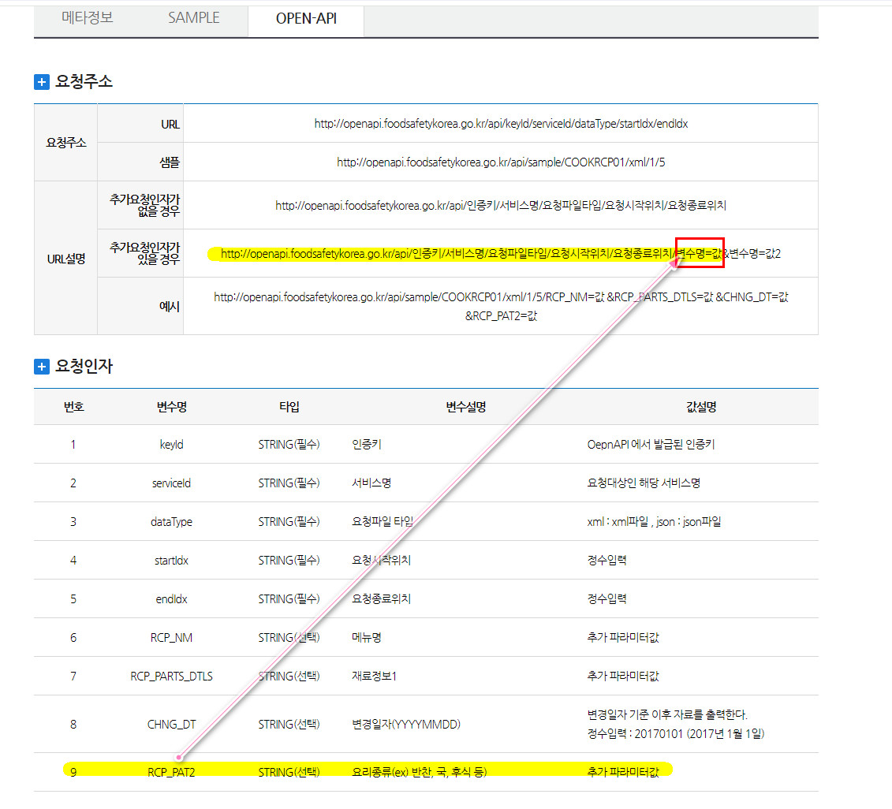
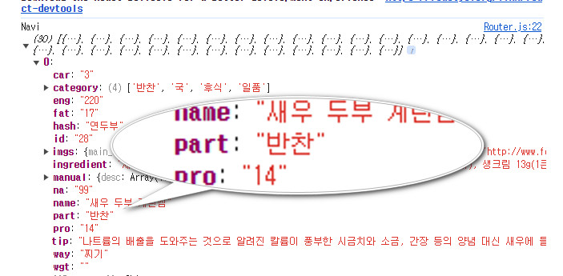
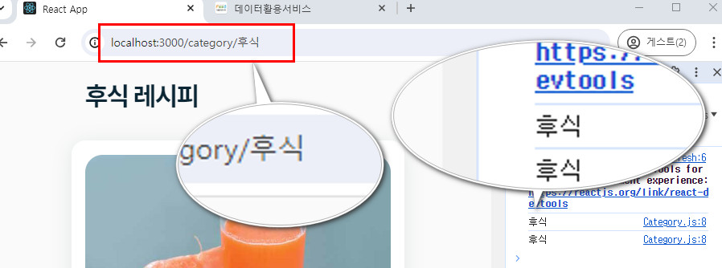
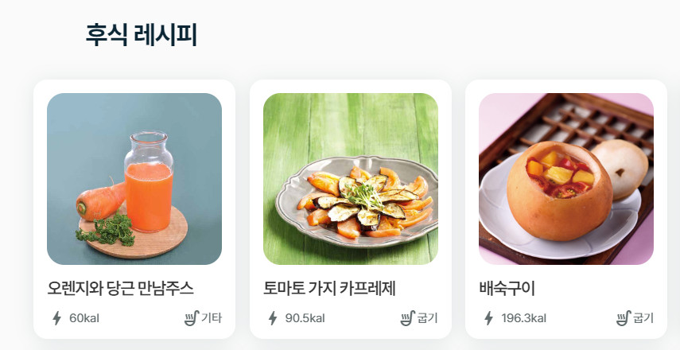
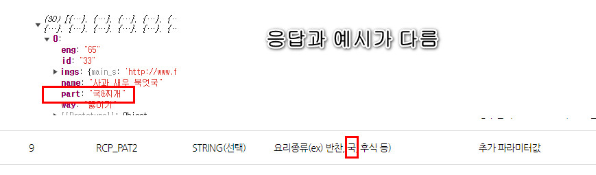
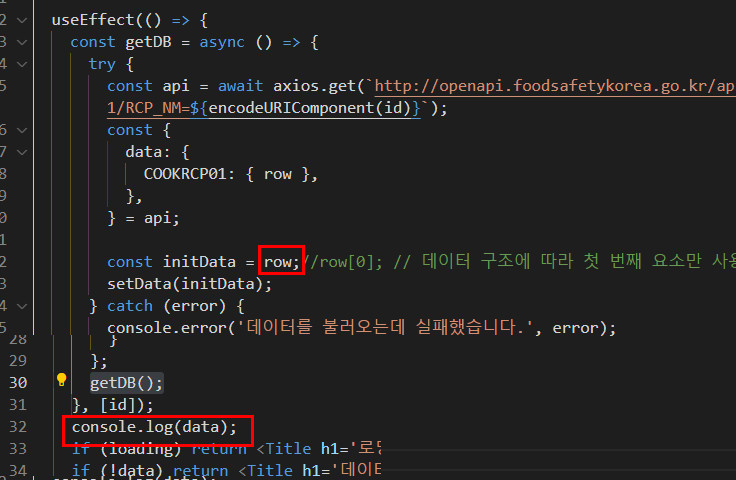
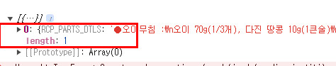

### 목차 <!-- omit in toc -->

- [1. App 의 구조](#1-app-의-구조)
- [2. Router 설정하기](#2-router-설정하기)
	- [2.1. Router 컴포넌트 내에 Navigate 컴포넌트 작성하기](#21-router-컴포넌트-내에-navigate-컴포넌트-작성하기)
- [3. Category 컴포넌트 작성](#3-category-컴포넌트-작성)
	- [3.1. useParams 사용](#31-useparams-사용)
- [4. 상세정보 컴포넌트 만들기](#4-상세정보-컴포넌트-만들기)
	- [4.1. 동적라우터 작성](#41-동적라우터-작성)
	- [4.2. 컴포넌트 작성](#42-컴포넌트-작성)
		- [4.2.1. DetailApi.js](#421-detailapijs)
		- [4.2.2. Detail 컴포넌트 작성](#422-detail-컴포넌트-작성)

## 1. App 의 구조

```md
    src/
     ├─── App.js
     ├─── common.scss
     └───  scss/ (partial 파일들)
     │	    │
     │	    ├─── _init.scss (변수,믹스인 등 초기값 정의)
     │	    ├─── _layout.scss (레이아웃 정의)
     │	    ├─── _typo.scss (폰트정의 )
     │	    └─── _util.scss (기타 요소정의)
     │
     ├─── components/ (UI요소를 리턴하는 컴포넌트파일)
     │		│
     │		├─── Home.js 메인컴포넌트
     │		├─── Category.js 동적으로 카테고리 경로를 할당받을 컴포넌트
     │		├─── List.js 리스팅컴포넌트
     │		├─── Title.js 제목컴포넌트
     │		└─── DetailApi.js api 서버와 통신하여 상세정보 데이터 전달
     │		└─── Detail.js 상세정보 컴포넌트
     │
     └─── routes /  (라우팅 설정 파일)
     │ 		│
     │ 		└─── Router.js 라우터와 링크설정
     │
     └─── context /  (전역데이터 설정)
      		│
      		└─── RecipeContext.js (전역저장소 설치)
```

1. 위의 구조도에 맞게 파일과 폴더를 구성한다.
1. 각 파일의 쓰임새에 맞는 코드를 작성한다.
1. 이번 강좌는 리액트언어에 촛점을 맞출 것이므로 스타일링하는 scss 파일을 아래의 링크에서 내려받아 압축을 푼 후 각각 파일위치를 구조도를 참조하여 이동한다.
   [!button variant='dark' icon='download' text='scss파일' target='blank'](./assets/src.zip)

## 2. Router 설정하기

### 2.1. Router 컴포넌트 내에 Navigate 컴포넌트 작성하기

:::box
Navigate 컴포넌트는 gnb 역할을 할것이다.
Home과 각 카테고리로 이동하는 링크를 작성한다.
:::

1. 기존의 Anchor 컴포넌트는 삭제하고 Navigate 컴포넌트를 생성한다.
1. Navigate 컴포넌트의 카테고리 정보는 useContext 를 활용한다.

   ```js #
   import { RecipeContext } from '../context/RecipeContext';
   ...
   const Navigate = () => {
    const data = useContext(RecipeContext);
   };
   export { Router, Navigate };

   ```

1. Navite 시안을 참고하자
   
1. 5개의 Link 를 가지며 4개는 카테고리 정보이다. 카테고리 정보는 App컴포넌트의 전역 데이터의 해당 값을 참조하도록 한다. 카테고리 값 참조시 동적라우팅을 사용하여 해당 카테고리 데이터를 받아야 하므로 api 서버에서 제공하는 카테고리 정보를 가공해야 한다.
   식품안전나라의 api문서를 확인해보면 RCP_PAT2 변수에 요리종류가 반환되며 사용시 URL 설명의 예시처럼 작성하라는 안내가 있다.
   

1. Navigate 컴포넌트로 전달되는 데이터의 구조를 확인한다
   ```js #
   const Navigate = () => {
   const data = useContext(RecipeContext);
   console.log("Navi",data);
   ```
   
   30개의 배열의 각각 객체데이터가 존재하며 하위 키 part 에 RCP_PAT2 에 해당하는 데이터가 들어있다.
   30개의 데이터 내에서 part 의 값만을 추출한후 중복을 삭제하는 가공작업이 필요하다.
   이렇게 가공한 데이터를 각각 Link 컴포넌트로 전달한다.
1. 배열을 펼쳐서 원하는 속성만 추출후 중복값 삭제
   ```js #
   const uniquePart = [...new Set(data.flatMap((el) => el.part))];
   ```
1. Link 컴포넌트 작성

   ```js #6-11
   return (
   	<div className='gnb'>
   		<div className='inner'>
   			<div className='menu'>
   				<Link to={'/'}>홈화면</Link>
   				{uniquePart.map((el, idx) => {
   					return (
   						<Link key={idx} to={`/category/${el}`}>
   							{el}
   						</Link>
   					);
   				})}
   			</div>
   		</div>
   	</div>
   );
   ```

1. 동적라우터 설정
   ```js #7
   import Category from '../components/Category';
   ...
   const Router = () => {
   	return (
   		<>
   			<Navigate />
   			<Routes>
   				<Route path='/' element={<Home />} />
   				<Route path='/category/:id' element={<Category />} />
   			</Routes>
   		</>
   	);
   };
   ```

## 3. Category 컴포넌트 작성

:::comment_box
Category컴포넌트는 Navigate 컴포넌트에서 전달하는 parameter를 url로 전달받아 동적으로 카테고리 정보를 렌더링 하는 역할을 한다.
:::

### 3.1. useParams 사용

1.  src\components\Category.js 를 함수형 컴포넌트로 생성한다.
1.  url로 데이터를 전달받을수 있도록 `react-router-dom`의 `useParams` 모듈을 임포트 한다.

    ```js #
    import { useParams } from 'react-router-dom';
    const CategoryPage = () => {
    	const { id } = useParams();
    	console.log(id);
    	return <div className='inner'>${id}</div>;
    };
    export default CategoryPage;
    ```

    
    <mark>url의 파라미터가 전달되며 Category 컴포넌트의 데이터가 동적으로 렌더링 되는지 확인한다.</mark>

1.  이 컴포넌트는 전역데이터를 사용할수 없다.
    지금 받은 id 변수를 사용하여 api 서버에서 요리종류별 데이터를 요청 해야하기 때문이다.
    컴포넌트 내부에서 직접 api 서버와 통신 하는 로직을 작성한다.

    ```js #
    ...
    import { useEffect, useState } from 'react';  //데이터 수신후 컴포넌트를 리렌더 해야하므로 useState 를 임포트 하고 데이터 변경시에만 리렌더를 해야하므로 useEffect 를 임포트 한다.
    import axios from 'axios';  //axios 임포트
    import Title from './Title';
    import List from './List';  //받아온 데이터는 List 컴포넌트로  전달하여 렌더링 한다.
    const CategoryPage = () => {
      const { id } = useParams();
      const [loading, setLoading] = useState(true); //데이터 수신상태를 관리하여 사용자에게 피드백을 전달한다.
      const [data, setData] = useState([]);//컴포넌트는 처음에 빈 데이터를 갖고 있다 api 통신 성공시 해당 데이터를 렌더할수 있는 상태가 된다.
      useEffect(()=>{
      //데이터를 가져오는 로직을 작성한다.
      },[])
      ...
      	return (
          //화면에 데이터를 렌더링하는 로직을 작성한다.
        )
      }

    ```

1.  App 컴포넌트의 `getDB` 함수는 서버로 부터 데이터를 요청하여 전달받으면 새 변수에 할당하는 로직이 있으므로 해당 함수를 복사붙여넣기 한다.
1.  카테고리 페이지는 아래와 같은 데이터를 출력할 것 이므로 필요없는 데이터는 삭제한다.
    

    ```js #
    useEffect(() => {
    	const getDB = async () => {
    		try {
    			const { data } = await axios.get(`http://openapi.foodsafetykorea.go.kr/api/08cc9b42270a4439b1b5/COOKRCP01/json/1/30/RCP_PAT2=${id}`);
    			const {
    				COOKRCP01: { row },
    			} = data;
    			const initData = row.map(({ RCP_SEQ, RCP_NM, RCP_WAY2, RCP_PAT2, INFO_ENG, ATT_FILE_NO_MAIN, ATT_FILE_NO_MK }) => ({
    				id: RCP_SEQ,
    				name: RCP_NM,
    				eng: INFO_ENG,
    				way: RCP_WAY2,
    				part: RCP_PAT2,
    				imgs: { main_s: ATT_FILE_NO_MAIN, main_l: ATT_FILE_NO_MK },
    			}));

    			setData(initData);
    		} catch (error) {
    			console.error('데이터를 불러오는데 실패했습니다.', error);
    		} finally {
    			setLoading(false);
    		}
    	};
    	getDB();
    }, [id]);
    ```

1.  국&찌개 는 데이터를 불러우는데 실패한다. 원인을 알아보자
    
    응답데이터와 요청데이터가 다르다.
    요청시 `국` 으로 전달해야 응답을 받을수 있다.
    국&찌개를 국으로 변경한다.

    ```js #
    let { id } = useParams();
    if (id === '국&찌개') {
      id = '국';
    }
    ...
    	return (
    	<div className='inner'>
    		{loading ? (
    			<Title h1='로딩중입니다.' />
    		) : (
    			<>
    				{id === '국' ? <Title h2={`${id}&찌개 레시피`} /> : <Title h2={`${id} 레시피`} />}
    				<div className='list'>
    					<List items={data} />
    				</div>
    			</>
    		)}
    	</div>
    );
    ```

## 4. 상세정보 컴포넌트 만들기

### 4.1. 동적라우터 작성

```js # Router.js
import DetailApi from '../components/DetailApi';
...
const Router = () => {
	return (
...
    <Route path='/detail/:id' element={<DetailApi />} />
...

```

### 4.2. 컴포넌트 작성

#### 4.2.1. DetailApi.js

:::comment_box
DetailApi 컴포넌트는 라우터에서 전달하는 파라미터를 전달받아 Page 서버로 요청한다.
그후 응답결과를 우리 데이터 구조에 맞게 가공한다.
:::

1. DetailApi 컴포넌트 생성후 작성

```js # DetailApi.js
import { useEffect, useState } from 'react';
import { useParams } from 'react-router-dom';
import axios from 'axios';
import Title from './Title';
import Detail from './Detail';

const DetailApi = () => {
	const { id } = useParams(); // URL에서 id 가져오기
	const [loading, setLoading] = useState(true);
	const [data, setData] = useState(null);

	useEffect(() => {
		const getDB = async () => {
			try {
				const api = await axios.get(`http://openapi.foodsafetykorea.go.kr/api/08cc9b42270a4439b1b5/COOKRCP01/json/1/1/RCP_NM=${encodeURIComponent(id)}`);
				const {
					data: {
						COOKRCP01: { row },
					},
				} = api;
				const initData = row[0]; // 데이터 구조에 따라 첫 번째 요소만 사용
				setData(initData);
			} catch (error) {
				console.error('데이터를 불러오는데 실패했습니다.', error);
			} finally {
				setLoading(false);
			}
		};
		getDB();
	}, [id]);

	if (loading) return <Title h1='로딩중입니다.' />;
	if (!data) return <Title h1='데이터가 없습니다.' />;

	return <Detail data={data} />;
};

export default DetailApi;
```

==- [!badge variant='info' size='s' text='desc'] 설명보기
{.mt30}

[!badge variant='info' size='s' text='라인별 코드설명']

> DetailApi 컴포넌트는 Category 와 마찬가지로 파라미터를 전달받아 api서버로 해당 데이터를 요청하고
> 응답이 오면 우리의 데이터 구조에 맞게 가공하여 컴포넌트로 전달하는 역할을 한다.

- 1: 응답데이터에 따라 컴포넌트의 상태를 관리해야 하므로 useState와 useEffect 를 임포트
- 2: url을 통해 데이터를 전달받아야 하므로 useParams 임포트
- 3: api 서버로 2번의 데이터를 요청해야 하므로 axios 임포트
- 4: 응답받은 데이터를 내려줄 컴포넌트 (Title, Detail) 임포트
- 7: 컴포넌트 함수
- 8: url을 통해 전달받은 데이터를 id 변수에 구조분해할당함 (useParams 변수는 객체형으로 전달되므로 직접 꺼낼수 없다)
- 9: 컴포넌트가 로딩상태인지를 관리할 변수. 로딩중 일 경우 사용자에게 메시지를 전달한다.
- 10: 최초 렌더시에는 빈 데이터 이었다가 서버와 통신후 응답받은 데이터로 상태를 관리할 변수
- 12: id 변수의 값이 변경시에만 컴포넌트를 리렌더 하기 위한 HOOK
- 13: `getDB` 함수는 api 서버와 통신해야 하므로 비동기동작을 지원하는 `async`~`await` 을 사용한다.
- 14: `try` 블록은 api 서버로 데이터를 요청하는 로직을 갖고 있다.
- 15: `api` 변수는 `axio` 에서 제공하는 `.get()` 함수를 사용하여 서버로 데이터 요청을 한다. 이때 서버의 응답시간이 지연될수도 있기 때문에 `await` 키워드를 사용하여 비동기로 요청한다.
  또한 데이터의 요청은 url의 파라미터 를 전달하는 방식으로 이루어지며 이때 파라미터는 8번라인의 id 변수이다.
  id변수의 값은 한글을 포함하고 있어 서버데이터를 찾을때 혼선이 생길수 있으므로 `encodeURIComponent()` 함수를 사용하여 한글,특수문자 포함시 인코딩하여 요청한다.
- 16~19: api 변수에 할당된 값을 구조분해 할당하여 재구성 한다.
- 21: data 변수에 할당된 데이터의 구조를 살펴보기 위해 잠시 코드를 아래처럼 수정한다.
  
  화면의 오류는 무시하고 콘솔창의 반환값만 확인한다.
  
  배열에 포함된 객체가 반환되며 배열의 인덱스번호 0이 확인된다.
  데이터를 쉽게 꺼내 쓰기 위해 `initData` 변수에 값을 구조분해할당 한다.
  코드를 다시 아래와 같이 수정하고 콘솔명령어는 삭제한다.
  `const initData = row[0];`
- 22: data 상태업데이트 함수인 `setData`의 인자로 `initData` 를 전달한다.
  - data 변수는 빈 배열이었다가 setData 함수의 매개변수 initData의 값이 재할당된다.
- 23: catch 블록은 오류발생시 콘솔화면에 에러메시지를 출력한다.
- 25: finally 블록은 try 블록으로 진입하면 실행된다. 즉 try 에서 통신요청후 응답을 받아 데이터 구조를 변경하면 컴포넌트의 로딩상태를 false 로 업데이트 한다.
- 29: `getDB` 함수를 실행한다.
- 30: useEffect 의 인자로 id 변수의 값의 업데이트 시에만 useEffect 내 실행문을 실행한다.
- 32: loading 변수의 값이 true 일 경우 화면에 로딩중 메시지를 출력하여 사용자경험을 개선한다.
- 33: data 변수의 값이 비었을 경우 데이터없음 메시지를 전달하여 사용자 경험을 개선한다.
- 35: Detail 컴포넌트를 반환하고 data props 로 변수 data 를 전달한다.

===

#### 4.2.2. Detail 컴포넌트 작성

:::comment_box
Detail 컴포넌트는 DetailApi 컴포넌트가 전달하는 데이터를 ui요소에 할당하는 역할을 한다.
:::

```js #
import Title from './Title';

const Detail = (props) => {
	const { ATT_FILE_NO_MK, INFO_CAR, INFO_ENG, INFO_FAT, INFO_NA, INFO_PRO, MANUAL01, MANUAL02, MANUAL03, MANUAL04, MANUAL05, MANUAL06, MANUAL07, MANUAL08, MANUAL09, MANUAL10, MANUAL11, MANUAL12, MANUAL13, MANUAL14, MANUAL15, MANUAL16, MANUAL17, MANUAL18, MANUAL19, MANUAL20, MANUAL_IMG01, MANUAL_IMG02, MANUAL_IMG03, MANUAL_IMG04, MANUAL_IMG05, MANUAL_IMG06, MANUAL_IMG07, MANUAL_IMG08, MANUAL_IMG09, MANUAL_IMG10, MANUAL_IMG11, MANUAL_IMG12, MANUAL_IMG13, MANUAL_IMG14, MANUAL_IMG15, MANUAL_IMG16, MANUAL_IMG17, MANUAL_IMG18, MANUAL_IMG19, MANUAL_IMG20, RCP_NA_TIP, RCP_NM, RCP_PARTS_DTLS } = props.data;

	const manuals = [
		{ desc: MANUAL01, img: MANUAL_IMG01 },
		{ desc: MANUAL02, img: MANUAL_IMG02 },
		{ desc: MANUAL03, img: MANUAL_IMG03 },
		{ desc: MANUAL04, img: MANUAL_IMG04 },
		{ desc: MANUAL05, img: MANUAL_IMG05 },
		{ desc: MANUAL06, img: MANUAL_IMG06 },
		{ desc: MANUAL07, img: MANUAL_IMG07 },
		{ desc: MANUAL08, img: MANUAL_IMG08 },
		{ desc: MANUAL09, img: MANUAL_IMG09 },
		{ desc: MANUAL10, img: MANUAL_IMG10 },
		{ desc: MANUAL11, img: MANUAL_IMG11 },
		{ desc: MANUAL12, img: MANUAL_IMG12 },
		{ desc: MANUAL13, img: MANUAL_IMG13 },
		{ desc: MANUAL14, img: MANUAL_IMG14 },
		{ desc: MANUAL15, img: MANUAL_IMG15 },
		{ desc: MANUAL16, img: MANUAL_IMG16 },
		{ desc: MANUAL17, img: MANUAL_IMG17 },
		{ desc: MANUAL18, img: MANUAL_IMG18 },
		{ desc: MANUAL19, img: MANUAL_IMG19 },
		{ desc: MANUAL20, img: MANUAL_IMG20 },
	];

	const source = RCP_PARTS_DTLS.split('●')
		.map((el) =>
			el
				.split(':')
				.map((el) => el.trim())
				.filter(Boolean)
		)
		.filter((el) => el.length);

	return (
		<>
			<div className='detail'>
				
				<Title h1={RCP_NM} />
				<div className='detail_info'>
					<Title h3='재료' />
					{source.map((el, idx) => {
						return (
							<div className='txt' key={idx}>
								<span className='title'>{el[0]}</span>
								<span className='content'>{el[1]}</span>
							</div>
						);
					})}
				</div>

				<div className='detail_info'>
					<Title h3='조리 방법' />
					{manuals.map((manual, index) =>
						manual.desc ? (
							<div className='desc_list' key={index}>
								<span className='txt'>{manual.desc.slice(0, -1)}</span>
								
							</div>
						) : null
					)}
				</div>
				<div className='detail_info'>
					<Title h3='영양정보' />
					<div className='table'>
						<div className='row'>
							<span className='col'>열 량:</span> <span className='col'>{INFO_ENG} kal</span>
						</div>
						<div className='row'>
							<span className='col'>탄 수 화 물:</span> <span className='col'>{INFO_CAR} g</span>
						</div>
						<div className='row'>
							<span className='col'>단 백 질:</span> <span className='col'>{INFO_PRO} g</span>
						</div>

						<div className='row'>
							<span className='col'>지 방:</span> <span className='col'>{INFO_FAT} g</span>
						</div>

						<div className='row'>
							<span className='col'>나 트 륨:</span> <span className='col'>{INFO_NA} g</span>
						</div>

						<div className='tip'>
							<span className='col'>저감 조리법 TIP:</span> <span className='col'>{RCP_NA_TIP}</span>
						</div>
					</div>
				</div>
			</div>
		</>
	);
};

export default Detail;
```

==- [!badge variant='info' size='s' text='desc'] 설명보기
{.mt30}

> Detail 컴포넌트는 DetailApi 컴포넌트가 서버와 통신한 데이터를 props 로 전달받고
> 우리의 UI 구조에 맞게 삽입하여 렌더링하는 역할을 한다.

- 1: Title 컴포넌트 임포트
- 2: props로 상위컴포넌트의 데이터를 내려 받는다
- 4: 전달받을 props 를 Detail 컴포넌트에 내에서 꺼내기 쉽게 데이터를 구조분해 할당한다.

===
