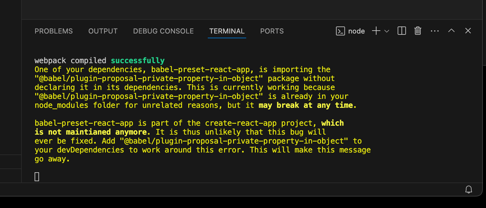
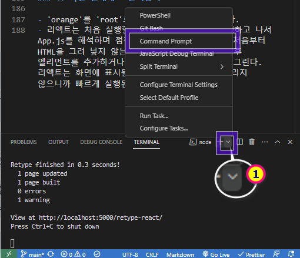
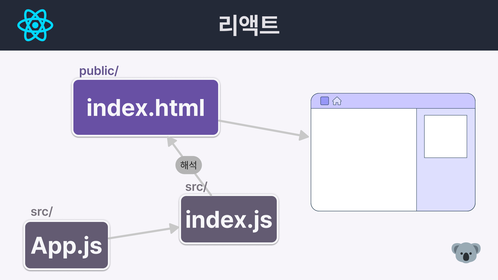
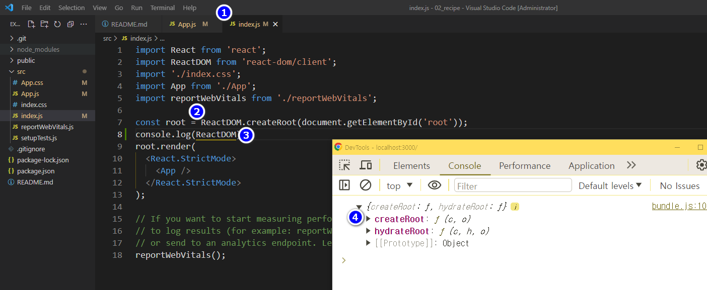
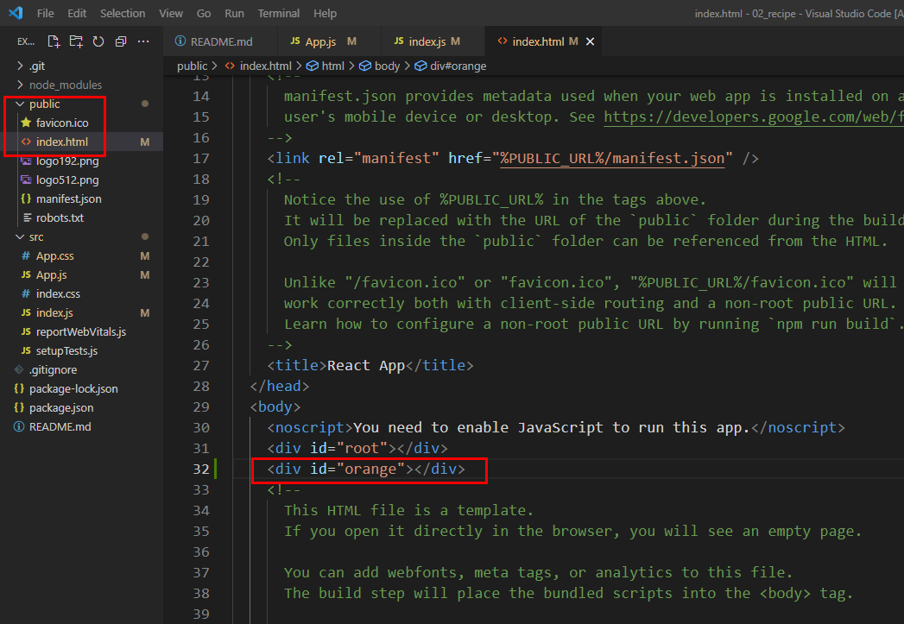
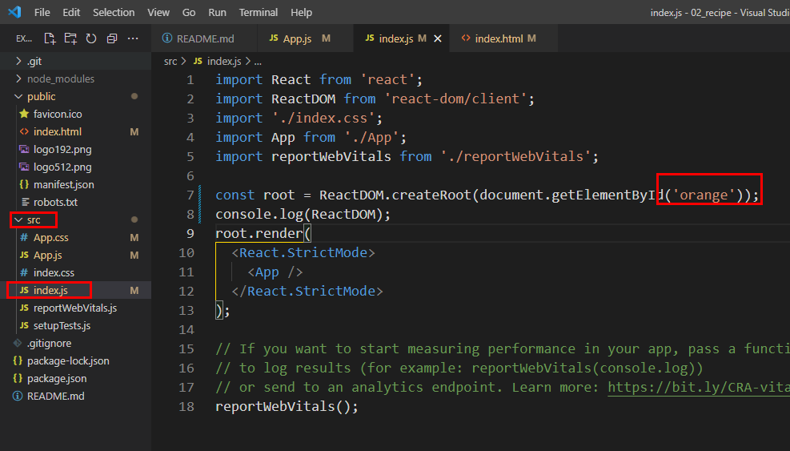

### 목차 <!-- omit in toc -->
- [1. 영상보기](#1-영상보기)
- [2. create-react-app으로 리액트 앱 만들기](#2-create-react-app으로-리액트-앱-만들기)
- [3. README 수정하기](#3-readme-수정하기)
- [4. 리액트 앱 실행하기](#4-리액트-앱-실행하기)
- [5. 리액트 앱 종료하기](#5-리액트-앱-종료하기)
- [6. 비주얼 스튜디오 코드 통합 터미널에서 실행하는 방법](#6-비주얼-스튜디오-코드-통합-터미널에서-실행하는-방법)
- [7. 깃허브에 리액트 앱 업로드하기](#7-깃허브에-리액트-앱-업로드하기)
  - [7.1. 깃허브에 저장소 만들기](#71-깃허브에-저장소-만들기)
  - [7.2. 깃허브 저장소에 리액트 앱 업로드하기](#72-깃허브-저장소에-리액트-앱-업로드하기)
  - [7.3. 깃허브 저장소 확인하기](#73-깃허브-저장소-확인하기)
- [8. 리액트 앱 살펴보고 수정하기](#8-리액트-앱-살펴보고-수정하기)
  - [8.1. 로컬 저장소 초기화하기](#81-로컬-저장소-초기화하기)
  - [8.2. public 폴더 살펴보기](#82-public-폴더-살펴보기)
  - [8.3. index.html 파일 살펴보기](#83-indexhtml-파일-살펴보기)
  - [8.4. App.js 파일 수정하기](#84-appjs-파일-수정하기)
  - [8.5. 리액트 앱 다시 실행하기](#85-리액트-앱-다시-실행하기)
  - [8.6. App.js 파일 수정하기](#86-appjs-파일-수정하기)
  - [8.7. 크롬 개발자 도구로 리액트 앱 살펴보기](#87-크롬-개발자-도구로-리액트-앱-살펴보기)
  - [8.8. Hello!!!!! 가 화면에 어떻게 표시되는지 살펴보기](#88-hello-가-화면에-어떻게-표시되는지-살펴보기)
- [9. 리액트 앱 동작 원리 알아보기](#9-리액트-앱-동작-원리-알아보기)
  - [9.1. index.js 살펴보기](#91-indexjs-살펴보기)
  - [9.2. index.html 수정해 보기](#92-indexhtml-수정해-보기)
  - [9.3. index.js 수정하여 오류 해결하기](#93-indexjs-수정하여-오류-해결하기)
  - [9.4. 파일 원래대로 돌려놓기](#94-파일-원래대로-돌려놓기)
- [10. 완성코드](#10-완성코드)


## 1. 영상보기
<iframe width="560" height="315" src="https://www.youtube.com/embed/rcCWzkgqW00?si=SZNoHGl0ZBIlY57i" title="YouTube video player" frameborder="0" allow="accelerometer; autoplay; clipboard-write; encrypted-media; gyroscope; picture-in-picture; web-share" referrerpolicy="strict-origin-when-cross-origin" allowfullscreen></iframe>

## 2. create-react-app으로 리액트 앱 만들기

1. 탐색기를 열고 recipe-app 폴더를 만든다.
1. VScode 를 실행후 recipe-app 폴더를 편집창으로 드래그드랍하여 루트폴더로 연다.
1. VScode 에서 <kbd>ctrl</kbd>+<kbd>J</kbd> 를 눌러 터미널을 실행한다.
1. 아래의 명령어를 터미널에 입력한다
   명령어는 npm 모듈에 내장되어 있는 보일러플레이트&#x28; [boilerplate](https://www.google.com/search?q=boilerplate&oq=boilerplate&gs_lcrp=EgZjaHJvbWUyBggAEEUYOdIBCDgzNDNqMGo3qAIAsAIA&sourceid=chrome&ie=UTF-8) &#x29;를 사용하여 리액트앱을 현재 폴더에 설치한다는 내용이다.
    ```bash
      npx create-react-app .
    ```

## 3. README 수정하기
  > 안에 있는 내용을 전부 지우고 아래와 같이 입력하고 Ctrl + S를 눌러 저장

  ```
  # recipe App 2024

  ```

## 4. 리액트 앱 실행하기

  > 터미널 `npm start`를 입력한다.
  > 크롬 브라우저가 실행되면서 http://localhost:3000/ or http://내아이피주소:3000/ 에 리액트 앱이 실행된다.


  
  [위 경고 발생시 해결방법](../debug/1.md) {.h2}

## 5. 리액트 앱 종료하기

> 터미널의 명령프롬프트로 돌아가서 <kbd> Ctrl</kbd> + <kbd> C</kbd> 를 누르면 리액트 앱이 종료된다.

## 6. 비주얼 스튜디오 코드 통합 터미널에서 실행하는 방법

- 터미널 > 새 터미널을 실행하여 터미널에서 실행할 수도 있다.
  

## 7. 깃허브에 리액트 앱 업로드하기

> {.h5} 이번 강의의 프로젝트를 다른 사람도 볼수 있게 하려면 깃 허브에 프로젝트를 업로드 하는것이 편리하다.
> 우리는 vercel 호스팅을 사용하여 프로젝트를 배포할 것이고 vercel에서 깃허브의 저장소를 불러올수 있는 기능이 제공되기 때문이다.
>
> {.c-de-10} npm 을 사용하여 설치한 리액트 앱은 깃 초기화가 이미 되어있다.
> vsCode 의 탐색기로 확인하면 .git 폴더가 보일것이다.

### 7.1. 깃허브에 저장소 만들기

[!ref target='blank' text='깃허브로 이동' icon='link'](https://github.com/)

- Create a new repository 를 클릭후 Repository name 을 입력하여 생성한다.

### 7.2. 깃허브 저장소에 리액트 앱 업로드하기

- 깃 허브 저장소의 URL을 사용해 터미널에 다음과 같이 명령어를 입력한다. 이때 저장소 명은 타이핑하지 말고 복사해서 사용하자.

```bash
git branch -M main
git remote add origin https://github.com/깃허브아이디/레파지토리이름.git
git commit -m "깃허브에 리액트 앱 업로드하기"
git push -u origin main

```

### 7.3. 깃허브 저장소 확인하기

```cmd
https://github.com/깃허브아이디/레파지토리이름
```

## 8. 리액트 앱 살펴보고 수정하기

### 8.1. 로컬 저장소 초기화하기

- VSCode의 탐색기를 살펴보면 recipe-app 폴더 안에 우리가 자주 소스를 수정하게 될 public, src 폴더를 볼 수 있다.

### 8.2. public 폴더 살펴보기

- public 폴더에는 favicon.ico 파일이 있는데 이건 브라우저 제목과 함께 표시되는 아이콘이다.

### 8.3. index.html 파일 살펴보기

- public/index.html파일에는 자주 보는 html 문서의 코드가 보인다. .

### 8.4. App.js 파일 수정하기

- src 폴더의 App.js 를 열어서 아래와 같이 수정해보자

```js
import './App.css';

function App() {
	return <div className='App'></div>;
}

export default App;
```

### 8.5. 리액트 앱 다시 실행하기

```cmd
npm start
```

- <kbd> Ctrl</kbd>+<kbd>C</kbd> 를 눌러 실행 중이던 리액트 앱을 종료하고 다시 실행한다.
- 에러 없이 코드를 입력했다면 화면에 아무것도 표시되지 않은 빈 브라우저 화면이 실행된다.

### 8.6. App.js 파일 수정하기

- 인삿말을 표시해 보자.
- `src/App.js` 파일을 열어서 코드를 아래와 같이 변경하고 저장한다.

```js
import React from 'react';

function App() {
	return (
		<div className='App'>
			<h1> Hello!!!!! </h1>
		</div>
	);
}

export default App;
```

### 8.7. 크롬 개발자 도구로 리액트 앱 살펴보기

- 크롬 브라우저 창에서 <kbd>F12</kbd>를 눌러 개발자 도구를 실행한 다음 [Elements] 탭을 눌러보자. 그러면 앞에서 입력한 `<h1> Hello!!!!! </h1>`를 볼 수 있다.
  전체 코드를 보면`index.html`파일과`App.js`파일이 합쳐진 것 같이 보인다.

### 8.8. Hello!!!!! 가 화면에 어떻게 표시되는지 살펴보기

- `public/index.html` 파일을 열어서 body 엘리먼트 주변을 살펴보자.
- `<div id="root"> </div>` 사이에 아무것도 없다. 그런데 위 2.7에서는 이 공간에 코드가 들어가 있다. 어떻게 된 걸까?

## 9. 리액트 앱 동작 원리 알아보기

- 리액트는 우리가 작성한 프로젝트 폴더에 있는 코드(예를 들어 App.js, index.js)를 자바스크립트를 이용하여 해석한 다음 해석한 결과물을 `index.html`에 끼워 넣는다.
  
- 이것이 index.html 파일에 없었던 `<div> Hello!!!!! </div>`가 리액트 앱을 실행하면 생기는 원리이다.
  다시말해 index.html의` <div id="root"></div>`는 프로젝트 폴더에 있는 파일을 해석하여 넣는 역할을 담당한다.

### 9.1. index.js 살펴보기

- src 폴더의 index.js 파일을 다시 열어 보자.



- root 변수에 ReactDom 모듈의 createRoot 메서드를 호출하여 최상위dom 요소를 전달한것을 할당한다.
  - ReactDOM 객체를 콘솔에서 확인해보면 두개의 메서드가 반환된다.
    - [공식문서](https://react.dev/reference/react-dom/client)
    - createRoot : 브라우저 DOM 노드 내에 React 구성 요소를 표시하는 루트를 만들 수 있다.
    - **hydrateRoot: 서버앱을 클라이언트에서 활성화 할때 사용 (NextJS없이 SSR 구현가능)**

### 9.2. index.html 수정해 보기

- public 폴더의 index.html 파일을 열어서` <div id="root"></div>`를 `<div id="orange"></div>`로 바꿔보자.



- <kbd>Ctrl</kbd>+<kbd>C</kbd>를 눌러 종료하고 `npm start`로 다시 시작하면 console에 에러가 뜨면서 실행되지 않는다.

### 9.3. index.js 수정하여 오류 해결하기

- src 폴더의 index.js 파일을 아래와 같이 수정해 보자.



### 9.4. 파일 원래대로 돌려놓기

- 'orange'를 'root'로 다시 원래대로 바꿔놓는다.
- 리액트는 처음 실행할 때 빈 index.html을 실행하고 나서 App.js를 해석하며 점점 채워지는 형식이다.
  즉, 처음부터 HTML을 그려 넣지 않는다.
  일부 HTML만 그리고 이후 엘리먼트를 추가하거나 제거하는 방식으로 화면을 그린다.
  리액트는 화면에 표시될 모든 HTML을 처음부터 그리지 않으니까 빠르게 실행된다.

## 10. 완성코드

[!button size="l" variant='primary' icon='mark-github' text='완성소스코드' target='blank'](https://github.com/qwerewqwerew/recipe-app/tree/48cf984d5ec6ad0a21e132173cc16359e2bf46f7)
