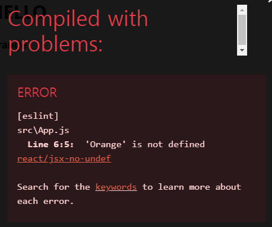
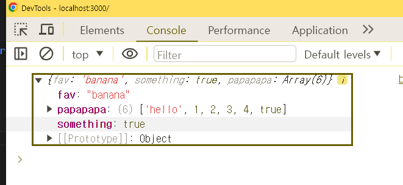
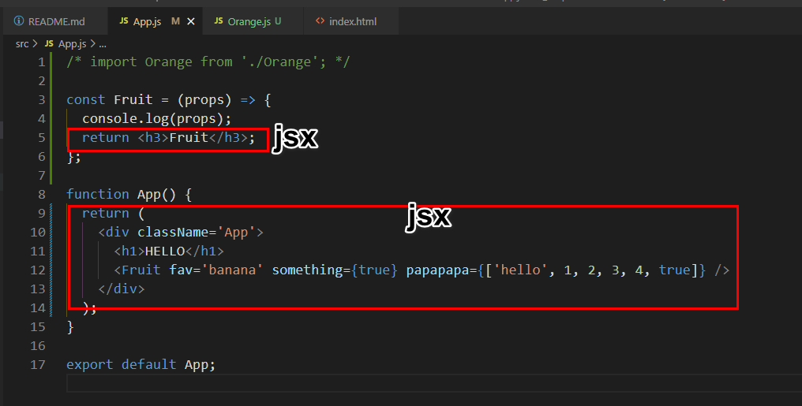

### 목차 <!-- omit in toc -->

- [1. 컴포넌트와 프롭스란?](#1-컴포넌트와-프롭스란)
- [2. App.js 파일로 컴포넌트의 정의 알아보기](#2-appjs-파일로-컴포넌트의-정의-알아보기)
- [3. index.js 파일로 컴포넌트의 사용 알아보기](#3-indexjs-파일로-컴포넌트의-사용-알아보기)
- [4. JSX 문법 알아보기](#4-jsx-문법-알아보기)
	- [4.1. Orange 컴포넌트 만들기](#41-orange-컴포넌트-만들기)
	- [4.2. Orange 컴포넌트 작성하기](#42-orange-컴포넌트-작성하기)
	- [4.3. 마지막 줄에 export default Orange;를 추가](#43-마지막-줄에-export-default-orange를-추가)
	- [4.4. Orange 컴포넌트 사용하기](#44-orange-컴포넌트-사용하기)
- [5. index.js를 원래대로 돌려 놓자.](#5-indexjs를-원래대로-돌려-놓자)
- [6. App.js 파일의 App 컴포넌트에 Orange 컴포넌트 임포트하기](#6-appjs-파일의-app-컴포넌트에-orange-컴포넌트-임포트하기)
- [7. 개발자 도구에서 Orange 컴포넌트를 살펴보자.](#7-개발자-도구에서-orange-컴포넌트를-살펴보자)
- [8. Orange.js 파일을 삭제하고 App.js 파일 수정하기](#8-orangejs-파일을-삭제하고-appjs-파일-수정하기)
- [9. App 컴포넌트 안에 Orange 컴포넌트 만들기](#9-app-컴포넌트-안에-orange-컴포넌트-만들기)
- [10. jsx 정리](#10-jsx-정리)
- [11. props](#11-props)
	- [11.1. 컴포넌트 여러 개 사용해 보기](#111-컴포넌트-여러-개-사용해-보기)
	- [11.2. 다음과 같이 Foods컴포넌트를 15개 복사해서 붙여 넣어 보자](#112-다음과-같이-foods컴포넌트를-15개-복사해서-붙여-넣어-보자)
	- [11.3. props로 컴포넌트에 데이터 전달하기1](#113-props로-컴포넌트에-데이터-전달하기1)
	- [11.4. props로 컴포넌트에 데이터 전달하기2](#114-props로-컴포넌트에-데이터-전달하기2)
	- [11.5. Fruit 컴포넌트에 props 전달하기3](#115-fruit-컴포넌트에-props-전달하기3)
	- [11.6. Fruit 컴포넌트에 props 전달하기4](#116-fruit-컴포넌트에-props-전달하기4)
	- [11.7. Fruit 컴포넌트에 props 전달하기5](#117-fruit-컴포넌트에-props-전달하기5)
	- [11.8. Fruit 컴포넌트에 props 전달하기6](#118-fruit-컴포넌트에-props-전달하기6)
	- [11.9. Fruit 컴포넌트에 props 전달하기7 (props 다시 한번 사용하기)](#119-fruit-컴포넌트에-props-전달하기7-props-다시-한번-사용하기)
	- [11.10. Fruit 컴포넌트에 props 전달하기8](#1110-fruit-컴포넌트에-props-전달하기8)
	- [11.11. 구조 분해 할당으로 props 사용하기](#1111-구조-분해-할당으로-props-사용하기)
	- [11.12. 여러 개의 컴포넌트에 props 사용하기](#1112-여러-개의-컴포넌트에-props-사용하기)
- [12. 여기까지 깃허브에 올리기](#12-여기까지-깃허브에-올리기)
- [13. 완성코드](#13-완성코드)

---

[!button size='l' variant='danger' icon='download' text='유튜브 강의 완성코드' target='blank'](./assets/03/src.zip)

---

## 1. 컴포넌트와 프롭스란?

:::comment_box{.h6}
**component**: 두번이상 사용되는 UI 요소를 사용자정의 태그로 만들어 사용하는 것

**props**: 컴포넌트에 전달하는 데이터
:::

## 2. App.js 파일로 컴포넌트의 정의 알아보기

- ./src/App.js 파일을 열고 App() 함수와 App() 함수가 반환하는 값을 보자.

```jsx
import React from 'react';

function App() {
	//App() 컴포넌트를 정의했고,
	return (
		// App 컴포넌트는 HTML을 반환하고 있다.
		<div>
			<h1>Hello</h1>
		</div>
	);
}

export default App;
```

{.desc}

- App() 함수가 정의되어 있고, 이 함수가 `<div><h1>Hello</h1></div>`를 반환하고 있다.
- 바로 App 컴포넌트를 정의한 것이다.
- App() 함수가 반환한 HTML이 리액트 앱 화면에 그려지는 것이다.

## 3. index.js 파일로 컴포넌트의 사용 알아보기

- `./src/index.js` 파일을 열고 <App />이라고 입력한 내용에 집중해 보자.

```jsx
import React from 'react';
import ReactDOM from 'react-dom/client';
import './index.css';
import App from './App';
import reportWebVitals from './reportWebVitals';

const root = ReactDOM.createRoot(document.getElementById('orange'));
console.log(ReactDOM);
root.render(
	<React.StrictMode>
		<App />
	</React.StrictMode>
);

// If you want to start measuring performance in your app, pass a function
// to log results (for example: reportWebVitals(console.log))
// or send to an analytics endpoint. Learn more: https://bit.ly/CRA-vitals
reportWebVitals();
```

{.desc}

- App 컴포넌트 생김새가 마치 HTML 태그 같다.
  하지만 HTML에는 `<App />`이라고 생긴 태그가 없다.
  실제로 `<App />`는 HTML 태그가 아니기도 하다.
- root.render() 의 인자로 `<App />`을 전달하면 App 컴포넌트가 반환하는 것들을 화면에 그릴 수 있다.
  아이디가 root인 앨리먼트는 public/index.html에 정의되어 있다.
- 리액트는 `<App />`과 같은 표시를 컴포넌트로 인식하고, 그 컴포넌트가 반환하는 값을 화면에 그려준다.
  그래서 컴포넌트를 사용할 때 `<App />`가 아니라 App이라고 입력하면 오류가 발생한다.
- 여기서 집중할 내용은 리액트는 컴포넌트와 함께 동작하고, 리액트 앱은 모두 컴포넌트로 구성된다.

## 4. JSX 문법 알아보기

:::comment_box
우리는 아직 컴포넌트를 만든 적이 없다.
컴포넌트는 어떻게 만들까?
컴포넌트는 자바스크립트와 HTML을 조합한
**JSX(Javascript XML의 약자로 '자바스크립트에 XML을 추가한 확장형 문법')**
라는 문법을 사용해서 만든다.
JSX는 HTML과 자바스크립트를 조합한 것으로 별도로 학습할 필요가 없다.
컴포넌트를 만들다 보면 자연스럽게 JSX 문법을 어떻게 사용해야 하는지 알게 된다.
:::

### 4.1. Orange 컴포넌트 만들기

- src/Orange.js라는 이름의 새로운 파일을 만들어 보자.
- 파일 이름에서 첫 번째 글자는 반드시 대문자로 입력한다.
- 그후 아래의 코드를 입력한다.

```jsx
import React from 'react';
```

- 이 코드는 리액트 패키지로 부터 리액트 컴포넌트를 만드는 모듈울 불러온다는 의미이다.
- react 18버전 이후로 위의 import 는 생략가능하다
- 컴포넌트를 만들때 때 **중요한 규칙은 이름은 대문자로 시작해야 한다는 점**이다.
-

### 4.2. Orange 컴포넌트 작성하기

- 다음과 같이 Orange() 함수를 작성해 보자.

```jsx
import React from 'react';

const Orange = () => {
	return (
		<h3>Orange</h3> // HTML이 아니라 JSX이다.
	);
};
```

- Orange 컴포넌트의 기본 틀이 완성되었다.
- 이제 컴포넌트가 반환할 값을 입력하면 된다. 이때 컴포넌트가 반환할 값은 JSX문법으로 작성한다.

### 4.3. 마지막 줄에 export default Orange;를 추가

```jsx
import React from 'react';

const Orange = () => {
	return (
		<h3>Orange</h3> // HTML이 아니라 JSX이다.
	);
};

export default Orange;
```

- export default Orange; 를 추가하면 다른 파일에서 Orange 컴포넌트를 사용할 수 있다.
  컴포넌트란 재사용 가능한 UI를 의미하므로 이 파일은 다른 파일에서 여러번 불러서 사용한다는 의미이다.
  그렇기 때문에 반드시 내보내기를 해야한다.
  자! 컴포넌트를 완성했다. 이제 완성한 컴포넌트를 사용해 보자.

### 4.4. Orange 컴포넌트 사용하기

- ~~<React.StrictMode>~~ 를 삭제후 아래와 같이 Orange 컴포넌트를 추가한다.
- StrictMode 는 애플리케이션 내의 잠재적인 문제를 알아내기 위한 도구이다. 사용하면 좋으나 초심자의 개발단계에서는 사용할 일이 거의 없으므로 삭제한다.
  실무에서는 사용하는것을 추천한다.

```jsx #9-12
import React from 'react';
import ReactDOM from 'react-dom/client';
import './index.css';
import App from './App';
import Orange from './Orange';
import reportWebVitals from './reportWebVitals';

const root = ReactDOM.createRoot(document.getElementById('orange'));
root.render(
	  <App />
    <Orange />
);

// If you want to start measuring performance in your app, pass a function
// to log results (for example: reportWebVitals(console.log))
// or send to an analytics endpoint. Learn more: https://bit.ly/CRA-vitals
reportWebVitals();

```

- **오류가 발생**한다.
  오류 메세지는 '인접한 JSX 요소는 반드시 하나의 태그로 감싸야 합니다.'라고 말한다.
  리액트는 단 한개의 컴포넌트를 그려야 하는데 지금은 두 개의 컴포넌트를 그려야 해서 오류가 발생한 것이다.
  그러니 Orange 컴포넌트는 App 컴포넌트 안에 넣어야 한다.

## 5. index.js를 원래대로 돌려 놓자.

```jsx #9
import React from 'react';
import ReactDOM from 'react-dom/client';
import './index.css';
import App from './App';
~~import Orange from './Orange';~~
import reportWebVitals from './reportWebVitals';

const root = ReactDOM.createRoot(document.getElementById('root'));
root.render(<App />);

// If you want to start measuring performance in your app, pass a function
// to log results (for example: reportWebVitals(console.log))
// or send to an analytics endpoint. Learn more: https://bit.ly/CRA-vitals
reportWebVitals();

```

## 6. App.js 파일의 App 컴포넌트에 Orange 컴포넌트 임포트하기

```jsx
import Orange from './Orange'; //같은 경로의 Orange 모듈 내 Orange 컴포넌트를 불러옴
function App() {
	return (
		<div className='App'>
			<h1>HELLO</h1>
			<Orange />
		</div>
	);
}

export default App;
```

- 여기까지 확인하면 'love orange'가 출력되었다.

## 7. 개발자 도구에서 Orange 컴포넌트를 살펴보자.

- 개발자 도구의 [Element] 탭을 열어 코드를 살펴보면, 리액트가 <Orange />를 해석해서 <h3>I love orange</h3>로 만들었다.
  이것이 컴포넌트와 JSX가 리액트에서 동작하는 방식이다.
  컴포넌트는 JSX로 만들고, JSX는 자바스크립트와 HTML을 조합한 문법을 사용한다는 말이 이제는 조금 이해가 될 것이다.

## 8. Orange.js 파일을 삭제하고 App.js 파일 수정하기

- Orange.js 파일을 삭제하고 App.js 파일에서 Orange 컴포넌트를 import하는 코드를 지우자.

```jsx
import React from 'react';

function App() {
	return (
		<div>
			<h1>Hello</h1>
			<Orange />
		</div>
	);
}

export default App;
```

- 위 코드를 실행하면 오류 메세지가 나온다.
  오류 메세지의 내용은 'App.js 파일에 Orange가 없어서 컴파일에 실패했다'라는 내용이다.
  이제 이 오류를 해결하기 위해 App.js 파일 안에 Orange 컴포넌트를 만든 다음 Orange 컴포넌트를 사용해 보자.

 {.shadow}

## 9. App 컴포넌트 안에 Orange 컴포넌트 만들기

- src/App.js를 열고 다음과 같이 App 컴포넌트를 수정해서 Orange 컴포넌트를 만들어 보자.
  즉, App.js 파일에 Orange() 함수를 만들어 보자.

```jsx #3-5
import React from 'react';

const Orange = () => {
	return <h3>Orange</h3>;
};

function App() {
	return (
		<div>
			<h1>Hello</h1>
			<Orange />
		</div>
	);
}

export default App;
```

- 에러를 일으키며 중지되었던 앱이 다시 정상으로 작동한다.
  App.js 파일 안에 Orange 컴포넌트를 만들었고, Orange 컴포넌트를 App 컴포넌트 안에서 사용했다.
- 컴포넌트내에 중첩하여 컴포넌트를 작성할수 있다.
- 중첩컴포넌트 내에서는 import 문이 없이도 불러오기가 가능하다.

## 10. jsx 정리

:::comment_box
jsx 란 자바스크립트로 UI요소를 반환하는 컴포넌트를 만드는 문법이다. {.h5 .c-tone-80}

> 컴포넌트규칙 {.h5}
>
> 1. 파일명은 대문자로 시작
> 1. 반드시 `return` 으로 반환값이 있어야 하며 `return` 문의 반환값은 반드시 UI요소(즉 유사태그) 이어야 한다.
> 1. 최상위 요소는 단 한개만 가능하다.
> 1. 중첩컴포넌트는 import 를 생략해도 된다.

:::

## 11. props

:::comment_box {.h6}
props는 간단히 말하자면 컴포넌트에서 컴포넌트로 전달하는 데이터를 말한다.
함수의 매개변수라는 개념을 알고 있다면 매개변수를 이용하면 함수를 효율적으로 재사용할 수 있다는 것을 알 것이다.
컴포넌트의 props도 비슷하다. props를 사용하면 컴포넌트를 효율적으로 재사용할 수 있다.

:::

### 11.1. 컴포넌트 여러 개 사용해 보기

- 만약 우리가 만든 앱에 음식 목록이 있고, 그 음식목록을 컴포넌트로 표현한다고 해보자. 그런 상황을 가정하기 위해 Orange 컴포넌트의 이름을 Foods로 바꿔 보자.

```jsx
/* import Orange from './Orange'; */

const Foods = () => {
	return <h3>Foods</h3>;
};

function App() {
	return (
		<div className='App'>
			<h1>HELLO</h1>
			<Foods />
		</div>
	);
}

export default App;
```

- Foods컴포넌트 1개가 음식목록 1개라고 생각하면 만약 음식목록을 15개 그리려면 어떻게 해야 할까?

### 11.2. 다음과 같이 Foods컴포넌트를 15개 복사해서 붙여 넣어 보자

```jsx
import React from 'react';

const Foods = () => {
	return <h3>Foods</h3>;
};

function App() {
	return (
		<div>
			<h1>Hello</h1>
			<Foods />
			<Foods />
			<Foods />
			<Foods />
			<Foods />
			<Foods />
			<Foods />
			<Foods />
			<Foods />
			<Foods />
			<Foods />
			<Foods />
			<Foods />
			<Foods />
			<Foods />
			<Foods />
		</div>
	);
}

export default App;
```

- 위와 같이 코드를 구성한다면 Foods컴포넌트가 15개나 되는데 출력하는 값이 모두Foods로 같다는 것도 문제이다.
  컴포넌트가 서로 다른 값을 출력해야 앱의 목록을 구현할 수 있을 텐데...
  그래서 **컴포넌트로 데이터를 보내는 방법이 필요하다. 그 방법이 props**이다.

### 11.3. props로 컴포넌트에 데이터 전달하기1

- ./src/App.js 파일의 컴포넌트의 이름을 Foods에서 Fruit로 변경하자. 그리고 Foods 컴포넌트는 모두 삭제하자.
- h1 의 컨텐츠도 hello 로 변경한다.

```jsx
/* import Orange from './Orange'; */

const Fruit = () => {
	return <h1>I like orange</h1>;
};

function App() {
	return (
		<div className='App'>
			<h1>HELLO</h1>
			<Fruit />
		</div>
	);
}

export default App;
```

- 임시로 과일을 주제로 리액트 앱을 만들어 볼 것이다. 그냥 과일 앱이라고 부르자. props는 컴포넌트로 데이터를 보낼 때 사용할 수 있다고 했다. 이제 props를 이용하여 Fruit 컴포넌트에 데이터를 보내 보자.

### 11.4. props로 컴포넌트에 데이터 전달하기2

- ./src/App.js 파일의 <Fruit />를 <Fruit fav="banana" />로 수정해 보자. fav props의 값으로 "banana"를 추가하는 것이다.

```jsx
import React from 'react';

function Fruit() {
	return <h1>I like orange</h1>;
}

function App() {
	return (
		<div>
			<h1>Hello</h1>
			<Fruit fav='banana' />
		</div>
	);
}

export default App;
```

- 이게 바로 props를 이용하여 Fruit 컴포넌트에 데이터를 보내는 방법이다.
  Fruit 컴포넌트에 사용한 props의 이름은 fav이고, fav에 "banana"라는 값을 담아 Fruit 컴포넌트에 보낸 것이다.
- props에는 불리언 값(true, false), 숫자, 배열과 같은 다양한 형태의 데이터를 담을 수 있다.
  여기서 주의할 점은 **props에 있는 데이터는 문자열인 경우를 제외하면 모두 중괄호 `{}`로 값을 감싸야 한다는 점**이다.

### 11.5. Fruit 컴포넌트에 props 전달하기3

- ./src/App.js 파일의 Fruit 컴포넌트에 something, papapapa props를 추가해 보자. 그리고 수정한 파일을 저장.

```jsx
import React from 'react';

function Fruit() {
	return <h1>I like orange</h1>;
}

function App() {
	return (
		<div>
			<h1>Hello</h1>
			<Fruit fav='banana' something={true} papapapa={['hello', 1, 2, 3, 4, true]} />
		</div>
	);
}

export default App;
```

```
jsx 문서 내에서 자바스크립트 표현식의 출력은 `{}`를 사용한다.
something 의 값은 자바스크립트의 논리자료형 true 이므로 `{}`로 묶어야 자바스크립트 표현식으로 렌더링할수 있다.
```

### 11.6. Fruit 컴포넌트에 props 전달하기4

- ./src/App.js 파일을 수정한 상태에서 리액트 앱을 실행해 보자.
- 그러면 아무런 변화가 없을 것이다. 왜 그럴까? Fruit 컴포넌트에 props를 보내기만 했을 뿐 아직 사용하지 않았기 때문이다.
  그럼 Fruit 컴포넌트에서 props를 사용하려면 어떻게 해야 할까?

### 11.7. Fruit 컴포넌트에 props 전달하기5

- ./src/App.js 파일에서 일단 Fruit 컴포넌트의 인자로 전달된 props를 출력해 보자.

  ```jsx
  const Fruit = (props) => {
  	console.log(props);
  	return <h1>I like orange</h1>;
  };
  ```




- 리액트의 jsx는 return 함수내의 반환값이 태그인것을 의미한다.
- 그러므로 return 이전의 코드는 jsx 가 아닌 자바스크립트 이므로 바닐라자바스크립트 문법을 사용할수 있다.

### 11.8. Fruit 컴포넌트에 props 전달하기6

- 크롬의 개발자 도구를 실행해서 [Console] 탭을 눌러 보자.
- Fruit 컴포넌트에 전달한 props(fav, something, papapapa)를 속성으로 가지는 객체(Object)가 출력되었다. fav, something, papapapa의 값이 Fruit 컴포넌트의 첫 번째 인자(props)로 전달되는 과정을 확인할 수 있다.

### 11.9. Fruit 컴포넌트에 props 전달하기7 (props 다시 한번 사용하기)

- ./src/App.js 파일에서 코드를 다음과 같이 수정해보자. 일단 something, papapapa, props는 사용하지 않을 거니까 지우자.

```jsx
...
function App() {
	return (
		<div className='App'>
			<h1>HELLO</h1>
			<Fruit fav='banana' />
		</div>
	);
}
...
```

- 그러면 콘솔에 {fav: "banana"}만 출력될 것이다. 만약 문자열 "banana"를 화면에 그대로 출력하고 싶다면 어떻게 해야 할까?

### 11.10. Fruit 컴포넌트에 props 전달하기8

- `/src/App.js` 파일에서 Fruit 컴포넌트에 있는 데이터 "banana"를 화면에 출력하자면 props.fav를 중괄호로 감싸면 된다.

```jsx
...
const Fruit = (props) => {
	console.log(props.fav);
  return <h3>{props.fav}</h3>;
};
...
```

### 11.11. 구조 분해 할당으로 props 사용하기

🔗[03.destructuring](https://www.notion.so/03-destructuring-fb5e84cada484fe6832cb9c9b45b82d3?pvs=21)

- 자바스크립트의 ES6 문법 중 구조 분해 할당(destrueturing-assignment)를 사용하면 점 연산자를 사용하지 않아도 된다. 다음은 **Fruit 컴포넌트로 전달한 fav props를 Fruit 컴포넌트(함수)에서 {fav} = props; 와 같은 방법으로 사용**한 예이다.

```jsx
/* import Orange from './Orange'; */

const Fruit = (props) => {
	//const fav = props.fav;
	const { fav } = props;
	console.log(fav);
	return <h3>{fav}</h3>;
};

function App() {
	return (
		<div className='App'>
			<h1>HELLO</h1>
			<Fruit fav='banana' />
		</div>
	);
}

export default App;
```

- props에 포함된 데이터의 개수가 적으면 점 연산자를 사용하여 props.fav와 같은 방법으로 사용해도 불편하지 않지만, props에 포함된 데이터의 개수가 많아지면 매번 props.fav와 같은 방법으로 사용하면 불편하다. 이 경우 구조 분해 할당을 사용하면 편리하다.
- 구조 분해 할당은 객체에 있는 키값을 편하게 추출할 수 있게 해주는 자바스크립트 문법이다.

### 11.12. 여러 개의 컴포넌트에 props 사용하기

- Fruit 컴포넌트를 3개 추가하고 fav props의 값이 서로 다르도록 코드를 수정하자.

```jsx
import React from 'react';

function Fruit({ fav }) {
	return <h1>I like{fav}</h1>;
}

function App() {
	return (
		<div>
			<h1>Hello</h1>
			<Fruit fav='banana' />
			<Fruit fav='orange' />
			<Fruit fav='apple' />
			<Fruit fav='melon' />
		</div>
	);
}

export default App;
```

- 이번 액션에서는 Fruit 컴포넌트를 4개 사용해 각 컴포넌트에 전달한 fav props를 출력했다. 각각의 fav props에는 서로 다른 값이 들어 있으니까 같은 컴포넌트를 사용해도 서로 다른 문장이 출력된 것이다. 이렇게 하는 것을 컴포넌트 재 사용라고 한다.
- 배운 내용을 정리해 보자.

1. **컴포넌트가 무었인지 알아보고 JSX를 공부했다.**
2. **JSX는 단지 HTML과 자바스크립트를 조합한 문법이다.**
3. **JSX를 이용해서 컴포넌트를 작성했다. (컴포넌트의 이름은 대문자로 시작함에 유의!)**
4. **컴포넌트에 데이터를 전달할 때는 props 사용하면 된다.**

- **컴포넌트에 props를 전달하면 props에 있는 데이터가 하나의 객체로 변환되어 컴포넌트(함수)의 인자로 전달되고, 이걸 받아서 컴포넌트(함수)에서 사용할 수 있었다. ES6의 구조 분해 할당을 사용하면 props를 좀 더 편리한 방법으로 사용할 수 있었고, 앱을 만들 때 이 패턴이 사용되니까 잘 기억하고 넘어가자.**

## 12. 여기까지 깃허브에 올리기

```
$ git add .
$ git commit -m "03 깃허브에 리액트 앱 업로드하기"
$ git push origin main
```

## 13. 완성코드

[!button size="l" variant='primary' icon='mark-github' text='완성소스코드' target='blank'](https://github.com/qwerewqwerew/recipeApp/tree/chap3)
