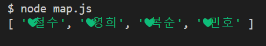
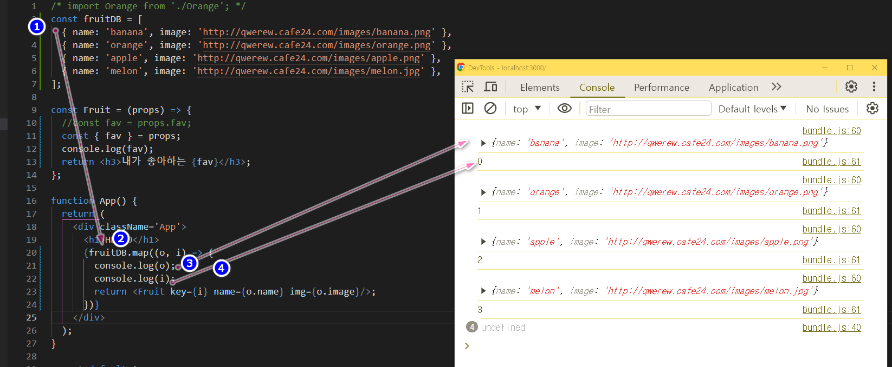
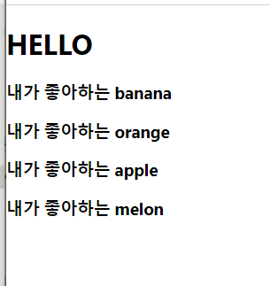
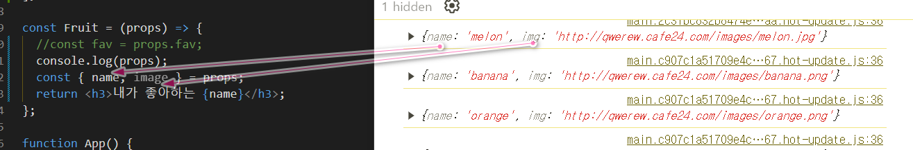
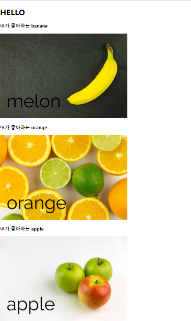
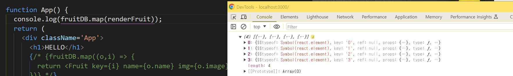

### 목차 <!-- omit in toc -->
- [1. 비슷한 컴포넌트 여러 개 만들기](#1-비슷한-컴포넌트-여러-개-만들기)
	- [1.1. 시작파일 내려받기](#11-시작파일-내려받기)
	- [1.2. 앞에서 만든 컴포넌트 형태 다시 살펴보기](#12-앞에서-만든-컴포넌트-형태-다시-살펴보기)
	- [1.3. 과일 데이터 만들기1](#13-과일-데이터-만들기1)
	- [1.4. 과일 데이터 만들기2](#14-과일-데이터-만들기2)
- [2. map() 함수로 컴포넌트 많이 만들기](#2-map-함수로-컴포넌트-많이-만들기)
	- [2.1. map() 함수 사용법 알아보기1](#21-map-함수-사용법-알아보기1)
	- [2.2. map() 함수 사용법 알아보기2](#22-map-함수-사용법-알아보기2)
	- [2.3. map() 함수로 Fruit 컴포넌트를 많이 만들어 보기1](#23-map-함수로-fruit-컴포넌트를-많이-만들어-보기1)
	- [2.4. map() 함수로 Fruit 컴포넌트를 많이 만들어 보기2](#24-map-함수로-fruit-컴포넌트를-많이-만들어-보기2)
	- [2.5. Fruit 컴포넌트에 과일 이미지 출력하기1](#25-fruit-컴포넌트에-과일-이미지-출력하기1)
	- [2.6. 추가설명 React에서 map을 사용하다보면 console에서 다음과 같은 경고 메시지 해결방법](#26-추가설명-react에서-map을-사용하다보면-console에서-다음과-같은-경고-메시지해결방법)
- [3. 과일 앱 이리저리 만지고, 고쳐보기](#3-과일-앱-이리저리-만지고-고쳐보기)
	- [3.1. map() 함수의 인자로 함수 전달하기](#31-map-함수의-인자로-함수-전달하기)
	- [3.2. renderFruit() 함수 정의하기](#32-renderfruit-함수-정의하기)
	- [3.3. map() 함수의 반환값 살펴보기](#33-map-함수의-반환값-살펴보기)
	- [3.4. 과일 앱 다시 원래대로 돌려놓기](#34-과일-앱-다시-원래대로-돌려놓기)
- [4. 여기까지 깃허브에 올리기](#4-여기까지-깃허브에-올리기)
- [5. 완료파일 내려받기](#5-완료파일-내려받기)

## 1. 비슷한 컴포넌트 여러 개 만들기

:::comment_box
우리는 앞에서 컴포넌트를 많이 만들 때 `<Fruit /> <Fruit /> <Fruit /> ... `와 같이 컴포넌트를 직접 입력했다.
이게 최선의 방법일까?
어떻게 하면 컴포넌트를 효율적으로 출력할 수 있는지 알아보자.
:::

### 1.1. 시작파일 내려받기
> 만약 전시간 파일이 없을 경우 아래의 파일을 다운로드 하여 진행한다

[!button variant='success' icon='download' text='시작 파일' target='blank'](./assets/04/start.zip)

==- 파일활용방법
1. 다운로드 받은 start.zip 파일의 압축을 푼다
2. 새 리액트 앱을 설치한다. 리액트 앱 설치를 모를경우 아래 링크를 참고한다.
    [!ref target='blank' text='리액트 설치안내' icon='link'](../리액트좀해라/1.md)
3. 리액트 앱의 설치가 왼료 되었으면 1번의 파일압축을 푼다
4. 압축을 풀게 되면 start/src 폴더가 있다.
5. 2번의 src폴더에 4번의 src 폴더를 덮어 씌운다.
	
6. 2번의 폴더를 루트로 선택하여 vscode를 연다.
7. vscode 의 터미널에 npm start 를 입력하여 앱을 실행한다.
===

### 1.2. 앞에서 만든 컴포넌트 형태 다시 살펴보기


- 우리가 마지막으로 작성한 App.js 파일을 다시 열어 코드가 효율적인지 살펴보자.

```jsx #
import React from 'react';

function Fruit({ fav }) {
	return <h1>내가 좋아하는{fav}</h1>;
}

function App() {
	return (
		<div>
			<h1>Hello</h1>
			<Fruit fav='바나나' />
			<Fruit fav='오렌지' />
			<Fruit fav='사과' />
			<Fruit fav='메론' />
		</div>
	);
}

export default App;
```

- 이 코드는 효율적이지 않다. 왜냐하면 새 과일을 추가할 때마다 <Fruit fav="..." />를 복사해야 하기 때문이다.
  만약 과일이 1000개라면 1000개를 반복해서 작성해야 하고, 그때마다 fav props에 다른 값을 입력해야 한다.
- 또 서버에서 과일 데이터를 받아 출력하는 경우, 과일 데이터의 개수를 알 수 없다면 이 방법은 문제가 될 것이다.
  그때그때 서버에서 넘어오는 데이터 개수만큼 컴포넌트를 작성할 수 없기 때문에...
- 지금부터 이 문제를 해결하는 방법을 알아 보자.
  다만! 우리는 아직 서버에서 데이터를 받아오는 방법을 모르니까 일단 서버에서 데이터를 받았다고 가정하고, 그 데이터를 출력하는 방법을 알아보자.

### 1.3. 과일 데이터 만들기1

- 서버에서 넘어온 데이터를 저장할 수 있도록 fruitIDB라는 변수를 만든 다음 빈 배열을 할당하자.
  그리고 아쉽지만 App 컴포넌트 안에 한 땀 한 땀 입력했던 Fruit 컴포넌트는 모두 삭제하자.

```jsx #
import React from 'react';

function Fruit({ fav }) {
	return <h1>내가 좋아하는 {fav}</h1>;
}

const fruitDB = []; // fruitDB 변수에 빈 배열을 저장해!

function App() {
	return (
		<div>
			<h1>Hello</h1>
		</div>
	);
}

export default App;
```

### 1.4. 과일 데이터 만들기2

- image 키의 값은 아래 주소를 복붙한다.

```jsx #
'http://qwerew.cafe24.com/images/banana.png';
'http://qwerew.cafe24.com/images/orange.png';
'http://qwerew.cafe24.com/images/apple.png';
'http://qwerew.cafe24.com/images/melon.jpg';
```

- 아래는 fruitDB 의 완성된 데이터구조 이다.
  오타가 났을 경우 복사하여 사용한다.

```jsx #
const fruitDB = [
	{ name: 'banana', image: 'http://qwerew.cafe24.com/images/banana.png' },
	{ name: 'orange' image: 'http://qwerew.cafe24.com/images/orange.png' },
	{ name: 'apple', image: 'http://qwerew.cafe24.com/images/apple.png' },
	{ name: 'melon', image: 'http://qwerew.cafe24.com/images/melon.jpg' },
];

...
export default App;
```

## 2. map() 함수로 컴포넌트 많이 만들기

- fruitIDB에 있는 데이터로 컴포넌트를 여러 개 만들려면 자바스크립트 함수 map()의 사용 방법을 알아야 한다.

### 2.1. map() 함수 사용법 알아보기1
[🔗mdn](https://developer.mozilla.org/ko/docs/Web/JavaScript/Reference/Global_Objects/Array/map)
- map 메소드: 배열이 갖고있는 함수. 콜백함수에서 리턴된 값을 기반으로 새 배열 생성함

```html
/*기존의 배열요소를 기반으로 새로운 배열요소를 만들어 리턴*/
<script>
	let cats = ['땅콩', '얼룩', '회색'];
	let call = cats.map(function (value, index, array) {
		//return value, index, array;
		return value + '밥먹자!!';
	});
	//땅콩밥먹자,얼룩밥먹자,회색밥먹자 출력됨
	//매개변수 value를 추가하여 새 배열로 생성함

	document.write(call);
</script>

-------------------------------------------------------------------------------------

<script>
	// 배열을 선언.
	let numbers = [273, 52, 103, 32, 57];

	// 배열의 모든 값을 두배로.
	let doubles = numbers.map(function (value) {
		return value * 2;
	});

	// 출력.
	console.log(doubles);

</script>
```

### 2.2. map() 함수 사용법 알아보기2

+++ 지시문
!!!info
map 함수를 사용하여 아래와 같은 결과를 출력하시오


!!!

시작코드

```
const frends = ['철수', '영희','복순','민호'];
```

+++ 정답

```js
const frends = ['철수', '영희', '복순', '민호'];
const add = frends.map((o) => {
	return '❤' + o;
});
console.log(add);
```

+++

### 2.3. map() 함수로 Fruit 컴포넌트를 많이 만들어 보기1

- 자 이제 크롬 브라우저에서 벗어나 VSCode 화면으로 돌아가서 ./src/App.js를 보자.
  그리고 fruitIDB 배열을 다시 한번 눈으로 확인하면서 map 함수를 어떻게 적용할지 설계해 보자.

```
(생략...)
const fruitDB = [
  {
      name : 'banana',
      image: 'http://qwerew.cafe24.com/images/banana.png',
  },
  {
      name : 'orange',
      image: 'http://qwerew.cafe24.com/images/orange.png',
  },
(생략...)
```

- fruitDB.map(...)과 같이 작성하고, map() 함수에 전달할 인자에는 value => <Fruit .../>와 같이 컴포넌트를 반환하는 함수를 전달하면 될 것이다.
  value에는 배열에 있는 원소, 즉 객체 [name: '...', image: '...']이 하나씩 넘어올 것이다.
  이걸 value.name, value.image와 같은 방법으로 컴포넌트에 전달하면 된다.
  이제 천천히 코딩해 보자.

### 2.4. map() 함수로 Fruit 컴포넌트를 많이 만들어 보기2

- map() 함수를 fruitDB배열에 적용하여 코드를 작성해 보자.
`<h1> Hello </h1>`은 삭제하고, `[fruitDB.map(...)]`을 추가하면 된다.

3.  그리고 fruit 컴포넌트에서 받은 인자를 {name}로 수정한다.



```jsx #
const fruitDB = [
	{ name: 'banana', image: 'http://qwerew.cafe24.com/images/banana.png' },
	{ name: 'orange' image: 'http://qwerew.cafe24.com/images/orange.png' },
	{ name: 'apple', image: 'http://qwerew.cafe24.com/images/apple.png' },
	{ name: 'melon', image: 'http://qwerew.cafe24.com/images/melon.jpg' },
];

const Fruit = (props) => {
	//const fav = props.fav;
	console.log(props);
	const { name, img } = props;
	return <h3>내가 좋아하는 {name}</h3>;
};

function App() {
	return (
		<div className='App'>
			{fruitDB.map((o, i) => {
				// console.log(o);
				// console.log(i);
				return <Fruit key={i} name={o.name} img={o.image} />;
			})}
		</div>
	);
}

export default App;
```

 {.shadow}

 {.shadow}

### 2.5. Fruit 컴포넌트에 과일 이미지 출력하기1

```jsx #
const Fruit = (props) => {
	//const fav = props.fav;
	console.log(props);
	const { name, img } = props;
	return (
		<div>
			<h3>내가 좋아하는 {name}</h3>
			
		</div>
	);
};
```

- 이제 과일의 이름과 이미지가 모두 나타난다. 이렇게 map() 함수를 사용하면 배열에 데이터가 몇 개 있던지 컴포넌트를 쉽게 출력할 수 있다.
  

### 2.6. 추가설명 React에서 map을 사용하다보면 console에서 다음과 같은 경고 메시지 해결방법

```
> Warning: Each child in a list should have a unique "key" prop.
```

- list 내의 각 child에는 고유한 "key"prop이 있어야한다. 즉, 모든 react의 element들은 유일해야하고, element들을 list 안에 넣을 때, 그 고유성을 잃어버린다. for some reason
- 우리가 해야할 일은, list에 id를 추가하는 것이다. 즉, react의 모든 element들은 다르게 보일 필요가 있다.

```jsx #
const fruitDB = [
	{ id: 1, name: 'banana', image: 'http://qwerew.cafe24.com/images/banana.png' },
	{ id: 2, name: 'orange' image: 'http://qwerew.cafe24.com/images/orange.png' },
	{ id: 3, name: 'apple', image: 'http://qwerew.cafe24.com/images/apple.png' },
	{ id: 4,  name: 'melon', image: 'http://qwerew.cafe24.com/images/melon.jpg' },
];
```

- 그리고 컴포넌트에 prop을 준다. 그 prop은 바로 "key"이다.
- 그리고 나면 아래와 같이 key prop을 추가하면 바로 경고 문구가 사라진 것을 볼 수 있다.

```jsx #
/* import 오렌지 from './오렌지'; */
const fruitDB = [
	{ id: 1, name: 'banana', image: 'http://qwerew.cafe24.com/images/banana.png' },
	{ id: 2, name: 'orange' image: 'http://qwerew.cafe24.com/images/orange.png' },
	{ id: 3, name: 'apple', image: 'http://qwerew.cafe24.com/images/apple.png' },
	{ id: 4,  name: 'melon', image: 'http://qwerew.cafe24.com/images/melon.jpg' },
];

const Fruit = (props) => {
	//const fav = props.fav;
	console.log(props);
	const { name, img } = props;
	return (
		<div>
			<h3>내가 좋아하는 {name}</h3>
			
		</div>
	);
};

function App() {
	return (
		<div className='App'>
			<h1>HELLO</h1>
			{fruitDB.map((o, i) => {
				// console.log(o);
				// console.log(i);
				return <Fruit key={i} name={o.name} img={o.image} />;
			})}
		</div>
	);
}

export default App;
```

## 3. 과일 앱 이리저리 만지고, 고쳐보기

- 04-2에서 만든 과일 앱을 이리저리 만져 보면서 리액트와 map() 함수가 어떤 상호 작용을 하는지 조금만 더 자세히 알아보자. 우선 map() 함수와 인자로 함수를 전달하도록 만들어 보자.

### 3.1. map() 함수의 인자로 함수 전달하기

- {fruitIDB.map(dish => ( <Fruit key={dish.id} name={dish.name} picture={dish.image} /> ))}를 {fruitIDB.map( renderFruit )}로 변경하자.

```jsx #
...
{fruitDB.map(renderFruit)}
...
```

- 현재 상태에서는 Error로 실행되지 않는다.

### 3.2. renderFruit() 함수 정의하기

- 그런 다음 renderFruit() 함수를 정의하자

```jsx #
/* import 오렌지 from './오렌지'; */
const fruitDB = [
	{ id: 1, name: 'banana', image: 'http://qwerew.cafe24.com/images/banana.png' },
	{ id: 2, name: 'orange' image: 'http://qwerew.cafe24.com/images/orange.png' },
	{ id: 3, name: 'apple', image: 'http://qwerew.cafe24.com/images/apple.png' },
	{ id: 4,  name: 'melon', image: 'http://qwerew.cafe24.com/images/melon.jpg' },
];

const Fruit = (props) => {
	const { name, img } = props;
	return (
		<div>
			<h3>내가 좋아하는 {name}</h3>
			
		</div>
	);
};
const renderFruit = (o, i) => {
	return <Fruit key={i} name={o.name} img={o.image} />;
};

function App() {
	return (
		<div className='App'>
			<h1>HELLO</h1>
			{/* {fruitDB.map((o,i) => {
				return <Fruit key={i} name={o.name} img={o.image} />;
			})} */}
			{fruitDB.map(renderFruit)}
		</div>
	);
}

export default App;
```

- map() 함수의 첫 번째 인자로 전달한 화살표 함수를 밖으로 빼서 일반 함수 renderFruit()로 작성했을 뿐, 과일 앱의 기능이 달라진 건 아니다. 코드를 저장하고 앱을 실행해 보면 결과 화면은 같다.
- 이제 map() 함수의 1번째 인자로 전달할 renderFruit() 함수를 분리했다. 그러면 계속해서 map() 함수가 반환하는 값이 구체적으로 무엇인지 자세히 살펴보자.

### 3.3. map() 함수의 반환값 살펴보기

- 다음과 같이 코드를 수정해서 map() 함수의 반환값을 그대로 출력해 보자. 그리고 출력한 값을 자세히 보자.

```jsx #
...
function App() {
	console.log(fruitDB.map(renderFruit));
	return (
...
```

- [Console] 탭을 보면 Array(4)가 보일 것이다. ▶를 눌러서 펼쳐보면 뭔가 이상한 배열이 출력되고 있다. 이게 바로 map() 함수가 반환한 리액트 컴포넌트이다. 좀 복잡한 구조임을 알 수 있다. 리액트 컴포넌트가 어떤 구조인지 보고 싶으면 또 다시 ▶를 눌러 펼쳐서 구경하면 된다.



### 3.4. 과일 앱 다시 원래대로 돌려놓기

- renderFruit() 함수는 map() 함수가 반환한 리액트 컴포넌트를 출력하려고 사용해 본 것이므로 다시 원래대로 코드를 돌려놓자.

```jsx #
const fruitDB = [
	{ id: 1, name: 'banana', image: 'http://qwerew.cafe24.com/images/banana.png' },
	{ id: 2, name: 'orange' image: 'http://qwerew.cafe24.com/images/orange.png' },
	{ id: 3, name: 'apple', image: 'http://qwerew.cafe24.com/images/apple.png' },
	{ id: 4,  name: 'melon', image: 'http://qwerew.cafe24.com/images/melon.jpg' },
];

const Fruit = (props) => {
	//const fav = props.fav;
	//console.log(props);
	const { name, img } = props;
	return (
		<div>
			<h3>내가 좋아하는 {name}</h3>
			
		</div>
	);
};
const renderFruit = (o, i) => {
	return <Fruit key={i} name={o.name} img={o.image} />;
};

function App() {
	console.log(fruitDB.map(renderFruit));
	return (
		<div className='App'>
			<h1>HELLO</h1>
			{fruitDB.map((o, i) => {
				return <Fruit key={i} name={o.name} img={o.image} />;
			})}
			{/* {fruitDB.map(renderFruit)} */}
		</div>
	);
}

export default App;
```

- 이렇게 하는 이유는 App.js 안에 또 다른 함수를 만들지 않기 위해서이다. 함수가 많아지면 나중에 관리하기 어려워질 수 있다.

## 4. 여기까지 깃허브에 올리기

```
git add .
git commit -m "04 깃허브에 리액트 앱 업로드하기"
git push origin main
```


## 5. 완료파일 내려받기
[!button variant='success' icon='download' text='완료 파일' target='blank'](./assets/04/chap04_fin.zip)