### 목차 <!-- omit in toc -->
- [1. 클래스컴포넌트 VS 함수컴포넌트](#1-클래스컴포넌트-vs-함수컴포넌트)
- [2. 컴포넌트의 상태관리](#2-컴포넌트의-상태관리)
  - [2.1. index.js](#21-indexjs)
  - [2.2. TimerFn](#22-timerfn)
  - [2.3. TimerCl](#23-timercl)
- [3. 컴포넌트의 생명주기](#3-컴포넌트의-생명주기)
  - [4. 컴포넌트의 라이프 사이클 개요](#4-컴포넌트의-라이프-사이클-개요)
  - [5. 클래스형 컴포넌트의 라이프 사이클 이해](#5-클래스형-컴포넌트의-라이프-사이클-이해)
  - [6. 클래스형 컴포넌트 라이프사이클 함수](#6-클래스형-컴포넌트-라이프사이클-함수)
  - [7. 함수형 컴포넌트의 라이프사이클 이해](#7-함수형-컴포넌트의-라이프사이클-이해)
  - [7.1. useEffect](#71-useeffect)
  - [8. 함수형 컴포넌트 라이프사이클 함수](#8-함수형-컴포넌트-라이프사이클-함수)
  - [8.1. 예제](#81-예제)
- [9. 퀴즈퀴즈!](#9-퀴즈퀴즈)
- [10. 퀴즈퀴즈!](#10-퀴즈퀴즈)
  - [10.1. cleanUp](#101-cleanup)
- [11. 정리](#11-정리)


{.my-box-blue}
> 3차시 컴포넌트의 props 를 기억 할 것이다.
> props란 컴포넌트 간 주고받는 데이터이며 부모가 자식에게 전달할수 있다고 배웠다.
> 그리고 상황예시로 여러 친구를 초대하고 한 테이블 위 3개의 동일한 접시에 3종류의 각기 다른 음식을 전달하는
> 사례를 들어 설명하였다.
> [!ref target='blank' text='영상링크 18:29' icon='link'](https://www.youtube.com/watch?v=ReP1iOyNxF4)
> 그림 1을 리액트 컴포넌트로 구현 할 경우 그림 2 의 구조가 될 것 이다.
> 햄버거,딸기,사과는 컴포넌트로 전달되는 props 즉 속성의 값이 된다.
> 
>
>
> 이번 차시 학습 내용은 아래의 그림처럼 친구가 음식을 먹어버렸을 경우 이다.
> Plate 컴포넌트의 햄버거라는 값이 있다가 없어지게 하려면 어떻게 해야 할까?{.red}
> 
>
> 접시의 햄버거가 <mark>있는 상태에서 없는 상태로 바꾸면</mark> 된다. {.h1}


:::comment_box

리액트 훅은 함수형 컴포넌트(Functional Component)가 클래스형 컴포넌트(Class Component)의 기능을 사용 할 수 있도록 하는 함수이다
use라는 접두사로 시작하며 컴포넌트 함수내에 작성해야 한다.

:::

## 1. 클래스컴포넌트 VS 함수컴포넌트

==- 1. 클래스 컴포넌트
{.mt30}

{.shadow}

==- 2. 함수 컴포넌트

{.shadow}

===

## 2. 컴포넌트의 상태관리

:::comment_box
컴포넌트의 상태를 다룰때는 useState() 훅을 사용한다.

state란 컴포넌트의 상태를 의미하는데 주로 동적 데이터를 다룰 때 사용한다.

동적 데이터란 말 그대로 변경될 가능성이 있는 데이터를 말한다.

객체를 예를 들면 객체의 구성 요소 중 일부가 있다가 없을 수도 있고,
구성 요소가 하나였다가 둘이 될 수도 있는데  props는 그런 데이터를 다루지 못한다.

props 는 컴포넌트 끼리 주고받는 데이터이고 state 는 컴포넌트 내에서 변경되는 데이터로 구분하자

리액트 v16 이하에서는 컴포넌트의 형태에 따라 state 와 Hook 을 구분하였으나 v18이상부터는 useState 를 사용하여 처리한다.

:::

React 에서 컴포넌트 내부의 값 변경시 useState 함수를 사용한다. {.h3 .m-t-60 .c-tone-20}

기본문법 {.h3 .c-tone-20}

```jsx
const [<상태 값 저장 변수>, <상태 값 갱신 함수>] = useState(<상태 초기 값>);
```

[!embed width='100%' height='900'](https://codesandbox.io/p/sandbox/riaegteu-usestate-qg9dyg)

### 2.1. index.js

- index.js를 수정한다.

```jsx
..
import TimerFn from './TimerFn';
import reportWebVitals from './reportWebVitals';

const root = ReactDOM.createRoot(document.getElementById('root'));
root.render(<TimerFn />);
...
```

### 2.2. TimerFn

아래는 함수형 컴포넌트의 상태관리 사례이다.

- TimerFn.js 파일 생성

  ```jsx
  import { useState } from 'react';

  const TimerFn = () => {
  	return (
  		<>
  			<div>TimerFn</div>
  			<h3>0</h3>
  			<button>더하기</button>
  		</>
  	);
  };
  export default TimerFn;
  ```

- useState 를 콘솔로그로 출력해보자

  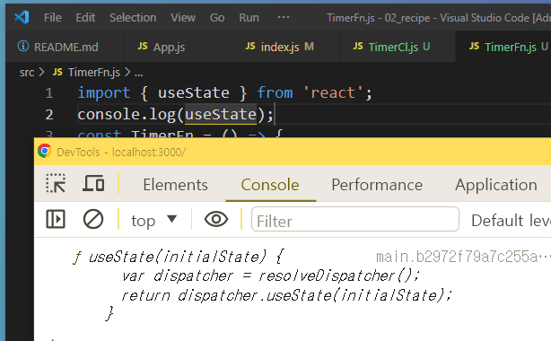{.shadow}

  자료의 타입은 함수이고 변수 dispatcher 과 return 코드가 작성된것을 볼수 있다.

  useState란 리액트의 훅 종류의 하나로 리액트에서 제공하는 내장 함수이다.

  제이쿼리의 show(), hide() 와 유사하다.

  리액트의 훅은 사용시 import 해야하며 컴포넌트 함수내에 작성해야 한다.

  ```jsx
  import { useState } from 'react';
  const TimerFn = () => {
  	let useTime = useState(0);
  	...
  ```

  {.shadow}

변수 useTime 을 선언하고 useState훅의 호출하면서 초기값을 전달한다.

그후 콘솔창에 useTime 변수의 값을 확인해본다.

배열자료형으로 두개의 값이 반환되었으며 첫번째 인자로는 초기값인 0이 두번째 인자로는 함수형태가 반환된것을 볼수 있다.

두번째 인자로 반환된 함수는 컴포넌트 내의 값을 변경할수 있는 함수이며 첫번째 값은 변수의 초기값이다.

- useTime의 반환값이 배열이므로 배열내 원소들을 각각 변수에 할당해보자

  ```jsx
  ...
  const TimerFn = () => {
  	let useTime = useState(0);
  	let time = useTime[0];
  	let setTime = useTime[1];
  	console.log(time);
  	console.log(setTime);
  	...
  ```

{.shadow}

- 변수time 에는 useTime 의 첫번째 값이 확인된다.
- 변수setTime 에는 useTime 의 두번째 값이 확인된다.
- 카운트함수를 작성한다.

  ```jsx
  const updateTime = () => {
  	setTime(time + 1);
  };
  ```

- 버튼에 이벤트리스너를 추가하여 함수를 호출한다

  ```jsx
  <h3>{time}</h3>
  <button onClick={updateTime}>더하기</button>
  ```


💡 주의할점

{.shadow}
이벤트리스너에 바로 setTime 함수호출을 연결할경우 위와 같은 에러 메시지가 확인된다.

이유는 리액트에서 컴포넌트를 다루는 방식은 함수이며 자바스크립트의 함수는 호출시 함수내의 모든 변수와 함수가 초기화 되기 때문이다. (자바스크립트의 평가방식)

바로 호출하지 말고 변수를 참조하는 방법으로 작성해야 한다.

`<button onClick={()=>setTime(time + 1)}>더하기</button>`


- 일반적으로는 이렇게 작성하지 않고 destructuring 을 사용한다.

  ```jsx
  let [time, setTime] = useState(0);
  ```

### 2.3. TimerCl

- 자주 사용하지는 않지만 클래스 기반의 컴포넌트에서 상태를 다뤄보는 학습을 해보자
- index.js 를 수정한다.

  ```jsx
  import React from 'react';
  import ReactDOM from 'react-dom/client';
  import './index.css';
  import App from './App';
  import TimerFn from './TimerFn';
  import TimerCl from './TimerCl';
  import reportWebVitals from './reportWebVitals';

  const root = ReactDOM.createRoot(document.getElementById('root'));
  root.render(<TimerCl />);

  // If you want to start measuring performance in your app, pass a function
  // to log results (for example: reportWebVitals(console.log))
  // or send to an analytics endpoint. Learn more: https://bit.ly/CRA-vitals
  reportWebVitals();
  ```

- react 모듈로부터 Component 라는 컴포넌트를 임포트 한다.

  ```jsx
  //TimerCl.js
  import { Component } from 'react';
  ```

- 컴포넌트를 저장할 식별자의 이름을 쓰고 Component 모듈로 부터 컴포넌트를 만들수 있는 권한을 상속받는다.

  ```jsx
  import { Component } from 'react';

  class TimerCl extends Component {}
  ```

- class 는 자바스크립트의 문법으로 객체를 템플릿처럼 만들어놓고 불러쓰는것이다.
- 객체는 메서드를 가질수 있었는데 이것을 class에서 선언할때는 constructor 함수를 사용한다.
- 컴포넌트는 반드시 반환값으로 태그가 있어야 하는데 class 에서는 render 함수내에 작성해야 한다.

  ```jsx
  import { Component } from 'react';

  class TimerCl extends Component {
  	constructor(props) {
  		super(props);
  		console.log(props);
  	}
  	render() {
  		return <div>class</div>;
  	}
  }
  export default TimerCl;
  ```

  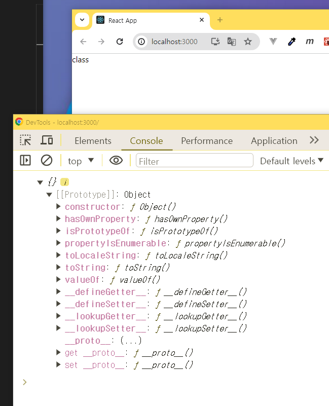{.shadow}
  props 는 메서드 사용시 전달할 값이 있는경우 전달받아 사용할수 있다.

  props 는 메서드 사용시 전달할 값이 있는경우 전달받아 사용할수 있다.

```jsx
import { Component } from 'react';

class TimerCl extends Component {
	constructor(props) {
		super(props);
		console.log(this);
		this.state = { time: 0 };
	}
	render() {
		return <div>class</div>;
	}
}
export default TimerCl;
```

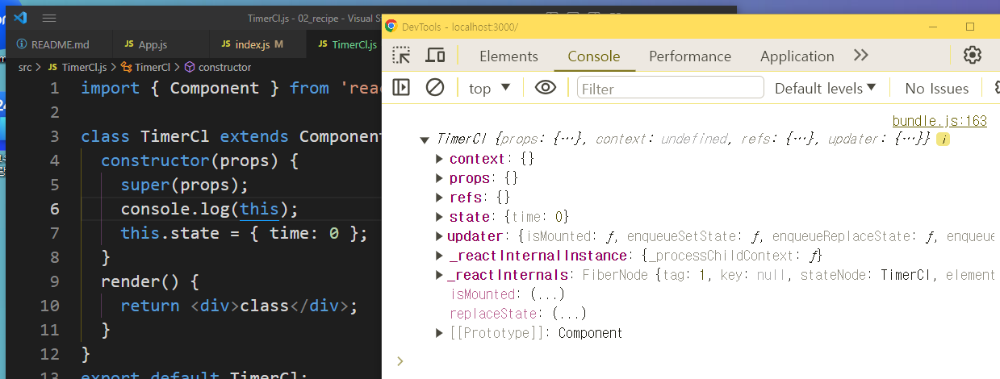{.shadow}

this 는 객체 자기자신 즉 TimerCl 컴포넌트이며 TimerCl 컴포넌트는 리액트의 컴포넌트모듈로 부터 명령어를 상속받았다.

그중 하나인 state 를 사용한다.

```jsx
import { Component } from 'react';

class TimerCl extends Component {
	constructor(props) {
		super(props);
		console.log(this);
		this.state = { time: 0 };
	}
	updateTime = () => {
		this.setState({ time: this.state.time + 1 });
	};

	render() {
		return (
			<>
				<h3>{this.state.time}초</h3>
				<button onClick={this.updateTime}>1씩 올려주세요</button>
			</>
		);
	}
}
export default TimerCl;
```

---

## 3. 컴포넌트의 생명주기

### 4. 컴포넌트의 라이프 사이클 개요

> 컴포넌트 라이프사이클은 컴포넌트의 생성부터 소멸에 이르는 일련의 주기.
> 모든 리액트 컴포넌트는 Lifecycle을 가진다.
> Lifecycle은 세 가지 단계로 나뉜다.


📖 **Lifecycle 단계**

- **Mounting**: 컴포넌트가 화면에 나타남
- **Updating**: 컴포넌트가 업데이트됨
- **Unmounting**: 컴포넌트가 화면에서 사라짐
{.shadow}

---

### 5. 클래스형 컴포넌트의 라이프 사이클 이해
{.shadow}


---

### 6. 클래스형 컴포넌트 라이프사이클 함수
{.shadow}


리액트는 라이프사이트 단계에 따라 메서드를 가지고 있다.

위의 ComponentDidMount … 은 클래스형 컴포넌트에서 사용할수있는 메서드이다.

https://ko.legacy.reactjs.org/docs/react-component.html

---

### 7. 함수형 컴포넌트의 라이프사이클 이해

Hook을 사용한다.
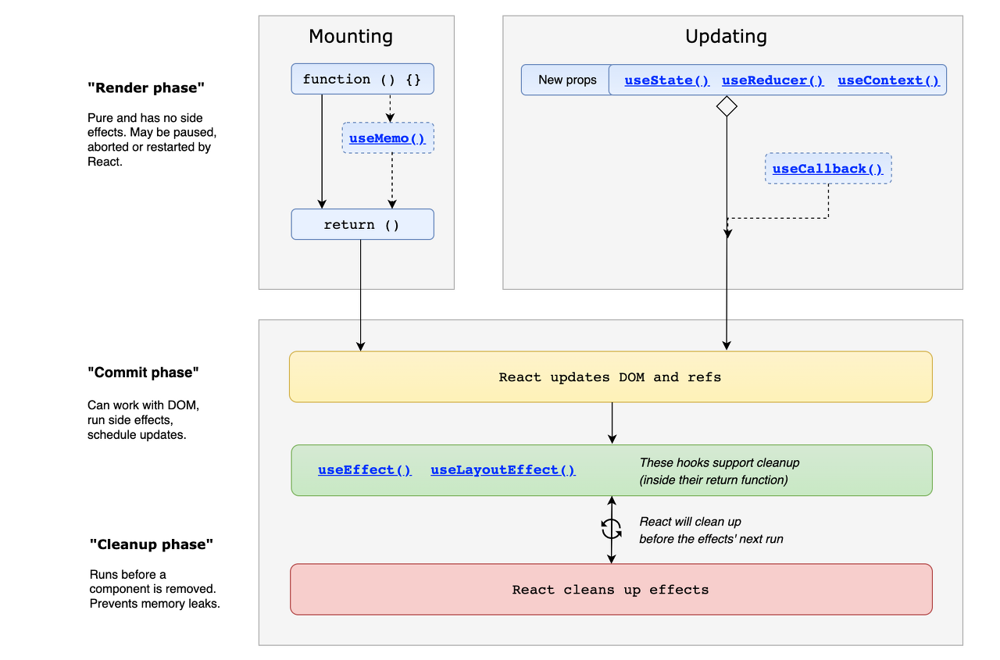{.shadow}


---


💼 라이프사이클 ⇒ 컴포넌트의 일생 3단계

1. Mount (생성)
2. update (갱신)
3. unMount (소멸)

---

1. 라이프사이클을 제어하는 함수는 기본적으로 클래스컴포넌트에 사용가능
2. 리액트 버전 16.8 부터 추가된 Hooks 를 이용하면 함수컴포넌트에도 생애주기 함수 사용가능

---

useEffect 훅을 사용하여 컴포넌트를 변경해보자


- 🔗[useEffect 공식문서](https://ko.reactjs.org/docs/hooks-effect.html)

useEffect 문법: [예제](https://www.notion.so/11-useEffect-9ea6dd3e9f3e42ff8de698343b5ec654?pvs=21)

[!embed width='100%' height='900'](https://codesandbox.io/s/magical-bas-00n3kt?file=/src/test.js)

**`state`가 업데이트될 때 마다 리액트는 화면을 새롭게 그린다.
그것을 렌더링이 된다고 표현한다.**

**만약 컴포넌트가 맨 처음 렌더링될 때 state를 업데이트하는 상황이면 어떻게 될까?**

```jsx
import { useState } from 'react';
function LifeCycle() {
	const [time, setTime] = useState(0); //1. state를 만듭니다.
	setTime(time + 1);
	console.log('Rendering이 됩니다!');
	return <h3>{time}</h3>;
}

export default LifeCycle;
```

아래와 같은 에러가 뜬다.

state가 변경되면서 컴포넌트 함수가 호출되며 리렌더링된다.

컴포넌트 함수내의 모든 함수와 변수의 값이 초기화 되면서 무한 반복이 일어난다
{.shadow}


### 7.1. useEffect

그래서 React에서는 렌더링하는 것을 제어할 수 있는 장치로 `useEffect` 라는 메소드를 제공한다

**useEffect의 두 번째 인자에 들어가는 변수가 변경될 때마다 useEffect 안의 함수가 재실행 된다.**

만일 값이 없다면 딱 한 번만 실행되고 더 이상 실행되지 않는다.

### 8. 함수형 컴포넌트 라이프사이클 함수

`useEffect(function, [ 모니터링 대상])` {.h4 .red}

[!ref target='blank' text='리액트 공식문서 useEffect' icon='link'](https://react.dev/reference/react/useEffect#useeffect)

### 8.1. 예제

- 위의 LifeCycle.js 를 우선 아래와 같이 수정한다.

  ```jsx
  import { useEffect, useState } from 'react';
  function LifeCycle() {
  	const [time, setTime] = useState(0); //1. state를 만듭니다.

  	console.log('Rendering이 됩니다!');
  	return (
  		<>
  			<h3>{time}</h3>
  			<button onClick={() => setTime(time + 1)}>click</button>
  		</>
  	);
  }

  export default LifeCycle;
  ```

- useEffect 훅을 활용하여 컴포넌트내의 함수의 실행 시점을 제어해보자
  ```jsx
  import { useEffect, useState } from 'react';
  function LifeCycle() {
  	const [time, setTime] = useState(0);
  	useEffect(() => {
      console.log('dependencies array 없어');
    });
  	console.log('Rendering이 됩니다!');
  	...
  ```
  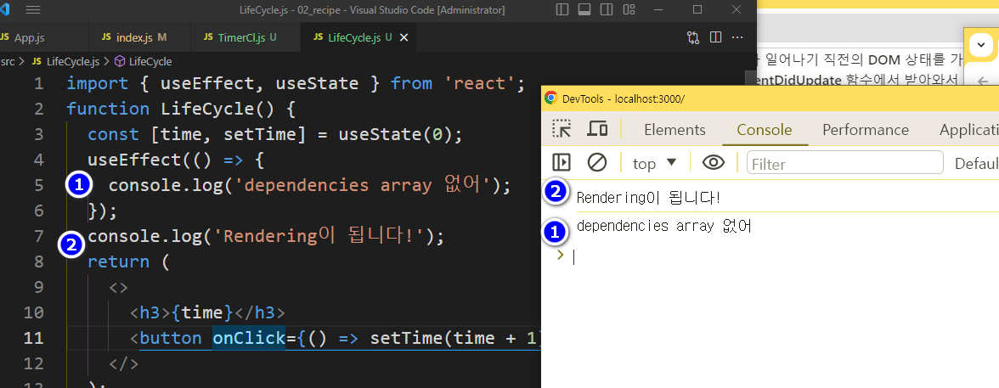{.shadow}

  - 의존성배열 이 없을 경우 렌더링 이후 업데이트시 실행된다.
- 빈배열을 추가한다
  ```jsx
  	useEffect(() => {
      console.log('dependencies array 없어');
    });
  	**useEffect(() => {
      console.log('dependencies array 빈거');
    },[]);**
  	console.log('Rendering이 됩니다!');
  ```
  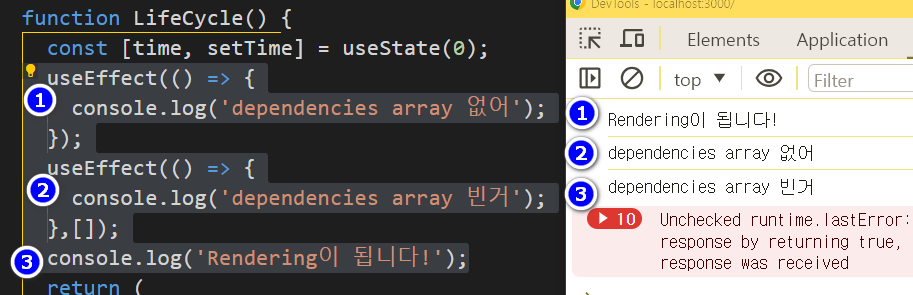{.shadow}

- 의존성배열에 변수추가
  ```jsx
  useEffect(() => {
  	console.log('time');
  }, [time]);
  ```
  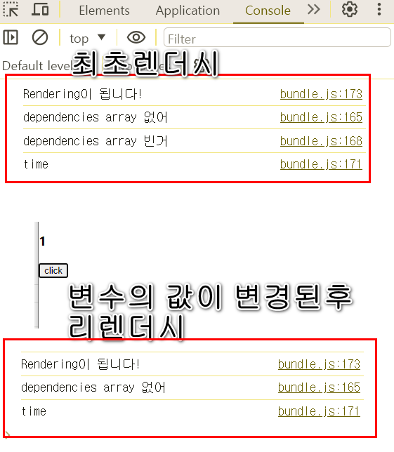{.shadow}


위의 사례에서 확인할수 있는 것은

1. 컴포넌트 렌더시 컴포넌트 내의 모든 함수가 한번씩 평가(실행) 된다.
2. 컴포넌트 내에서 사용중인 값의 변경후 리렌더 시에만 평가(실행) 해야 하는 문장의 경우 useEffect함수의 의존성배열을 작성해야 한다.

   그냥 작성할경우 무한 렌더링이 발생하여 오류가 난다.

## 9. 퀴즈퀴즈!

1. 변수 time 의 값이 5이상 될 경우 다시 0으로 할당하는 코드를 작성해보세요

- 보지말고 해볼것
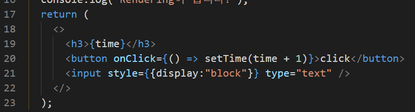{.shadow}


## 10. 퀴즈퀴즈!

- input 요소를 추가하고 상태관리를 해보자
{.shadow}
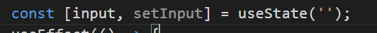{.shadow}

- useStat 를 추가한다
  {.shadow}
- input 을 추가하고 value에 input 변수를 작성한다.
  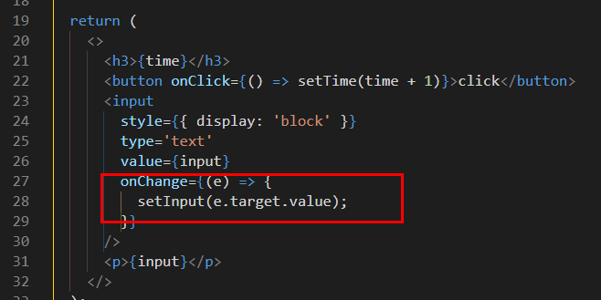{.shadow}
- input 요소에 아무리 글을써도 화면에 출력되지 않는다
  value의 값이 공백이며 value 의 값을 변경하려면 setInput 함수를 사용해야 한다.
  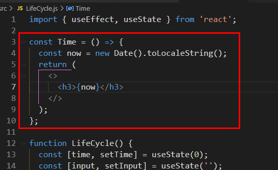{.shadow}

### 10.1. cleanUp

- LifeCycle 컴포넌트에 Time 컴포넌트를 추가한다.
  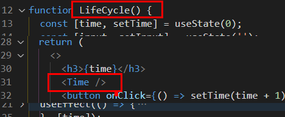{.shadow}
- LifeCycle 컴포넌트 내에 Time 컴포넌트를 중첩한다
  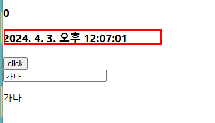{.shadow}
- 실행화면

  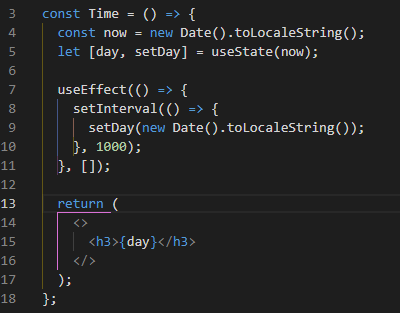{.shadow}

- Time 컴포넌트의 시간을 초단위로 변경하여 리렌더 해보자

  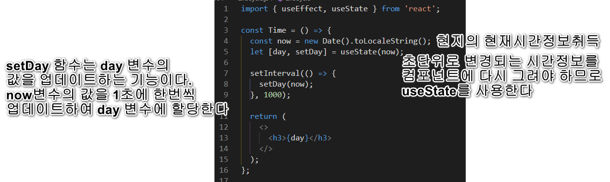{.shadow}

  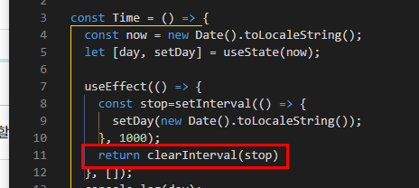{.shadow}

- setInterval 함수 사용시 컴포넌트가 언마운트 될때에도 함수는 계속 실행되어 메모리의 누수가 발생할수 있다.
  useEffect 의 return 문에 clearInterval 함수를 작성하여 setInterval 을 중단시킬경우 Time 컴포넌트의 언마운트시 실행되므로 사이드이펙트(부수효과)를 사전예방 할수있다
  {.shadow}

## 11. 정리


💡 React에서 제공하는 useState, useEffect 같은 메소드를 `Hook`이라고 한다


```jsx
**/*useEffect*/**
	//마운트 될때 , dependency array 를 빈값
	useEffect(() => {
		console.log("Mount!");
	}, []);

	//업데이트 될때 , depicendency array 없음
	useEffect(() => {
		console.log("update!");
	});

	//특정값이 업데이트 될때
	// dependency array 에 값추가
  const [count, setCount] = useState(0);
	useEffect(() => {
		console.log(`count is update: ${count}`);
		if (count > 5) {
			alert("5초과 1로 초기화");
			setCount(1);
		}
	}, [count]);

//언마운트시
	useEffect(()=>{
		console.log('마운트됨');
		return()=>{
			//unmount 시점에 실행됨
			console.log("지금이순간이 언마운트");
		}
	},[])

```
