### 목차 <!-- omit in toc -->
- [1. 시작파일](#1-시작파일)
- [2. 완료파일](#2-완료파일)
- [3. Component State(상태관리)](#3-component-state상태관리)
	- [3.1. 클래스형 vs 함수형 상태관리](#31-클래스형-vs-함수형-상태관리)
	- [3.2. 함수형 컴포넌트의 상태관리](#32-함수형-컴포넌트의-상태관리)
		- [3.2.1. useState()](#321-usestate)
			- [3.2.1.1. 카운터를 만들어보자-1](#3211-카운터를-만들어보자-1)
			- [3.2.1.2. 카운터를 만들어보자-2](#3212-카운터를-만들어보자-2)
			- [3.2.1.3. 카운터를 만들어보자-3](#3213-카운터를-만들어보자-3)
			- [3.2.1.4. 카운터를 개선 해보자](#3214-카운터를-개선-해보자)
	- [3.3. 퀴즈퀴즈](#33-퀴즈퀴즈)
- [4. Component LifeCycle(생명주기)](#4-component-lifecycle생명주기)
	- [4.1. 클래스형 컴포넌트와 생명주기](#41-클래스형-컴포넌트와-생명주기)
		- [4.1.1. 클래스형 컴포넌트](#411-클래스형-컴포넌트)
		- [4.1.2. 클래스형 컴포넌트 생명주기](#412-클래스형-컴포넌트-생명주기)
	- [4.2. 함수형 컴포넌트의 생명주기](#42-함수형-컴포넌트의-생명주기)
		- [4.2.1. useEffect](#421-useeffect)
			- [4.2.1.1. 무한루프 문제상황 만들기](#4211-무한루프-문제상황-만들기)
			- [4.2.1.2. Mount-컴포넌트 렌더링 직전 딱 한번 실행](#4212-mount-컴포넌트-렌더링-직전-딱-한번-실행)
			- [4.2.1.3. Update-컴포넌트 렌더시](#4213-update-컴포넌트-렌더시)
			- [4.2.1.4. UnMount-컴포넌트가 사라질때 실행](#4214-unmount-컴포넌트가-사라질때-실행)

---

3차시 컴포넌트의 props 를 기억 할 것이다.
props란 컴포넌트 간 주고받는 데이터이며 부모가 자식에게 전달할수 있다고 배웠다.

예시로 여러 친구를 초대하고 한 테이블 위 3개의 동일한 접시에 3종류의 각기 다른 음식을 전달하는 사례를 들어 설명하였다. [:link: 영상링크 18:29](https://www.youtube.com/watch?v=ReP1iOyNxF4)
**그림 1** 을 리액트 컴포넌트로 구현 할 경우 **그림 2** 의 구조가 될 것 이다.
햄버거,딸기,사과는 컴포넌트로 전달되는 props 즉 속성의 값이 된다.
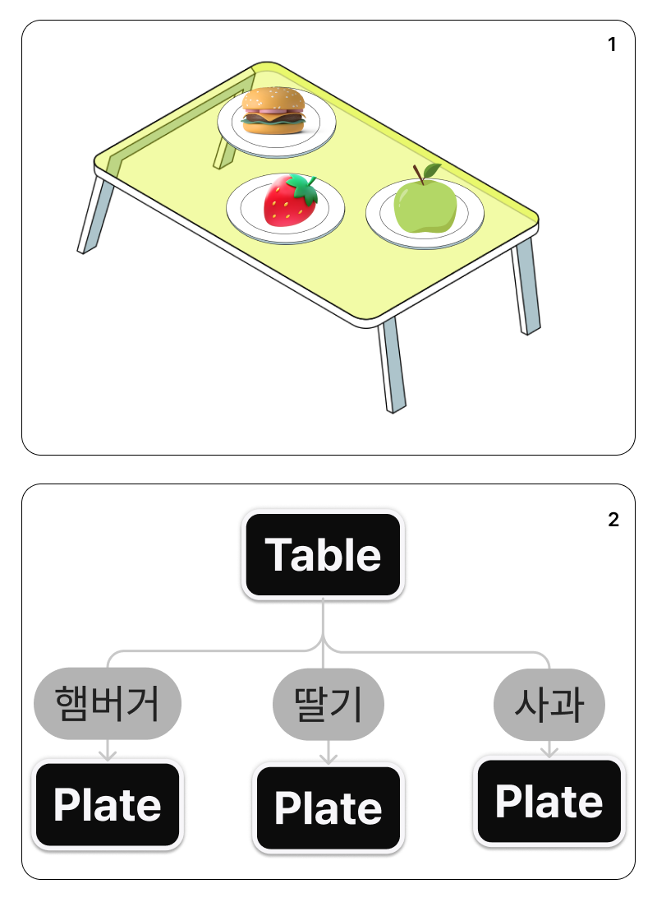{.w80}

이번 차시의 학습 내용은 아래의 그림처럼 친구가 음식을 먹어버렸을 경우 이다.

**Plate 컴포넌트의 햄버거라는 값이 있다가 없어지게 하려면 어떻게 해야 할까?**
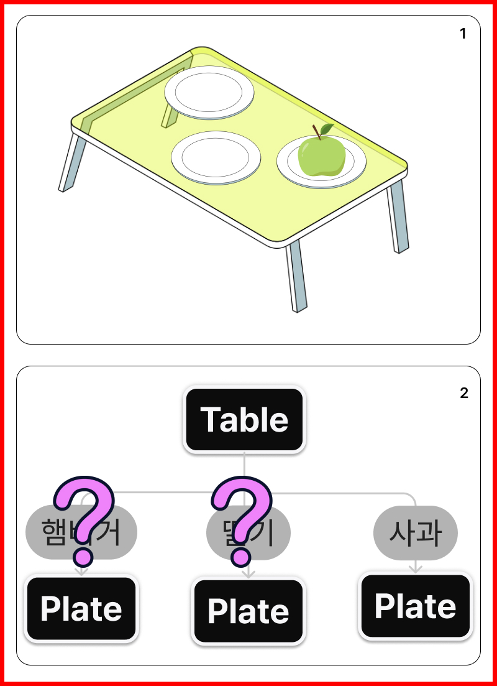{.w80}
Plate 컴포넌트의 햄버거가 <mark>있는 상태에서 없는 상태로 바꾸면</mark> 된다. {.h5}

컴포넌트의 상태관리 와 라이프 사이클에 대해 알아보자 {.h5}

---
## 1. 시작파일
> 만약 전시간 파일이 없을 경우 아래의 파일을 다운로드 하여 진행한다
[!button variant='success' icon='download' text='지난 수업 파일' target='blank'](./assets/05/start.zip)
==- 파일활용방법
1. 다운로드 받은 start.zip 파일의 압축을 푼다
2. 새 리액트 앱을 설치한다. 리액트 앱 설치를 모를경우 아래 링크를 참고한다.
    [!ref target='blank' text='리액트 설치안내' icon='link'](../리액트좀해라/1.md)
3. 리액트 앱의 설치가 왼료 되었으면 1번의 파일압축을 푼다
4. 압축을 풀게 되면 start/src 폴더가 있다.
5. 2번의 src폴더에 4번의 src 폴더를 덮어 씌운다.
	
6. 2번의 폴더를 루트로 선택하여 vscode를 연다.
7. vscode 의 터미널에 npm start 를 입력하여 앱을 실행한다.
===

## 2. 완료파일
[!button variant='success' icon='download' text='유튜브강의 완료 파일' target='blank'](./assets/05/chap05_fin.zip)


## 3. Component State(상태관리)
### 3.1. 클래스형 vs 함수형 상태관리
==-  클래스형 vs 함수형 상태관리

아래 코드샌드박스의 코드에서  Timer.js 는 함수형 컴포넌트의 상태관리 예시이고 Timer2.js는 클래스형 컴포넌트의 상태관리예시이다.

[!embed width='100%' height='900'](https://codesandbox.io/p/sandbox/riaegteu-usestate-qg9dyg)

===

### 3.2. 함수형 컴포넌트의 상태관리
#### 3.2.1. useState()
:::my-box-blue
[!ref target='blank' text='공식참조문서' icon='link'](https://react.dev/reference/react/useState)

위에서 언급했듯 컴포넌트 내부에서 A -> B 로 변경돼야 하는 것들이 있다.

예를 들면 아래의 버튼 컴포넌트처럼 클릭시 텍스트가 로그인 -> 로그아웃 으로 바뀌는 경우를 생각해 볼수 있다.
 {.shadow}


이런 경우 `useState()` 라는 리액트의 [:link:Hook](../Reference/Hooks.md)을 사용한다.

Hook이란 간단히 말하면 리액트에서 제공하는 메서드이다.

_리액트 v16 이하에서는 컴포넌트의 형태에 따라 state 와 Hook 을 구분하였으나 v16.8이상부터는 useState 를 사용하여 처리한다._

함수형 컴포넌트에서는 useState() 라는 훅을 사용하여 컴포넌트의 상태관리를 한다  {.h5}


<details markdown='block'>
  <summary>
 🐨<i class="c-light-70">보충설명 : 컴포넌트 내부의 데이터 변경이 도대체 무슨 말일까?</i>
  </summary>
  <pre>컴포넌트에 대한 이해가 충분치 않을 경우 내부의 데이터 라는 말이 이해가 선뜻 되지 않는다.</pre>
  <pre>컴포넌트는 쉽게 말해 화면 구현 시 외형이 유사한 컨테이닝 블록들을 함수로 만들어 놓고 불러서 사용하는 것이다.</pre>
  <pre>비슷한 외형을 가진 구조는 함수로 만들어 사용하고 섹션별 콘텐츠는 props나 state 라는 데이터로 주입한다.</pre>
  <pre>이때 다른 컴포넌트에서 주입되는 데이터의 이름은 props 컴포넌트 함수 안에서 주입되는 데이터의 이름은 state라고 한다</pre>
</details>

:::

:::my-box-blue
기본문법 {.h6 .c-tone-20}

```js
import { useState } from 'react';
const [<상태 값 저장 변수>, <상태 값 갱신 함수>] = useState(<상태 초기 값>);
```

:::

##### 3.2.1.1. 카운터를 만들어보자-1
1. src/Counter.js 파일을 생성한다.
	```js # Counter.js
	const Counter = () => {
		return (
			<>
				<div>Counter</div>
			</>
		);
	};
	export default Counter;
	```
2. Counter 컴포넌트를 App 컴포넌트에서 임포트한다.
	```js # App.js
	import Counter from "./Counter";
	...
	function App() {
		return (
	...
			<Counter />
	...
	```
3. Counter 컴포넌트 상단에 useState 임포트한다.
   useState란 리액트의 훅 종류의 하나로 리액트에서 제공하는 내장 함수이다.
  제이쿼리의 show(), hide() 와 유사하다.
  Counter 컴포넌트의 내부에 콘솔로그로 useState 함수의 반환값을 출력해본다.
	```js # Counter.js
	import { useState } from 'react';
	const Counter = () => {
		console.log(useState());
	...
	```
  > useState함수(훅)를 콘솔창에서 호출시 반환되는 값이 있는데 배열임을 알수있다.
  > 두개의 값이 반환되며 0번에는 변수를 선언하였으나 초기화하지 않았을때 볼수있는 undefined 자료형이 보이고 1번에는 함수가 보인다.
  >  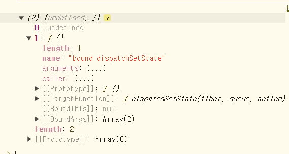{.w60 .shadow}
  > **리액트의 훅은 사용시 import 해야하며 컴포넌트 함수내에 작성해야 한다.**
---
##### 3.2.1.2. 카운터를 만들어보자-2

1. 변수 num 을 선언하고 useState훅을 호출하면서 초기값으로 0 전달한다.
	```js # Counter.js
	import { useState } from 'react';
	const Counter = () => {
		let num = useState(0);
			console.log(num);
	...
	```
	>  콘솔로그에 num 변수의 값을 확인하면 undefined 가 아닌 0이 확인된다.
	> 인덱스번호 1번에 반환 되는 함수는 지금 초기화한 이 변수의 값을 업데이트하는 함수이다.
	>  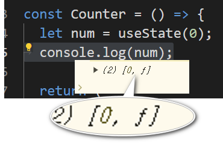{.shadow}

2. num의 반환값이 배열이므로 배열내 원소들을 각각 변수에 할당해보자
	```js # Counter.js
	...
	const Counter = () => {
		let num = useState(0);
		let count=num[0];
		let setCount=num[1];
		console.log(count);
		console.log(setCount);
	...
	```
  > 변수 count 에는 num 의 첫번째 값이 확인된다.
  > 변수 setCount 에는 num 의 두번째 값이 확인된다.
  > 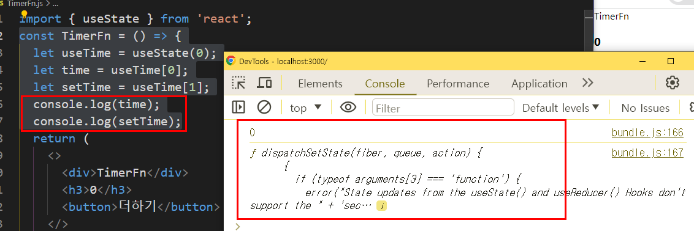{.shadow}
---
##### 3.2.1.3. 카운터를 만들어보자-3
1. 카운트함수를 작성한다.
	```js # Counter.js
	...
	const updateCount = () => {
		setCount(count + 1);
	};
	...
	```
2. 버튼에 이벤트리스너를 연결한다. `h1` 사이의 데이터를 변수 로 수정한다.
	```js # Counter.js
	...
	return (
		<>
			<h1>{count}</h1>
			<button onClick={updateCount}>클릭</button>
		</>
	);
	...
	```
	:::my-box-red
	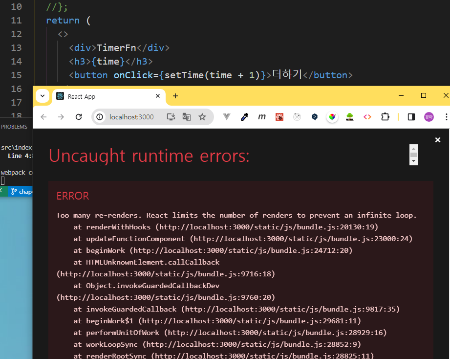{.shadow}
	이벤트리스너에 바로 setCount 함수를 호출 할 경우 위와 같은 에러 메시지가 확인된다.
	우리의 컴포넌트를 다루는 방식은 함수이고 자바스크립트의 함수는 평가과정에서 내부의 모든 코드가 된다.
	즉 버튼요소의 클릭이벤트리스너에 연결한 함수가 카운터함수 평가과정시 같이 실행 되기 때문에 클릭하기도 전에 호출되어서 실행되는 것이다.
	게다가 updatecount 함수는 컴포넌트 count 변수에 1을 더하면서 리렌더하게 되는 현상이 반복되어서 오류가 발생하게 되므로 바로 호출하지 말고 참조하는 방법으로 작성해야 한다.

	`<button onClick={()=>setCount(count + 1)}>더하기</button>`
	:::
[:link: 리액트의 이벤트 학습하기](../리액트좀해라/4.md)

---

##### 3.2.1.4. 카운터를 개선 해보자
1. useState 훅의 반환값을 변수에 할당 받는 부분을 구조 분해 할당 문법을 사용하면 간결하게 수정할수 있다.
	```js # Counter.js
	...
	let [count, setCount] = useState(0);
	...
	```
### 3.3. 퀴즈퀴즈
실행화면
{.shadow}
```md # 지시문
컴포넌트를 생성하여 위의 그림처럼 클릭하면 상태를 업데이트 한다.
🍔 를 클릭하면 🍗 으로 상태가 1회 변경되도록 한다. (토글아님)
```

## 4. Component LifeCycle(생명주기)
{.my-box-blue}
> 컴포넌트 라이프사이클은 컴포넌트의 생성부터 소멸에 이르는 일련의 주기를 말한다.
> 모든 리액트 컴포넌트는 Lifecycle을 가진다.
> 리액트의 컴포넌트 유형별(클래스,함수) 생명주기 관리방식의 차이가 있다
> 우리는 함수형 컴포넌트의 생명주기만을 다룰 것이며 클래스형의 생명주기는 아래 2.1의 자료를 참고하도록 하자.
### 4.1. 클래스형 컴포넌트와 생명주기
==- 클래스형 컴포넌트와 생명주기
#### 4.1.1. 클래스형 컴포넌트
1. 아래는 클래스형 컴포넌트와 함수형 컴포넌트의 문법 비교이다.
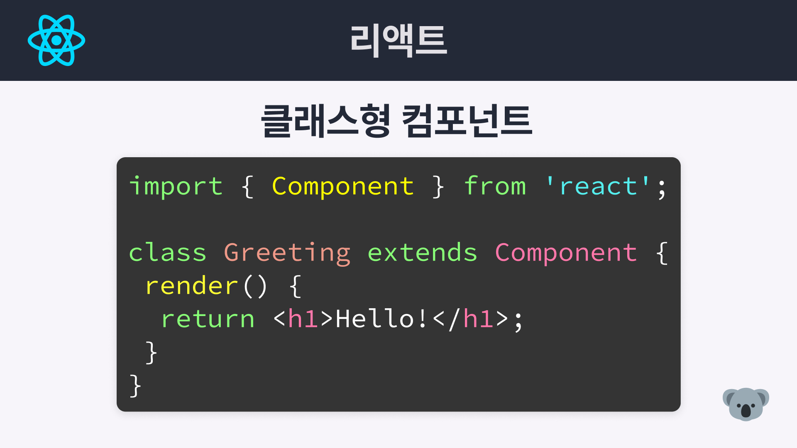{.shadow .w80}
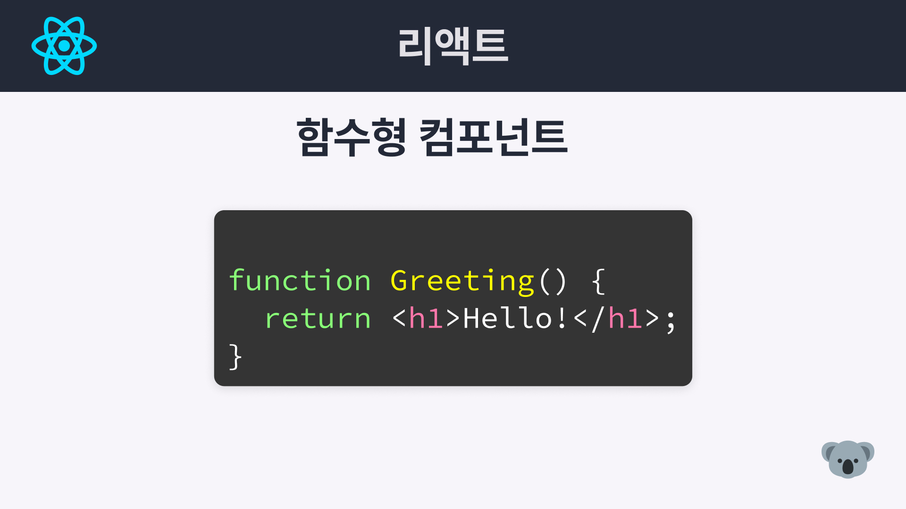{.shadow .w80}
#### 4.1.2. 클래스형 컴포넌트 생명주기
컴포넌트가 화면에 렌더링 되고 데이터를 표시하고 화면에서 사라지기 까지의 일련의 단계를 의미한다.
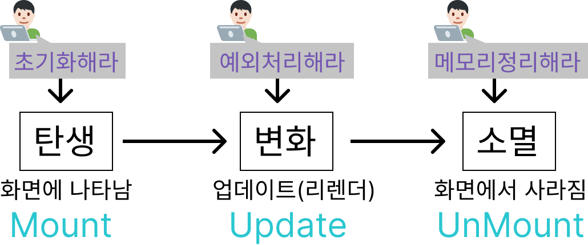{.shadow .w80}
   1. 클래스형 컴포넌트의 Lifecycle은 크게 세 가지 단계로 나뉜다.
      - **Mounting**: 컴포넌트가 화면에 나타남
      - **Updating**: 컴포넌트가 업데이트됨
      - **Unmounting**: 컴포넌트가 화면에서 사라짐
1. 세부적인 주기는 아래의 그림과 같다.
  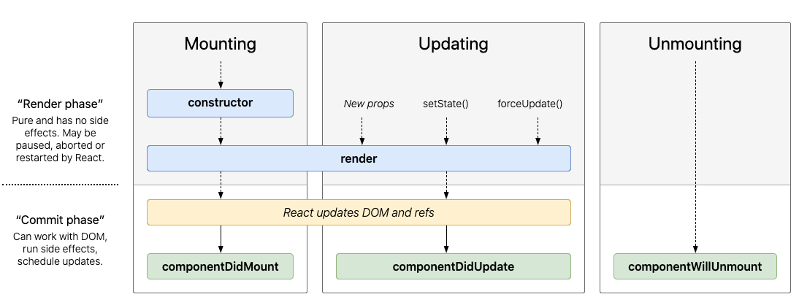{.shadow}
1. 컴포넌트의 상태별로 사용할수 있는 대표적인 함수는 아래와 같다.
  {.shadow .w80}

===

---

### 4.2. 함수형 컴포넌트의 생명주기
앞서 언급했듯 컴포넌트의 생명주기는 사람의 성장 과정 처럼 컴포넌트가 화면에서 렌더되는 일련의 과정을 의미한다.
이것을 학습해야 하는 이유는 생명주기별 사용할수 있는 함수나 발생할수 있는 효과가 다르기 때문이다.
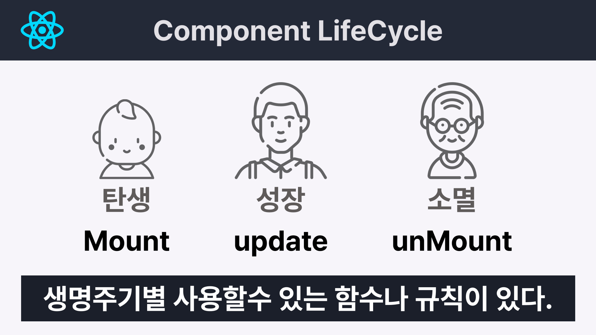{.shadow .w70}

:::my-box-blue
함수형 컴포넌트의 생명주기는 3단계로 구성된다.
아래 그림과 표를 참고하자.

| 단계           | 설명                              | useEffect 용법                                        |
| -------------- | --------------------------------- | ----------------------------------------------------- |
| Mount (생성)   | 컴포넌트가 생성되는 단계          | `useEffect(()=>{},[])`                                |
| Update (갱신)  | 컴포넌트가 그려지고 변화하는 단계 | `useEffect(()=>{})` <br> `useEffect(()=>{},[변수명])` |
| UnMount (소멸) | 컴포넌트가 사라지는 단계          | `useEffect(()=>{ return 실행문 },[])`                 |

:::comment_box
함수형 컴포넌트의 생명주기 다이어그램 {.center}
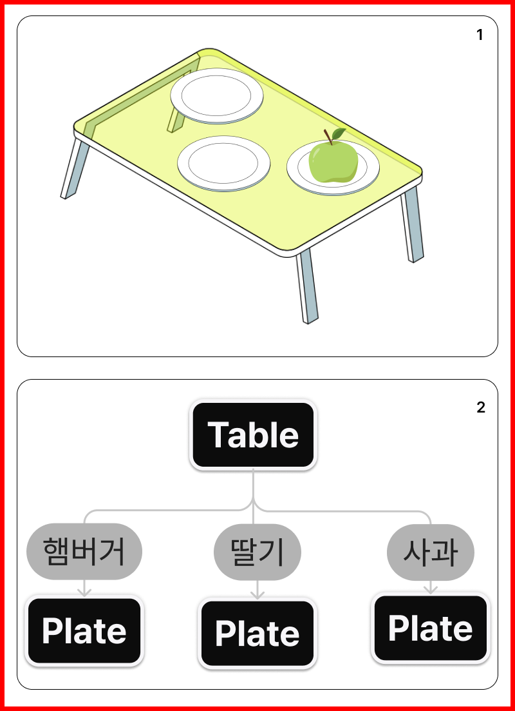
:::

함수형 컴포넌트에서는 `useEffect()` 훅을 사용하여 생명주기를 관리한다. {.h5}
:::

#### 4.2.1. useEffect
[!ref target='blank' text='공식참조문서' icon='link'](https://react.dev/reference/react/useEffect)
useEffect 는 두개의 인수를 받는데 첫번째는 필수이고 두번째는 선택이다.
첫번째 인수는 함수를 두번쨰 인수는 배열을 받는데 이 두번째 배열에 따라 생명주기가 달라진다.

##### 4.2.1.1. 무한루프 문제상황 만들기
[카운터만들기 예제](#1113-카운터를-만들어보자-3)에서 버튼 클릭이벤트 발생시 바로 setState 함수를 호출할 경우  `Too many re-renders. React limits ...  infinite loop...` 라는 에러가 발생하는 것을 확인했다.
그래서 우리는 이문제를 별도의 함수를 만들고 상태를 업데이트 하도록 작성하였다. 그후 클릭이벤트 발생시 이 함수를 이벤트핸들러로 전달하여 에러를 해결하였다.
만약 컴포넌트의 렌더시 상태를 업데이트 하는 경우라면 어떻게 해야 할까?

1. LifeCycle 컴포넌트를 만들고 컴포넌트 코드를 작성한다.
App 컴포넌트에 LifeCycle 컴포넌트를 임포트 한다.
	```js # LifeCycle.js
	import { useState } from 'react';

	const LifeCycle = () => {
		const [mount, setMount] = useState(0);
		setMount(mount + 1);
		return (
			<>
				<h1>Mount:{mount}</h1>
			</>
		);
	};
	export default LifeCycle;

	```
1. 아래와 같은 에러가 뜬다.
  state가 변경되면서 컴포넌트 함수가 호출되며 리렌더링되고
  컴포넌트 함수내의 함수가 실행 되면서 무한 반복이 일어난다
	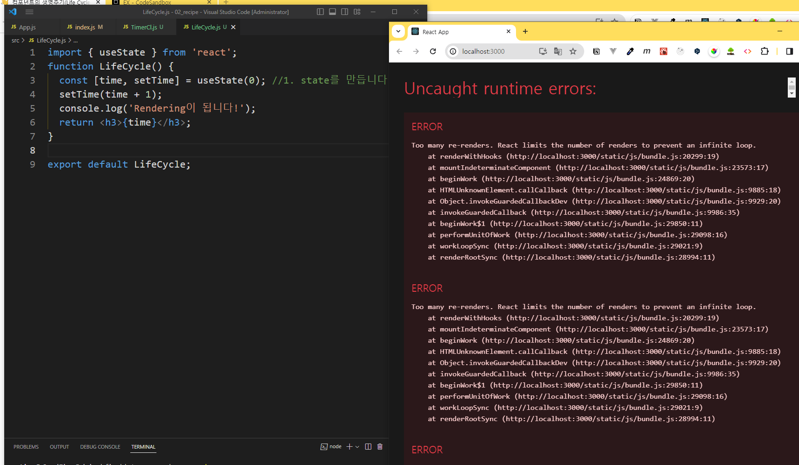{.shadow}

---

##### 4.2.1.2. Mount-컴포넌트 렌더링 직전 딱 한번 실행
위의 에러를 해결해보자
:::my-box-blue
[마운트시 딱한번 실행] 의존성배열을 비움{.h5}
```js #
//의존성 배열에 빈값을 넣으면 컴포넌트 마운트시 한번만 실행된다.
useEffect(() => {
  //실행문
}, []);

```
:::
1. LifeCycle 컴포넌트에서 useEffect 를 임포트 한다.
2. useEffect 를 작성한다.
	```js # LifeCycle.js
	import { useState, useEffect } from 'react';
	const LifeCycle = () => {
		const [mount, setMount] = useState(0);
		useEffect(() => {
			console.log('마운트 됨');
		}, []);
		return (
			<>
				<h1>
					Mount:{mount} <button onClick={() => setMount((mount) => mount + 1)}>click</button>
				</h1>
			</>
		);
	};
	export default LifeCycle;
	```
3. 이제 오류가 사라지고 LifeCycle 컴포넌트의 mount 변수의 값은 버튼을 클릭할떄 마다 증가한다.
4. `setMount()` 함수를 사용하여  `mount`변수의 값을 업데이트 할 경우 바로 재할당이 불가하며 콜백함수를 사용해야 하는 점을 주의한다.
      [:link:참조링크](https://react.dev/reference/react/useState#examples-updater)
  위의 공식사이트 참조문서링크를 보면 이전상태를 기반으로 상태를 업데이트 할 경우 변수의 값을 바로 변경하지 말고 함수를 사용하여 변경하라고 되어있다.
5. `useEffect()`의 인수로 함수와 빈배열을 전달하면 컴포넌트가 **마운트(그려지기 직전) 될때 딱 한번 전달받은 함수를 실행**한다.
6. 콘솔창을 열고 메시지를 확인하면 useEffect 내에 작성한 콘솔함수는 1회만 실행되고 더이상 실행되지 않는다.
    

---

##### 4.2.1.3. Update-컴포넌트 렌더시
이번에는 컴포넌트가 리렌더 될 때 마다 실행해보자.
:::my-box-blue
[컴포넌트 리렌더시 실행] 의존성배열을 지움{.h5}
```js #
//의존성 배열을 삭제하면 컴포넌트 리렌더시 마다 실행된다.
useEffect(() => {
  //실행문
});
```
:::

1. LifeCycle.js 를 수정한다. 상태관리를 추가한다.
	```js #4-6 LifeCycle.js
	....
	const [rerender, setRerender] = useState(0);
	...
	useEffect(() => {
		console.log('리렌더 됨');
	});
	return (
		<h1>
			rerender:{rerender} <button onClick={() => setRerender((rerender) => rerender + 1)}>click</button>
		</h1>
	...
	```
1. 콘솔창을 열고 마운트 버튼과 리렌더 버튼을 마구 눌러 콘솔 메시지 출력횟수를 비교해본다.
  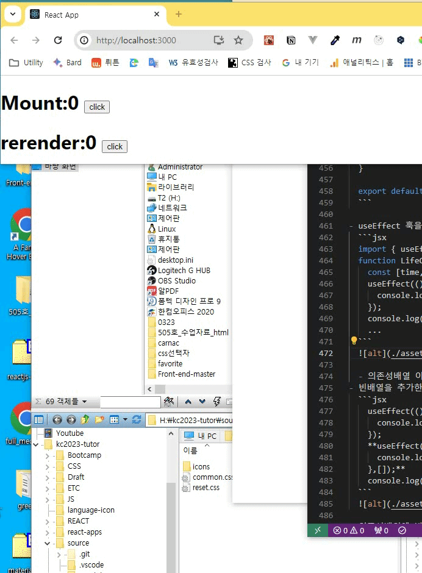{.w40}

---
이번에는 특정 값 변경시 함수를 실행해보자

:::my-box-blue
[특정값의 업데이트시 실행] 의존성배열의 값을 특정함{.h5}
```js #
// 의존성 배열에 작성한 변수의 값이 변경될때 마다 실행된다.
useEffect(() => {
  //실행문
},[변수명]);
```
:::
1. 아래 코드중 표시된 부분을 추가한다.
	```js #6,13-16,25-27 LifeCycle.js
	import { useState, useEffect } from 'react';

	const LifeCycle = () => {
		const [mount, setMount] = useState(0);
		const [rerender, setRerender] = useState(0);
		const [update, setUpdate] = useState(0);
		useEffect(() => {
			console.log('마운트 됨');
		}, []);
		useEffect(() => {
			console.log('리렌더 됨');
		});
		useEffect(() => {
			console.log('업데이트 됨');
		},[update]);

		return (
			<>
				<h1>
					Mount:{mount} <button onClick={() => setMount((mount) => mount + 1)}>click</button>
				</h1>
				<h1>
					rerender:{rerender} <button onClick={() => setRerender((rerender) => rerender + 1)}>click</button>
				</h1>
				<h1>
					Update:{update} <button onClick={() => setUpdate((update) => update + 1)}>click</button>
				</h1>
			</>
		);
	};
	export default LifeCycle;
	```
2. 버튼을 번갈아 클릭하면서 콘솔메시지를 살펴보자.
	업데이트 버튼 클릭시 update 변수의 값이 변경되었기 때문에 컴포넌트의 리렌더후 업데이트가 실행된다.
	그래서 콘솔메시지는 리렌더됨->업데이트됨 이 확인된다.
	**useEffect의 의존성배열에 값을 넣으면 해당 값이 업데이트 될때 실행된다.**
---

##### 4.2.1.4. UnMount-컴포넌트가 사라질때 실행
:::my-box-blue
[UnMount] 의존성배열 비움 & return{.h5}

```js #
useEffect(() => {
  return //실행문
}, []);
```
빈 의존성 배열과 리턴문에 함수를 작성하면 컴포넌트 소멸시 해당함수를 실행하게 된다.
:::
1. UnMount 컴포넌트를 LifeCycle에 중첩하여 작성한다.

	```js #3-11,18 LifeCycle.js
	import { useState, useEffect } from 'react';

	const UnMount = () => {
		console.log('타이머준비중');
		useEffect(() => {
			const timer = setInterval(() => {
				console.log('타이머진행중');
			}, 1000);
		});
		return <p>타이머진행중</p>;
	};

	const LifeCycle = () => {
	...
		return (
			<>
	...
				<UnMount />
			</>
	...
	```
2. 콘솔창에서를 확인하면 초단위로 계속 메시지가 실행되는것을 확인한다.
	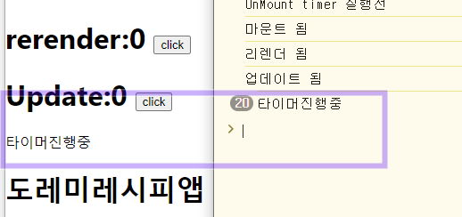

3. 타이머를 종료하는 버튼을 추가해보자. LifeCycle 컴포넌트 내에 작성한다.
	[:link:동적스타일&조건부렌더링 강의 링크](../리액트좀해라/7.md)
	```js # LifeCycle.js
	const [stop, setStop] = useState(false);
	...
	```
1. `return`문 내에 작성한다.
	```js # LifeCycle.js
	<div>
		{!stop ? <UnMount /> : "타이머준비중"}
		<button onClick={() => setStop(!stop)}>stop</button>
	</div>
	...
	```
1. 실행화면에서 stop 클릭시 화면은 업데이트 되나 콘솔메시지는 계속 진행 되고 있다.
	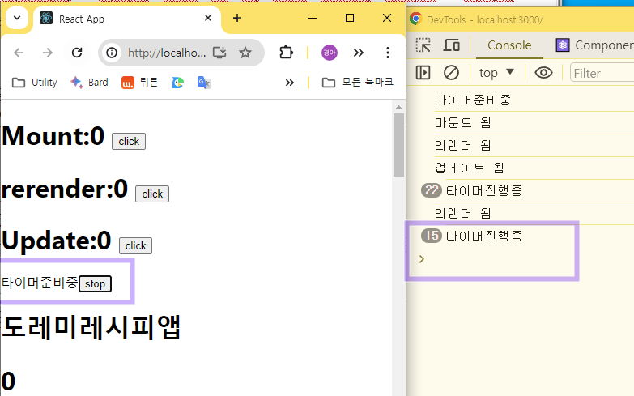{.w70}
1. 이제 정리함수를 작성한다. `UnMount` 컴포넌트의 useEffect 함수에 작성해야 한다.
	```js #7-10 LifeCycle.js
	const UnMount = () => {
	console.log('타이머준비중');
	useEffect(() => {
		const timer = setInterval(() => {
			console.log('타이머진행중');
		}, 1000);
		return ()=>{
			console.log("타이머종료");
			clearInterval(timer)
		};
	});
	return <p>타이머진행중</p>;
	};
	```
1. 이제 stop 버튼을 클릭하면 실행화면과 콘솔메시지가 모두 종료 되었다.
