### 목차 <!-- omit in toc -->

- [1. 시작파일](#1-시작파일)
- [2. 연관링크](#2-연관링크)
- [3. fetch](#3-fetch)
	- [3.1. fetch 함수 간단맛보기](#31-fetch-함수-간단맛보기)
	- [3.2. 앱에 fetch 적용해보기](#32-앱에-fetch-적용해보기)
- [4. 공공 API 신청](#4-공공-api-신청)
- [5. Axios](#5-axios)
	- [5.1. API 연결하기](#51-api-연결하기)
	- [5.2. Axios 설치](#52-axios-설치)
	- [5.3. 레시피데이터 받아오기](#53-레시피데이터-받아오기)
- [6. 레시피 데이터 화면에 그리기](#6-레시피-데이터-화면에-그리기)
	- [6.1. 객체에 있는 키에 조금 더 똑똑하게 접근하기](#61-객체에-있는-키에-조금-더-똑똑하게-접근하기)
	- [6.2. 코드개선하기(Refactoring)](#62-코드개선하기refactoring)
	- [6.3. 필요한 데이터만 추출하여 업데이트 하자](#63-필요한-데이터만-추출하여-업데이트-하자)
- [7. 여기까지 깃허브에 올리기](#7-여기까지-깃허브에-올리기)
- [8. 완료파일 내려받기](#8-완료파일-내려받기)

---

## 1. 시작파일

+++ 파일다운로드
만약 이전 파일이 없을 경우 아래의 파일을 다운로드 하여 진행한다
[!button variant='success' icon='download' text='시작 파일' target='blank'](./assets/07/start.zip)
+++ 파일활용방법

1. 다운로드 받은 start.zip 파일의 압축을 푼다
2. 새 리액트 앱을 설치한다. 리액트 앱 설치를 모를경우 아래 링크를 참고한다.
   [!ref target='blank' text='리액트 설치안내' icon='link'](../리액트좀해라/1.md)
3. 리액트 앱의 설치가 왼료 되었으면 1번의 파일압축을 푼다
4. 압축을 풀게 되면 start/src 폴더가 있다.
5. 2번의 src폴더에 4번의 src 폴더를 덮어 씌운다.
   {.shadow}
6. 2번의 폴더를 루트로 선택하여 vscode를 연다.
7. vscode 의 터미널에 `npm start` 를 입력하여 앱을 실행한다.
   +++

## 2. 연관링크

| 🔗연관링크                                                                                                                              |
| --------------------------------------------------------------------------------------------------------------------------------------- |
| [API란?](./assets/07/api.pdf)                                                                                                           |
| [fetch와 promise 예제](https://qwerewqwerew.github.io/book01/docs/javascript/docs/fetch/#fetch)                                         |
| [MDN fetch ](https://developer.mozilla.org/ko/docs/Web/API/Fetch_API/Using_Fetch)                                                       |
| [MDN try...catch 문 ](https://developer.mozilla.org/ko/docs/Web/JavaScript/Guide/Control_flow_and_error_handling#try...catch_%EB%AC%B8) |
| [axios 공식홈 ](https://axios-http.com/kr/docs/intro)                                                                                   |

## 3. fetch

:::my-box-blue
fetch() {.h3 .blue}

fetch 함수는 웹에서 데이터를 요청하고 받아오는 자바스크립트 기능이다.
간단하게는 fetch('주소')를 사용해 데이터를 요청하고, .then()을 통해 받은 데이터를 처리한다

우리의 레시피 앱은 자바스크립트의 fetch() 함수를 사용하는것이 정석이긴 하지만 어려우므로 axios 라이브러리를 사용해서 제작 할 것이다.

하지만 fetch 를 전혀 모르면 안되므로 기본적인 문법은 알아보도록 하자
:::

### 3.1. fetch 함수 간단맛보기

1.  [:link:더미데이터 사이트](https://jsonplaceholder.typicode.com/posts) 로 이동한다.
2.  json 데이터를 확인한다. 데이터의 가독성이 안 좋을 경우 이미지의 표시된 부분을 클릭한다.
    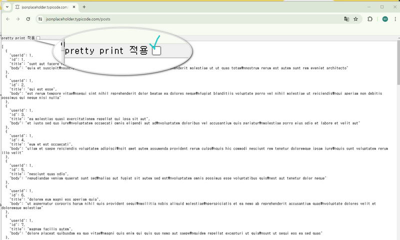{.shadow .w80}
3.  vscode 에서 fatch.js 파일을 생성후 코드를 작성한다.
    ```js # src/fetch.js
    let response = fetch('https://jsonplaceholder.typicode.com/posts').then((res) => {
    	console.log(res);
    });
    ```

promise 객체를 사용해서 반환되는 함수들은 then을 통해서 호출할수 있다.

1. 콘솔확인
   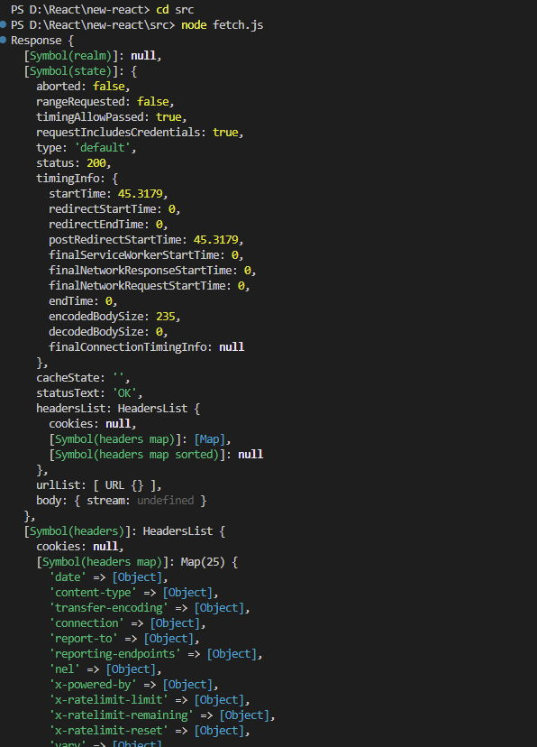{.shadow .w80}
2. fetch 를 통해 반환되는 값은 우리가 원하는 결과값이 아닌 성공객체 자체 를 반환하므로 우리가 원하는 형태와 다르다.
   편지를 보내고 답장을 받을때 봉투에 담겨 있는것과 같다
3. 봉투안의 편지를 꺼내듯 데이터 꺼내어 출력 해야 한다.
   async await 는 then을 간결히 작성할수 있게한다
   ```js # src/fetch.js
   async function getData() {
   	let rawResponse = await fetch('https://jsonplaceholder.typicode.com/posts');
   	let jsonResponse = await rawResponse.json();
   	console.log(jsonResponse);
   }
   getData();
   ```
   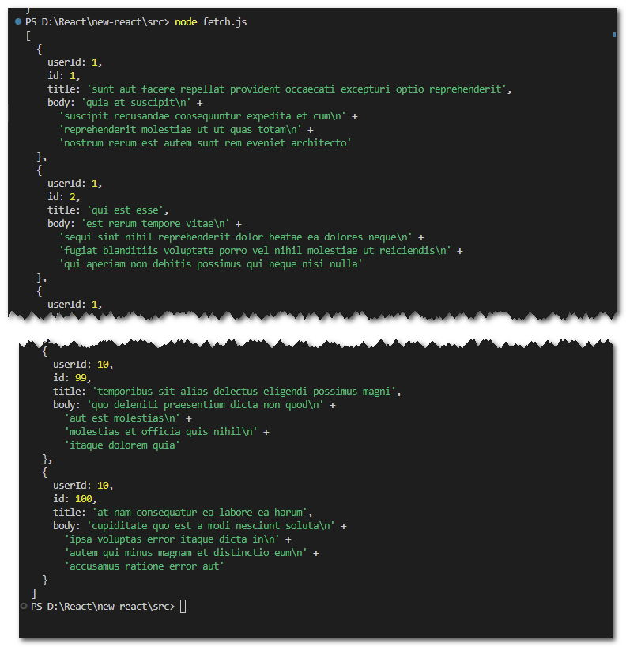{.shadow .w80}

### 3.2. 앱에 fetch 적용해보기

1. 이번에는 우리의 앱에 실제 네트워크 통신이 되는 데이터를 연결해보자
   src 폴더에 fetch.js 파일에 fetchDB 모듈을 추가하고 내용을 아래와 같이 작성한다.
   ```js # fetch.js
   export const fetchDB = async () => {
   	try {
   		let res = await fetch('https://jsonplaceholder.typicode.com/posts');
   		let db = await res.json();
   		return db;
   	} catch (error) {
   		console.error(error);
   	}
   };
   ```
2. App.js 에 fetchDB 를 임포트한다

   ```js # App.js
   import { useState, useEffect } from 'react';
   import { fetchDB } from './fetch';

   function App() {
   	const [loading, setLoading] = useState(true);
   	const [data, setData] = useState([]);
   	useEffect(() => {
   		const loadDB = async () => {
   			const db = await fetchDB();
   			setLoading(false);
   			setData(db);
   			console.log(db);
   		};
   		loadDB();
   		//삭제	setTimeout(() => {
   		//	}, 500);
   	}, []);

   	return (
   		<div className='App'>
   			return <div className='App'>{loading ? <h1>로딩중입니다...</h1> : <h1>도레미레시피</h1>}</div>;
   		</div>
   	);
   }

   export default App;
   ```

3. 콘솔로그를 확인해보자
   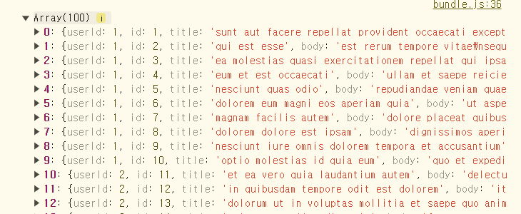{.shadow}
   100개의 데이터가 확인된다 이 데이터는 fetchDB에서 전달받은 것이다.
4. 코드설명

   | 줄번호 | 코드설명                                                                                                     |
   | ------ | ------------------------------------------------------------------------------------------------------------ |
   | 8      | loadDB 함수에 서버와 비동기 통신을 하고 컴포넌트의 상태플 변경하는 기능을 예엑한다.                          |
   | 9      | 서버와 통신시 서버 상황에 따라 응답속도의 차이가 있을수 있으므로 데이터를 요청하는 함수는 비동기로 작성한다. |
   | 10-11  | 컴포넌트의 로딩과 데이터의 상태를 관리하는 함수이다.                                                         |
   | 12     | 9번에서 응답받은 결과를 확인한다.                                                                            |
   | 14     | 8번에서 예약한 함수를 호출한다.                                                                              |

5. `data` 를 화면에 표시하기

```js #
return (
	<div className='App'>
		{loading ? (
			<h1>로딩중입니다...</h1>
		) : (
			data.map((el) => {
				return (
					<ul key={el.id}>
						<li style={{ color: 'red' }}>{el.userId}</li>
						<li>{el.title}</li>
						<li>{el.body}</li>
					</ul>
				);
			})
		)}
	</div>
);
```

## 4. 공공 API 신청

1.  [:link:식품안전나라](https://www.foodsafetykorea.go.kr/api/loginNew.do?menu_no=3817&menu_grp=MENU_NEW07) 회원가입을 한다.
2.  검색창에 레시피 입력후 해당 리스트 클릭
    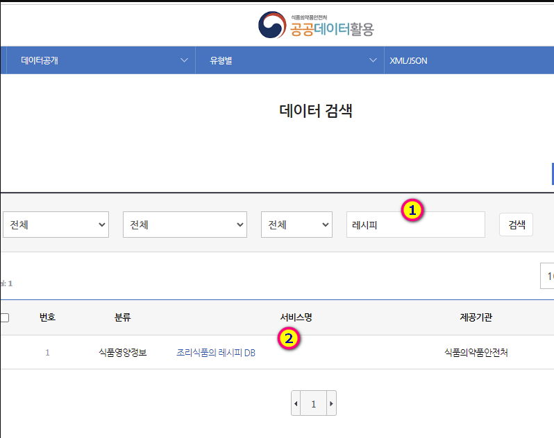{.shadow}

3.  OPEN-API 탭 클릭
    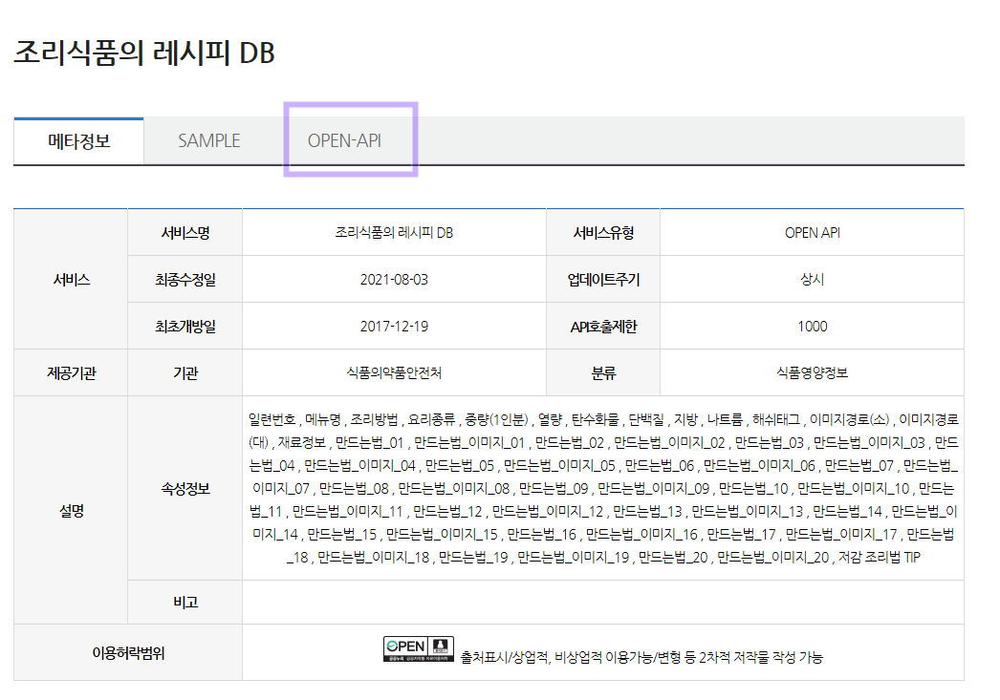{.shadow}

4.  인증키발급신청 클릭
    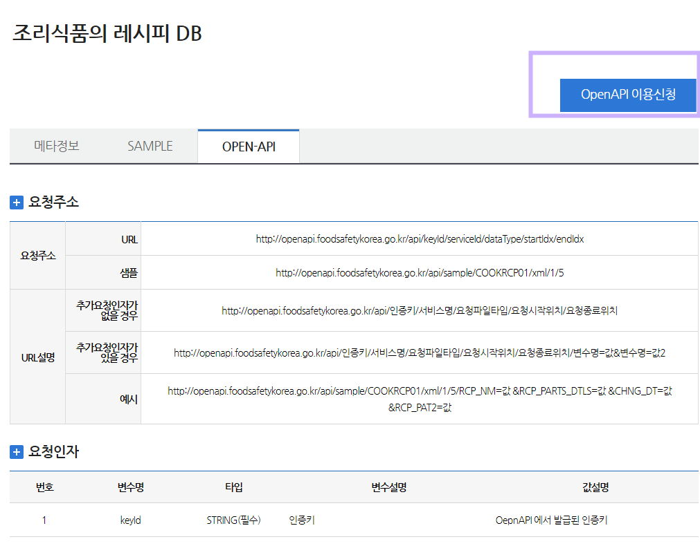{.shadow}
5.  약관동의 후 활용목적을 간단히 기재한다.
    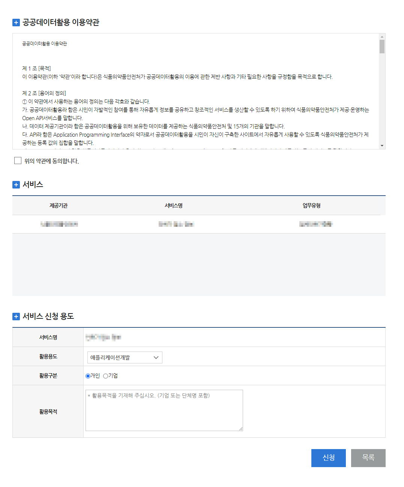{.shadow}
6.  1~2일 이후 회원 가입시 작성한 이메일이나 식품안전나라의 인증키 신청현황에서 발급된 키를 확인한다.

## 5. Axios

### 5.1. API 연결하기

1. API 요청주소 살펴보기
   API요청주소는 로그인시에만 공개되므로 하단의 링크를 이용하여 확인한다.
   [!ref target='blank' text='요청주소확인하기' icon='link'](https://www.foodsafetykorea.go.kr/api/newDatasetDetail.do)
   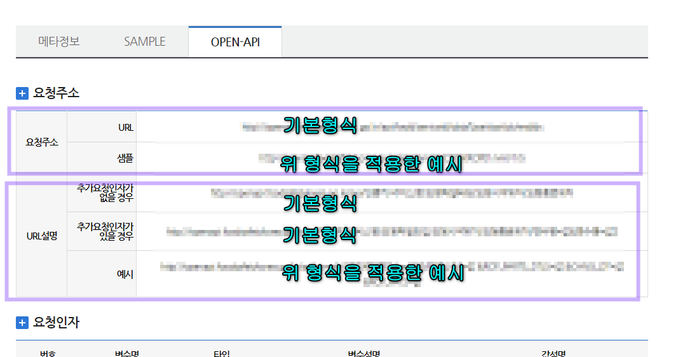{.shadow}
2. 요청주소의 샘플주소를 복사하여 주소창에 넣으면 데이터가 확인된다.

3. URL뒤에 원하는 데이터를 요청인자표를 보고 파라미터로 전달하면 원하는 데이터를 골라서 받을수 있다.
   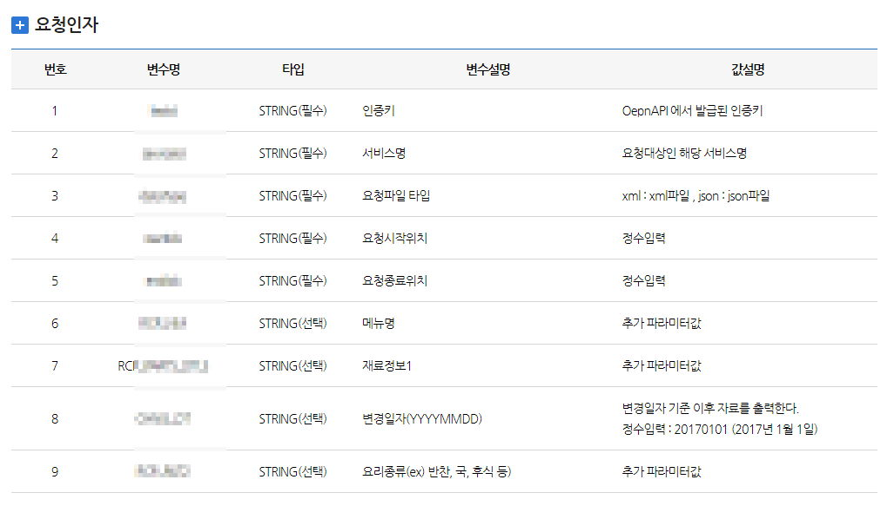{.shadow}

4. 데이터 확인해보기
   정말 그런지 API를 바로 사용해 보자.
   fetch.js에 작성한다.

   ```js # fetch.js
   //let res = await fetch('https://jsonplaceholder.typicode.com/posts');
   // 인증키=발급받은api키 / 서비스명=COOKRCP01 / 요청파일타입=json / 요청시작위치=1 / 요청종료위치=100
   let res = await fetch('http://openapi.foodsafetykorea.go.kr/api/인증키/COOKRCP01/json/1/100');
   ```

5. 실행화면 보기
   컴포넌트에는 데이터의 키가 맞지 않아 당연히 오류가 난다.
   콘솔창을 확인하면 통신결과는 성공으로 확인되며 100개의 레시피 데이터가 확인된다.
   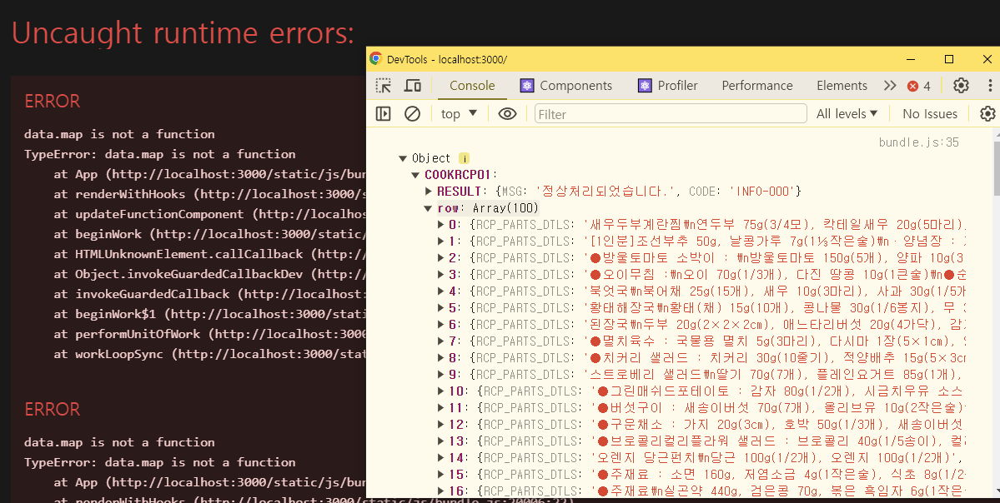{.shadow}

### 5.2. Axios 설치

:::my-box-blue
Axios란 브라우저와 Node.js 환경에서 사용할 수 있는 비동기 HTTP 통신 라이브러리.
Axios를 사용하면 HTTP 요청을 쉽게 보내고 응답을 처리할 수 있으며, Promise API를 기반으로 비동기 작업을 용이하게 한다.
Axios는 GET, POST, PUT, DELETE 등의 HTTP 메서드를 모두 지원하며, 요청과 응답을 JSON 형태로 자동 변환해준다.
:::

1. axios 설치하기
   실행중인 개발서버를 닫고 라이브러리 설치후 재실행한다.
   ```bash
   npm i axios
   npm start
   ```
2. 아래의 코드를 작성하여 데이터를 axios를 임포트 한다.
   3번라인 삭제.
   ```js #1,3 App.js
   import axios from 'axios';
   import { useState, useEffect } from 'react';
   //import { fetchDB } from './fetch';
   ```

### 5.3. 레시피데이터 받아오기

:::my-box-blue
위에서 언급했듯 서버에서 제공하는 데이터를 받아오는 작업은 컴포넌트를 렌더링 하는 작업에 비해 시간이 오래 걸리므로 비동기식으로 작성한다.
:::

1. 데이터를 받아오는 함수 getDB 에 async를 할당한다.
   서버와의 통신중 오류상황에 대비하여 try~catch 문 으로 예외처리를 작성한다.
   ```js # App.js
   	...
   	function App() {
   	const [loading, setLoading] = useState(true);
   	const [data, setData] = useState([]);
   const getDB = async () => {
   	try {
   		const DB = await axios.get('http://openapi.foodsafetykorea.go.kr/api/발급받은 서비스키/COOKRCP01/json/1/100');
   		console.log(DB); // 응답 데이터 확인.
   	} catch (error) {
   		console.error('데이터를 불러오는데 실패했습니다.', error);
   	}
   };
   //useEffect로 컴포넌트 마운트시 getDB함수를 호출한다.
   useEffect(() => {
   	getDB();
   	setLoading(false);
   }, []);
   ```
2. 결과확인
   서버에서 다양한 데이터를 전달하고 있는것이 확인된다.
   이중 우리가 원하는 값은 data.COOKRCP01.row에 배열형태로 반환되었다.
   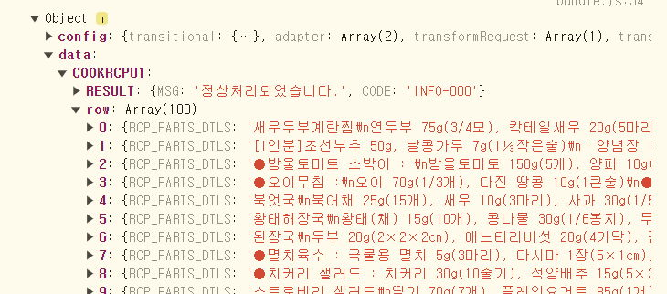{.shadow}

## 6. 레시피 데이터 화면에 그리기

### 6.1. 객체에 있는 키에 조금 더 똑똑하게 접근하기

1. `data.COOKRCP01.row` 에서 일단 `data` 까지 구조분해할당으로 꺼내보자

   ```js # App.js
   ...
   function App() {
   	const [loading, setLoading] = useState(true);
   	const [data, setData] = useState([]);
   	const getDB = async () => {
   		try {
   			const { data } = await axios.get('http://openapi.foodsafetykorea.go.kr/api/08cc9b42270a4439b1b5/COOKRCP01/json/1/100');
   			console.log(data);
   ...
   ```

2. 콘솔메시지는 1초 정도 기다리면 확인된다.
   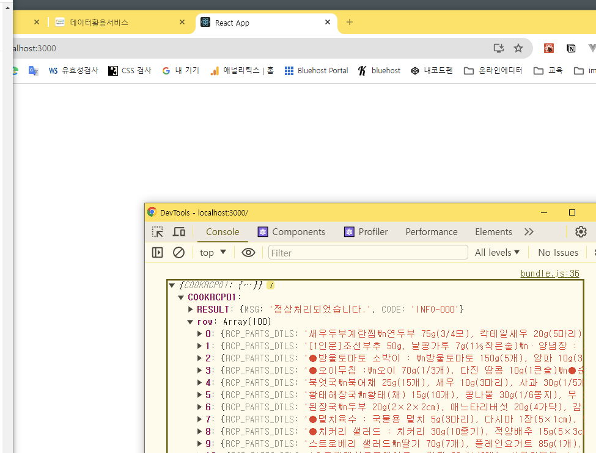{.shadow}
3. 상태관리를 여러개 할 경우 객체를 활용하여 간단히 관리할수 있다.
   loading,setLoadng의 초기값을 객체로 관리한다.
   ```js # App.js
   const [loading, setLoading] = useState({ state: true, data: [] });
   ```
   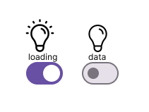{.inline-block} 두개의 스위치로 각각 제어하던 전등을
   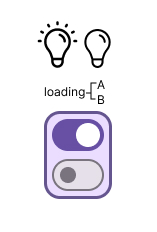{.inline-block} 하나의 멀티 스위치로 관리한다고 이해하면 쉽다. 이때 사용하는 자료형이 자바스크립트의 객체형이다.
4. 컴포넌트에 그리기
   ```js # App.js
   ...
   const getDB = async () => {
   	try {
   		const { data } = await axios.get('http://openapi.foodsafetykorea.go.kr/api/발급받은 서비스키/COOKRCP01/json/1/100');
   		setLoading({ state: false, data: data.COOKRCP01.row });
   		console.log(data);
   	} catch (error) {
   		console.error('데이터를 불러오는데 실패했습니다.', error);
   	}
   };
   useEffect(() => {
   	getDB();
   }, []);
   return (
   <div className='App'>
   	{loading.state ? (
   		<h1>로딩중입니다...</h1>
   	) : (
   		loading.data.map((a) => (
   			<div key={a.RCP_SEQ}>
   				<span style={{ color: 'red' }}>{a.RCP_NM}</span>
   				<span>{a.RCP_WAY2}</span>
   			</div>
   		))
   	)}
   </div>
   ...
   ```
5. 결과확인
   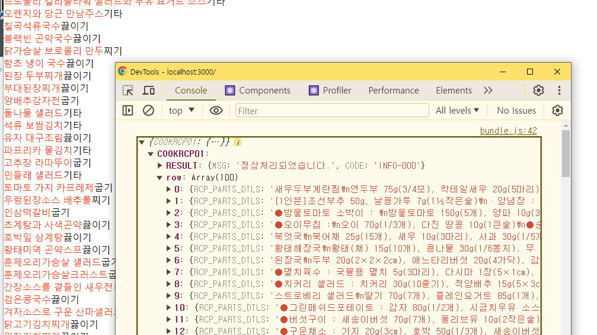{.shadow}

### 6.2. 코드개선하기(Refactoring)

1.  `	setLoading({ state: false, data: data.COOKRCP01.row });` 이 부분을 구조분해할당으로 줄여보자.
    data 를 한번더 분해해서 row키의 데이터만 추출하면 더욱 간결한 코드를 구현할수 있다.
    ```js #6,7 App.js
    function App() {
    	const [loading, setLoading] = useState({ state: true, data: [] });
    	const getDB = async () => {
    		try {
    			const {data} = await axios.get('http://openapi.foodsafetykorea.go.kr/api/발급받은 서비스키/COOKRCP01/json/1/100');
    			const {	COOKRCP01: { row } } = data;
    			setLoading({ state: false, data: row });
    		} catch (error) {
    			console.error('데이터를 불러오는데 실패했습니다.', error);
    		}
    	};
    	useEffect(() => {
    		getDB();
    	}, []);
    	return (
    	<div className='App'>
    		{loading.state ? (
    			<h1>로딩중입니다...</h1>
    		) : (
    			loading.data.map((el) => (
    				<div key={el.RCP_SEQ}>
    					<span style={{ color: 'red' }}>{el.RCP_NM}</span>
    					<span>{el.RCP_WAY2}</span>
    				</div>
    			))
    		)}
    	</div>
    );
    ...
    ```

### 6.3. 필요한 데이터만 추출하여 업데이트 하자

1. 응답데이터의 구조를 살펴보고 구조에 맞게 키를 넣어 컴포넌트에 렌더링 시켜보자.
   키에 해당하는 내용은 OPEN-API 페이지 하단의 출력항목 표에서 확인할수 있다 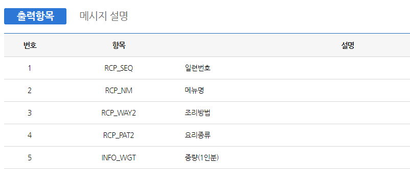{.shadow}

   ```js # App.js
   ...
   const {	COOKRCP01: { row } } = data;
   setLoading({ state: false, data: row });
   console.log('data', loading.data);
   ...
   	loading.data.map((el) => (
   		<div key={el.RCP_SEQ}>
   			<span style={{ color: 'red' }}>{el.RCP_NM}</span>
   			<span>{el.RCP_WAY2}</span>
   			<div>
   				<span>{el.MANUAL01}</span>
   				<span>{el.MANUAL02}</span>
   				<span>{el.MANUAL03}</span>
   			</div>
   		</div>
   ```

   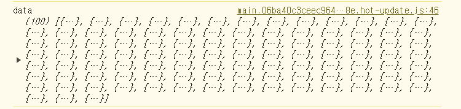{.shadow}

2. 앱을 실행해 보면 처음에는 isLoading... 이 화면에 나타나다가, 데이터가 화면에 렌더되는것을 볼수있다
   주의) 가끔 API가 오작동하며 axios.get()이 제대로 실행되지 않을 수도 있다. 그런 경우에는 1~2분 정도 기다렸다가 다시 리액트 앱을 실행해 보자.

## 7. 여기까지 깃허브에 올리기

```bash #
git add .
git commit -m "07 api 연결"
git push origin main
```

## 8. 완료파일 내려받기

[!button variant='success' icon='download' text='완료 파일' target='blank'](./assets/07/07_fin.zip)
