### 목차 <!-- omit in toc -->

- [1. 시작파일](#1-시작파일)
- [2. 연관링크](#2-연관링크)
- [3. 라우터 이해](#3-라우터-이해)
- [4. 라우터 연습](#4-라우터-연습)
	- [4.1. react-router 의 이해](#41-react-router-의-이해)
	- [4.2. 모듈설치](#42-모듈설치)
	- [4.3. 컴포넌트 작성](#43-컴포넌트-작성)
	- [4.4. 라우터 연결하기](#44-라우터-연결하기)
		- [4.4.1. 라우터 설치](#441-라우터-설치)
		- [4.4.2. createBrowserRouter 설치](#442-createbrowserrouter-설치)
		- [4.4.3. RouterProvider 서비스신청](#443-routerprovider-서비스신청)
	- [4.5. Link](#45-link)
	- [4.6. children](#46-children)
	- [4.7. Outlet](#47-outlet)
	- [4.8. errorElement](#48-errorelement)
	- [4.9. useNavigate](#49-usenavigate)
	- [4.10. 동적라우팅(useParams)](#410-동적라우팅useparams)
		- [4.10.1. 동적링크](#4101-동적링크)
	- [4.11. Router Path 속성](#411-router-path-속성)
		- [4.11.1. 상대경로2](#4111-상대경로2)
		- [4.11.2. index 라우트](#4112-index-라우트)
- [5. 라우터 실습](#5-라우터-실습)
	- [5.1. index.js 작성](#51-indexjs-작성)
	- [5.2. App 작성](#52-app-작성)
	- [5.3. layout/Root 작성](#53-layoutroot-작성)
	- [5.4. layout/Home 작성](#54-layouthome-작성)
	- [5.5. layout/Navi 작성](#55-layoutnavi-작성)
	- [5.6. layout/Category 작성](#56-layoutcategory-작성)
	- [layout/Recipe 작성](#layoutrecipe-작성)
- [6. 완료파일](#6-완료파일)

---

## 1. 시작파일

+++ 파일다운로드
만약 이전 파일이 없을 경우 아래의 파일을 다운로드 하여 진행한다
[!button variant='success' icon='download' text='시작 파일' target='blank'](./assets/08/start.zip)
+++ 파일활용방법

1.  다운로드 받은 start.zip 파일의 압축을 푼다
2.  새 리액트 앱을 설치한다. 리액트 앱 설치를 모를경우 아래 링크를 참고한다.
    [!ref target='blank' text='리액트 설치안내' icon='link'](../리액트좀해라/1.md)
3.  리액트 앱의 설치가 왼료 되었으면 1번의 파일압축을 푼다
4.  압축을 풀게 되면 start/src 폴더가 있다.
5.  2번의 src폴더에 4번의 src 폴더를 덮어 씌운다.
    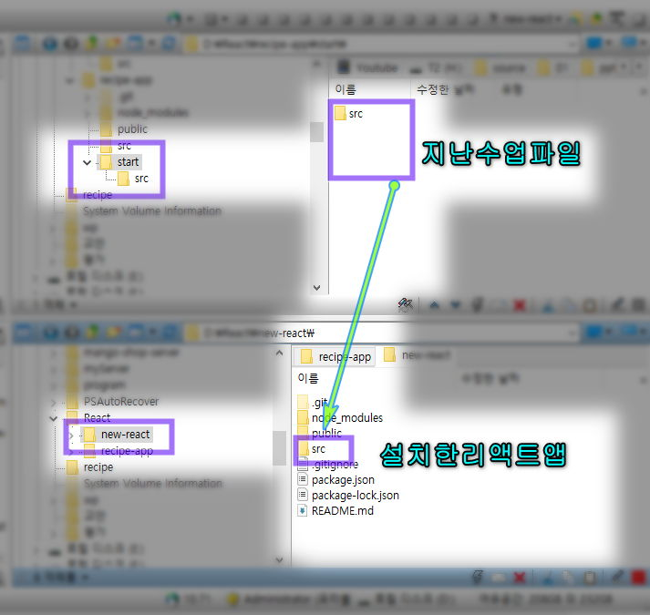
6.  2번의 폴더를 루트로 선택하여 vscode를 연다.
7.  vscode 의 터미널에 npm start 를 입력하여 앱을 실행한다.

+++

## 2. 연관링크

| 종류             | 🔗링크                                  |
| ---------------- | --------------------------------------- |
| 리액트라우터공식 | [ReactRouter](https://reactrouter.com/) |

## 3. 라우터 이해

:::comment_box
:icon-mortar-board: 라우터{.h4}

데이터를 연결하는 장치

:icon-mortar-board: 라우팅{.h4}

데이터의 최단/최적경로 찾기
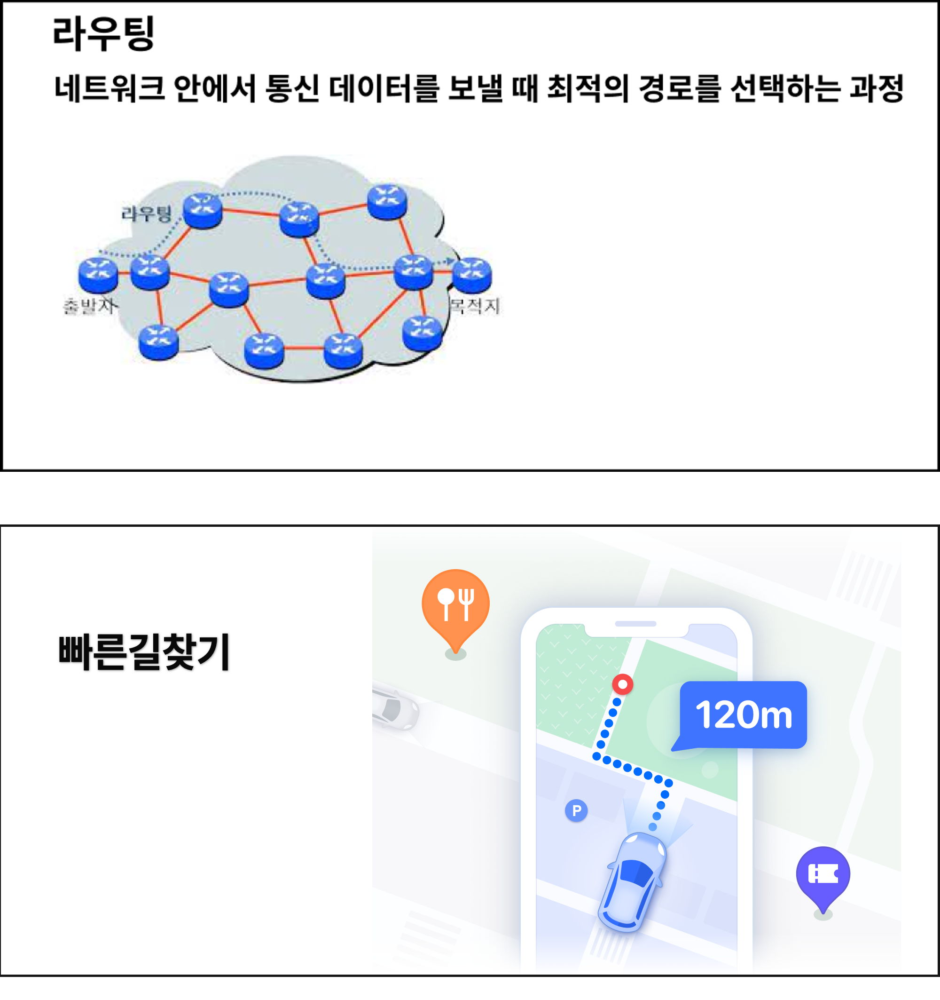{.shadow}

:icon-mortar-board: MPA{.h4}

레거시 웹페이지의 링크방식. 데이터 변경시 페이지 전체가 업데이트 된다.

:icon-mortar-board: SPA{.h4}

한개의 페이지에서 변경된 데이터 컴포넌트만 업데이트 되는 방식

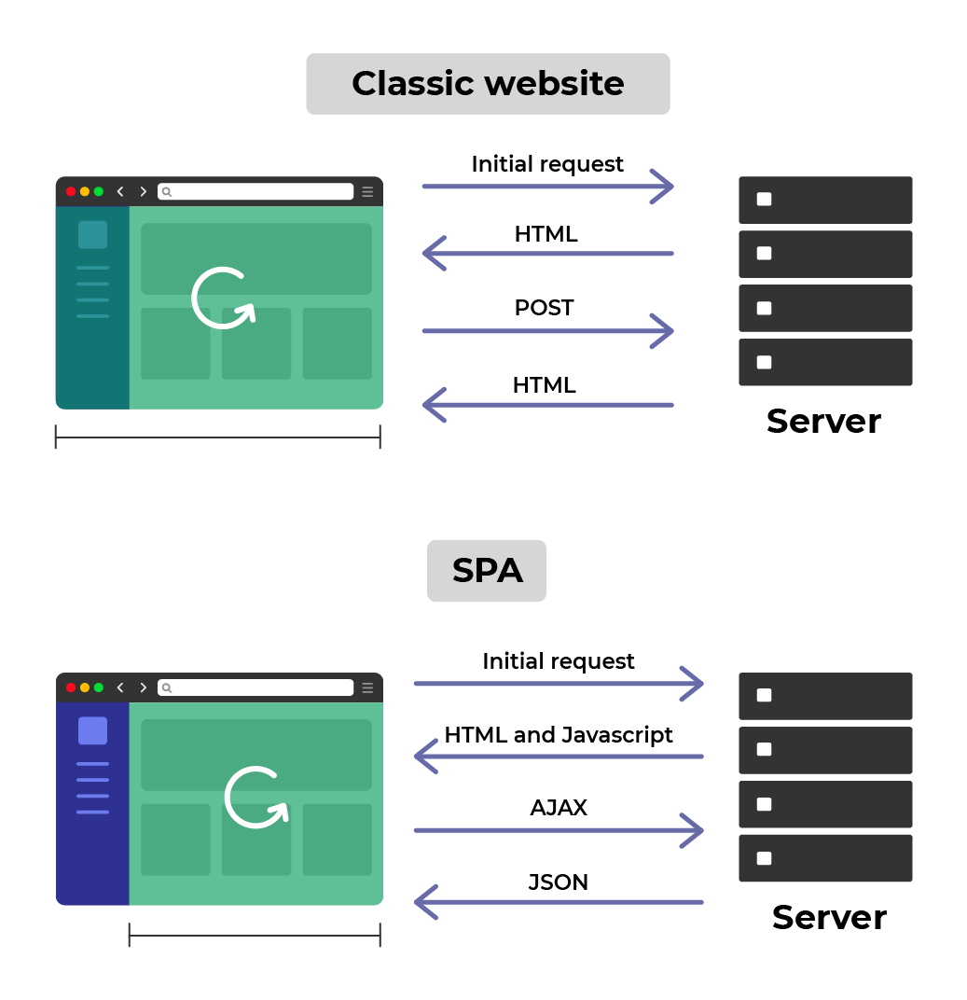{.shadow}
:::

## 4. 라우터 연습

### 4.1. react-router 의 이해

> 1. react-router 란 리액트 컴포넌트를 연결하는 모듈이다.
>    v3 까지는 하나의 모듈 이었으나 v4부터 네이티브 앱 용 `react-router-native`와 웹 개발용 `react-router-dom` 으로 분리되었다.
>
> :icon-mortar-board: React-router-dom v5 VS v6{.h4 .blue}
>
> React-rounter-dom v5 와 v6의 명령어가 크게 변경 되었으므로 프로젝트 유지보수 전 사용된 버전을 확인 후 그에 맞는 문법을 사용할것.
>
> 또한 v6도 v6.4이후 추가된 문법이 있다. 예제에서는 v6.4이후를 기준으로 진행한다.{.red}

### 4.2. 모듈설치

1. 열려있는 개발서버를 닫고 vscode 터미널 창에 아래의 명령어를 입력후 설치한다.
   ```cmd # Terminal
   npm install react-router-dom
   ```
2. 설치가 완료되면 서버를 실행한다.
   ```cmd # Terminal
   npm start
   ```

### 4.3. 컴포넌트 작성

> 연습할 컴포넌트 환경을 구성한다.
> [:link:snippets 설정하기](../Reference/Snippet.md)

```txt # 아래 구조대로 컴포넌트를 생성한다
/src─┬─
     └──/pages ─┬
                ├──Home.js
                └──Products.js

```

||| :icon-code: src\pages\Home.js

```jsx #
import React from 'react';

const Home = () => {
	return <h1>Home</h1>;
};
export default Home;
```

||| :icon-code: src\pages\Products.js

```jsx #
import React from 'react';

const Products = () => {
	return <h1>Products</h1>;
};
export default Products;
```

|||

### 4.4. 라우터 연결하기

#### 4.4.1. 라우터 설치

> 라우터(전화기)를 사용하여 라우팅(통화)을 하는 과정을 3단계로 나누어보자.
>
> 1. 전화기를 산다 = 라우터 설치{.red}
> 2. 통신서비스를 신청한다. = 통신서비스를 중개하는 객체에 서비스 신청
> 3. 친구한테 전화건다 = 라우팅 연결

<details markdown='block'>
  <summary>
 🐨 보충
  </summary>
<pre style="background:#f3f4f5;white-space:pre-wrap;padding:5px">
 실생활에서 사용하는 전화기의 종류가 다양하듯 리액트 라우터의 종류도 다양하다.
 2024년 6월 현재 reactrouter v6.23.1 기준으로 RouterComponents는 아래 6종류가 있다.
 1. BroswerRouter
 2. HashRouter
 3. MemoryRouter
 4. NativeRouter
 5. Router
 6. StaticRouter
</pre>
</details>

지금 우리는 여기서 1단계 를 하는 것 이다.
이 단계를 맡고 있는 🔗[createBrowserRouter](https://reactrouter.com/en/main/routers/create-browser-router) 이라는 객체를 사용해보자.
`createBrowserRouter` 객체로 특정 컴포넌트를 래핑하게 되면 하위의 컴포넌트는 라우터를 설정 할수있는 다양한 객체들을 상속받아 사용 할 수 있다.

#### 4.4.2. createBrowserRouter 설치

라우팅 서비스를 이용할 컴포넌트들은 이 객체로 래핑되어 있어야 한다.
어차피 앱내의 컴포넌트들은 모두 라우팅 될것이므로 최상위 컴포넌트에 작성하자.

1. 객체 구성확인
   ```js #3,6-7,11 src\index.js
   import React from 'react';
   import ReactDOM from 'react-dom/client';
   import { createBrowserRouter } from 'react-router-dom';
   import './index.css';
   import App from './App';
   import Home from './pages/Home';
   console.log(createBrowserRouter([{}]));
   const root = ReactDOM.createRoot(document.querySelector('#root'));
   root.render(
   	<>
   		<Home />
   		<App />
   	</>
   );
   ```
   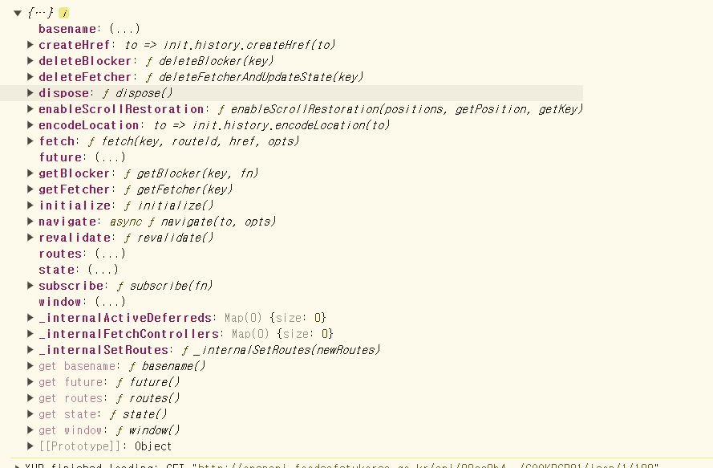{.shadow}
   콘솔창에서 객체가 가지고 있는 값을 확인해보면 잘 알수는 없지만 url 정보가 많이 보인다.
   우리는 이제 필요할때마다 이 안의 객체들을 사용해서 리액트의 컴포넌트 연결을 하는 것이다.
2. 겍체를 변수에 할당후 라우터 연결

   > 1. 전화기를 산다 = 라우터 설치
   > 2. 통신서비스를 신청한다. = 통신서비스를 중개하는 객체에 서비스 신청
   > 3. 친구한테 전화건다 = 라우팅 연결{.red}

   1. path : 경로
   2. element: 경로접근시 열릴 컴포넌트

   ```js #
   const router = createBrowserRouter([
   	{
   		path: '/',
   		element: <Home />,
   	},
   ]);
   ```

#### 4.4.3. RouterProvider 서비스신청

> 1. 전화기를 산다 = 라우터 설치
> 2. 통신서비스를 신청한다. = 통신서비스를 중개하는 객체에 서비스 신청{.red}
> 3. 친구한테 전화건다 = 라우팅 연결

설정한 라우터와 컴포넌트를 연결할때는 provider 컴포넌트를 사용한다

1. RouterProvider 컴포넌트를 이용한다

   ```jsx
   import React from 'react';
   import ReactDOM from 'react-dom/client';
   import { createBrowserRouter, RouterProvider } from 'react-router-dom';
   import './index.css';
   import App from './App';
   import Home from './pages/Home';
   const router = createBrowserRouter([
   	{
   		path: '/',
   		element: <Home />,
   	},
   ]);
   const root = ReactDOM.createRoot(document.querySelector('#root'));
   root.render(
   	<RouterProvider router={router}>
   		<Home />
   		<App />
   	</RouterProvider>
   );
   ```

   RouterProvider 객체는 router속성을 포함하고 있다.
   이 속성에 연결할 컴포넌트의 정보를 전달하면 라우팅이 완료 된다.

1. 아래와 같이 Home 컴포넌트가 라우팅 된것을 볼수있다.
   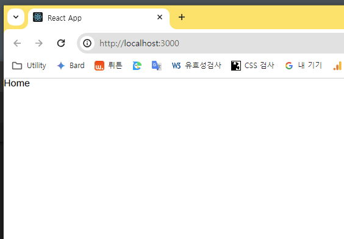{.shadow}

1. 라우터 추가 작성

   ```jsx # index.js
   import Products from './pages/Products';
   ...
   const router = createBrowserRouter([
      {
         path: '/',
         element: <Home />,
      },
      {
         path: '/app',
         element: <App />,
      },
      {
         path: '/products',
         element: <Products />,
      },
   ]);

   ```

1. 브라우저 주소창에 설정한 경로를 입력하면 페이지 새로고침 없이 컴포넌트가 이동한다.
   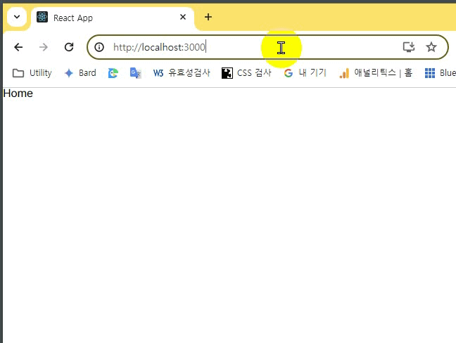{.shadow}

---

### 4.5. Link

> Link 컴포넌트는 html의 a 태그로 변환된다.
> href 속성은 to 라는 props로 작성한다.

1. Home 컴포넌트에 a태그로 링크생성

   ```jsx # \pages\Home.js
   import React from 'react';

   const Home = () => {
   	//localhost:3000/products
   	http: return (
   		<div>
   			<h1>Home</h1>
   			<a href='/products'>Products</a>
   		</div>
   	);
   };
   export default Home;
   ```

1. 클릭하면 화면이 한번 깜빡이고 이동한다.
   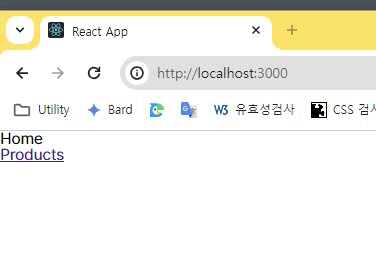{.shadow}
   이 방법은 페이지 내의 모든 컴포넌트를 새로고침하게 되며 SPA 내의 모든 컴포넌트를 리렌더 하게 된다. 리액트 앱은 컴포넌트 단위로 구성되어있는데 변경될 필요가 없는 컴포넌트 까지도 리렌더를 하게 되므로 SPA 에서 사용하기에는 부적절한 방법이다

1. Link 컴포넌트로 변경하자

   ```js # Home.js
   import { Link } from 'react-router-dom';

   const Home = (props) => {
   	return (
   		<>
   			<h1>Home</h1>
   			<Link to='/products'>LINK-Product </Link>
   			<a href='/products'>Products</a>
   		</>
   	);
   };
   export default Home;
   ```

1. 화면의 새로고침 없이 이동이 되는지 확인한다
   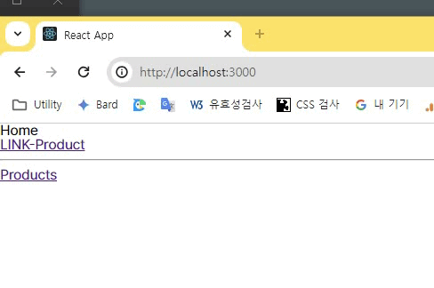{.shadow}
   a태그로 변환 되었는지도 확인한다.
   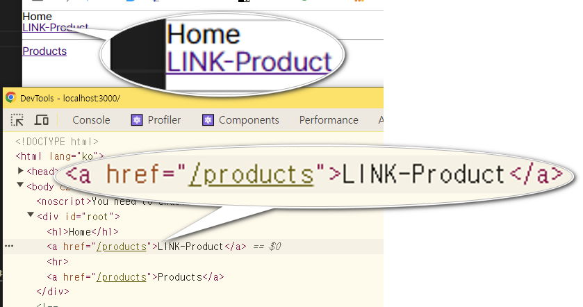{.shadow}

### 4.6. children

> 라우터 설정을 구조화 할수 있는 방법을 알아보자
> 컴포넌트 간의 관계에 따라 라우터도 계층화 한다면 좋을것이다.

1. pages 폴더에 모든 컴포넌트를 제어할 RootLayout 컴포넌트를 만든다. 이 컴포넌트는 mpa의 index.html 과 같은 역할을 한다.

   ```jsx # src\pages\RootLayout.js
   import Navi from './Navi';
   const RootLayout = () => {
   	return (
   		<>
   			<h1>Root</h1>
   			<Navi />
   		</>
   	);
   };
   export default RootLayout;
   ```

2. Navi 컴포넌트를 작성한다.

   ```js # Navi.js
   import { Link } from 'react-router-dom';
   import './Navi.css';
   const Navi = () => {
   	return (
   		<ul>
   			<li>
   				<Link to='/home'>Home</Link>
   			</li>
   			<li>
   				<Link to='/products'>Products</Link>
   			</li>
   		</ul>
   	);
   };
   export default Navi;
   ```

3. Navi.css 는 아래 코드를 복붙한다.

   ```css #
   ul {
   	padding: 1rem;
   	display: flex;
   	position: fixed;
   	bottom: 0;
   	list-style: none;
   	gap: 2rem;
   	background-color: pink;
   }
   ```

4. index.js 로 이동하여 router 의 속성을 추가한다.
   이때 헷갈리므로 root.render 함수는 RouterProvider 만 남겨놓는다

   ```js #
   import RootLayout from './pages/RootLayout';
   const router = createBrowserRouter([
      {
         path: '/',
         element: <RootLayout />,
         children: [
            {
               path: 'products',
               element: <Products />,
            },
            {
               path: 'home',
               element: <Home />,
            },
         ],
      },
   ]);
   ...
   root.render(<RouterProvider router={router} />);

   ```

   브라우저에서 테스트 해보면 경로의 이동은 되는데 컴포넌트의 렌더링이 되지 않는다.
   라우터 설정은 잘 되었으나 RootLayout 에서 Home과 Products 컴포넌트를 임포트 하지 않아서 인데
   리액트의 컴포넌트는 이점이 굉장히 불편하다. GNB나 모달팝업, 패널메뉴 같이 모든 컴포넌트에 표시돼야 하는 UI의 경우 매번 임포트해야 한다.
   하지만 최상위 컴포넌트를 만들어서 제어한다면 최상위에서 Outlet 이라는 컴포넌트만 작성하면 해결할수 있다.

### 4.7. Outlet

> 중첩된 라우트를 렌더링하는 데 사용되는 컴포넌트
> React Router v6부터 도입된 Outlet은 부모 라우트 내에서 자식 라우트가 렌더링될 위치를 지정하는 역할을 한다.

1.  RootLayout 에 Outlet 을 임포트 한다.

    ```js #1,8 RootLayout.js
    import { Outlet } from 'react-router-dom';
    import Navi from './Navi';
    const RootLayout = () => {
    	return (
    		<>
    			<h1>Root</h1>
    			<Navi />
    			<Outlet />
    		</>
    	);
    };
    export default RootLayout;
    ```

2.  브라우저에서 테스트 해보면 Root와 Navi 는 모든 컴포넌트에서 표시되며 컴포넌트간 이동도 잘 되는것이 확인된다.

### 4.8. errorElement

> react-router 에서 자체적으로 제공하는 예외처리문은 여러개가 있다. 그중 에러상황 발생시 사용할수 있는 객체를 알아보자 [:link:](https://reactrouter.com/en/main/route/error-element)

1. pages/Error.js 를 만들고 404 메시지를 작성한다.

   ```js # pages/Error.js
   import './Error.css';
   import Navi from './Navi';
   const ErrorPage = (props) => {
   	return (
   		<>
   			<Navi />
   			<div className='error'>404Error</div>
   		</>
   	);
   };
   export default ErrorPage;
   ```

   ```css # /Error.css'
   .error {
   	width: 100vw;
   	height: 100vh;
   	font-size: 5vw;
   	color: white;
   	background-color: #ff0000;
   }
   ```

2. 라우터 설정 추가

   ```js # index.js
   import ErrorPage from './pages/Error';
      {
         path: '/',
         element: <RootLayout />,
         errorElement: <ErrorPage />,
         children: [
            {
               path: 'products',
               element: <Products />,
            },
            {
               path: 'home',
               element: <Home />,
            },
         ],
      },
   ]);

   ```

3. 주소창에 없는 경로를 입력하면 에러컴포넌트가 확인된다
   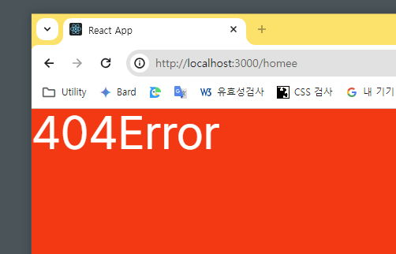

### 4.9. useNavigate

> 웹페이지 개발시 a태그를 사용하지 않고 다른 요소에 자바스크립트를 사용하여 링크를 해야 하는 경우가 있다.
> 이런 상황을 리액트에서는 어떻게 해결할수 있을까?
> useNavigate 훅은 이펙트 등에서 프로그래밍 방식으로 탐색할 수 있는 함수를 반환한다.
> React 애플리케이션에서 페이지 간의 탐색(navigation)을 수행하는 훅이다.

1. 아래와 같이 코딩한다

   ```jsx # src\pages\Home.js
   import { Link, useNavigate } from 'react-router-dom';

   const Home = (props) => {
   	const navi = useNavigate();
   	const naviFn = () => {
   		navi('/App');
   	};
   	return (
   		<>
   			<h1>Home</h1>
   			<button onClick={naviFn}>click</button>
   			<Link to='/products'>LINK-Product</Link>
   			<a href='/products'>Products</a>
   		</>
   	);
   };
   export default Home;
   ```

2. index.js 로 이동하여 라우터를 설정한다.
   ```js # src\index.js
   const router = createBrowserRouter([
   {
      ...
   },
   {
   	path:'/app',
   	element: <App />,
   }
   ```
   :::comment_box
   버튼을 클릭하면 App 컴포넌트가 렌더링된다.
   :::
   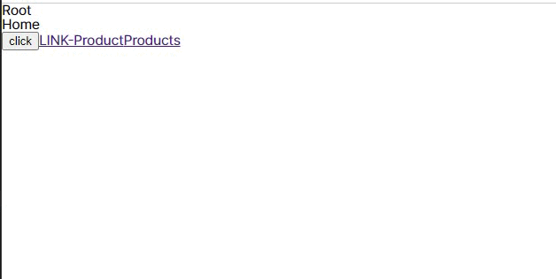{.shadow}
   이 코드는 링크 컴포넌트를 사용하여 이동하는 것이 아닌 버튼을 클릭시 함수를 호출하고 그 함수에서 다른 컴포넌트로 이동하기 위한 네비게이션 훅을 호출하는 방식이다.

### 4.10. 동적라우팅(useParams)

> 📢 시나리오:
> 상품페이지에는 상품이 여러개 있고 각 상품을 조회할수 있는 상세 페이지로 이동시키는 라우터를 작성해야 한다
> 이럴 경우 상품의 고유 식별자를 사용하여 연결할수 있다.
> 이때 useParams 를 사용하면 편리하다

1. src\pages\Products.js 에 구조를 추가하자

   ```js # src\pages\Products.js
   import React from 'react';

   const Products = () => {
   	return (
   		<>
   			<h1>Products</h1>
   			<ul>
   				<li>상품1</li>
   				<li>상품2</li>
   				<li>상품3</li>
   			</ul>
   		</>
   	);
   };
   export default Products;
   ```

2. 상품상세페이지 컴포넌트를 만든다

   ```jsx # src\pages\ProductDetail.js
   const ProductDetail = () => {
   	return <div>ProductDetail</div>;
   };
   export default ProductDetail;
   ```

3. 라우터를 작성한다

   ```jsx # src\index.js
      import React from 'react';
      import ReactDOM from 'react-dom/client';
      import { createBrowserRouter, RouterProvider } from 'react-router-dom';
      import './index.css';
      import App from './App';
      import Home from './pages/Home';
      import Products from './pages/Products';
      import ProductDetail from './pages/ProductDetail';
      import RootLayout from './pages/RootLayout';
      import ErrorPage from './pages/Error';
      const router = createBrowserRouter([
         {
            path: '/',
            element: <RootLayout />,
            errorElement: <ErrorPage />,
            children: [
               {
                  path: 'products',
                  element: <Products />,
               },
               {
                  path: 'products/detail',
                  element: <ProductDetail />,
               },
               {
                  path: 'home',
                  element: <Home />,
               },
            ],
         },
         {
            path: '/app',
            element: <App />,
         },
      ]);
      ...
   ```

   상품의 아이디나 관리번호에 따라 path 는 변경되야 할것이다

4. 동적경로 작성하기 `:`

   ```jsx # src\index.js
   { path: '/products/:id', element: <ProductDetail /> },
   ```

**: 이후의 값은 동적으로 처리된다**

5.  확인
    숫자 5를 넣어도 apple을 넣어도 상세 컴포넌트가 렌더링 된다
    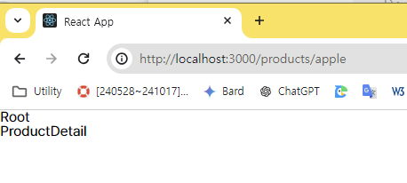{.shadow}

6.  상세 페이지에서 parameter 을 받아보자
    전달하는 parameter 을 받을때는 `useParams` 가 필요하다

    ```jsx # src\pages\ProductDetail.js
    import { useParams } from 'react-router-dom';

    const ProductDetail = (props) => {
    	console.log(useParams());

    	return (
    		<>
    			<div>ProductDetail</div>
    		</>
    	);
    };
    export default ProductDetail;
    ```

7.  확인

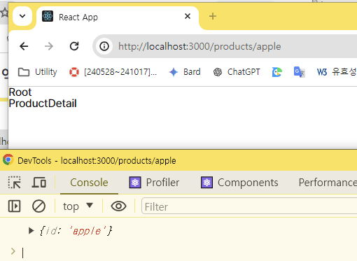{.shadow}

8. id 저장

```js #
   const {id}=useParams()
   ...
   <div>{id}</div>
```

#### 4.10.1. 동적링크

> 이번에는 동적 링크를 넣어보자

1. src\pages\Products.js 로 이동후 Link 컴포넌트를 추가한다
2. 상품들은 일반적으로 백엔드 서버에서 받아오겠지만 지금은 상수로 작성한후 map으로 불러온다
3. Link to 에 템플릿리터럴을 사용하여 속성을 전달하면 동적으로 링크주소를 작성할수 있다
   ```jsx # src/pages/Products.js
   import { Link } from 'react-router-dom';
   const PRODUCTS = [
   	{ id: '1', title: '상품1' },
   	{ id: '2', title: '상품2' },
   	{ id: '3', title: '상품3' },
   ];
   const Products = () => {
   	return (
   		<>
   			<h1>Products</h1>
   			<ul>
   				{PRODUCTS.map((item) => (
   					<li key={item.id}>
   						<Link to={`/products/${item.id}`}>{item.title}</Link>
   					</li>
   				))}
   			</ul>
   		</>
   	);
   };
   export default Products;
   ```
4. 확인
   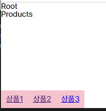{.shadow}

### 4.11. Router Path 속성

> router 의 children 배열의 path 속성에서 / 를 삭제 한다는것은 해당 경로를 상대경로로 변경한다는 의미이다.

```jsx #14-16 src/index.js
import { createBrowserRouter, RouterProvider } from 'react-router-dom';
import Home from './pages/Home';
import Products from './pages/Products';
import ProductDetail from './pages/ProductDetail';
import RootLayout from './pages/Root';
import ErrorPage from './pages/Error';

const router = createBrowserRouter([
	{
		path: '/',
		element: <RootLayout />,
		errorElement: <ErrorPage />,
		children: [
			{ path: '', element: <Home /> },
			{ path: 'products', element: <Products /> },
			{ path: 'products/:id', element: <ProductDetail /> },
		],
	},
]);

const App = () => {
	return <RouterProvider router={router} />;
};
export default App;
```

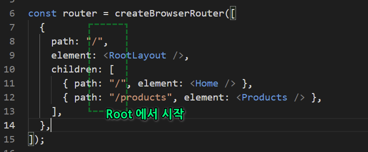{.shadow}
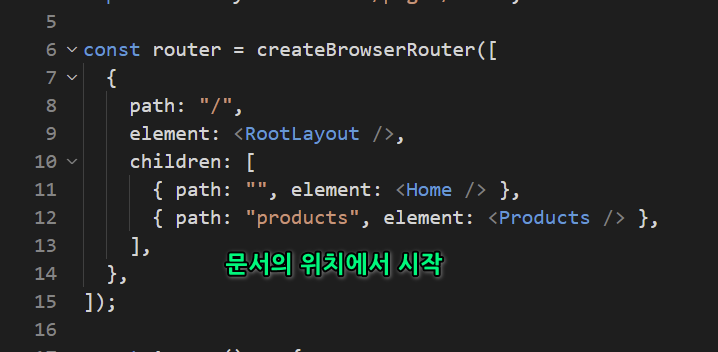{.shadow}

product.js 의 Link 를 보자
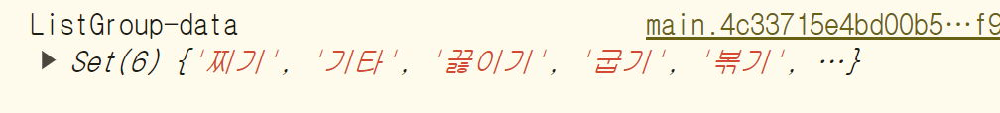{.shadow}

상대경로로 수정한다

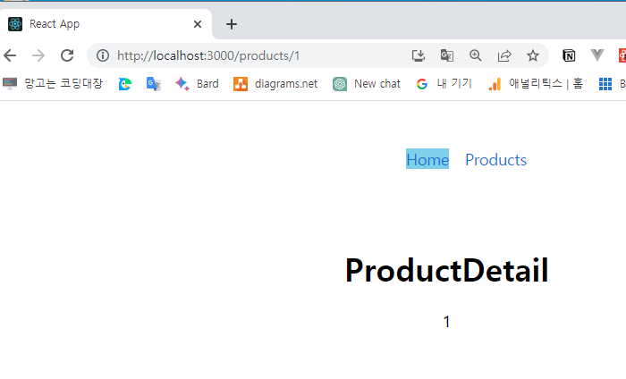{.shadow}
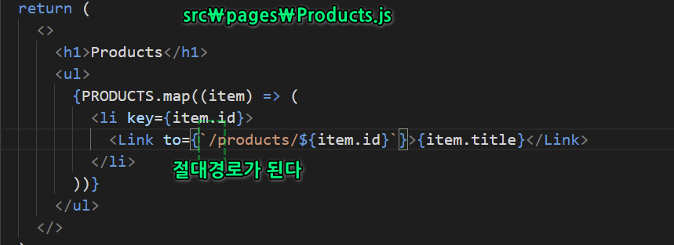{.shadow}

```jsx #4 src\pages\Products.js
...
{PRODUCTS.map((item) => (
	<li key={item.id}>
		<Link to={item.id}>{item.title}</Link>
	</li>
...
```

#### 4.11.1. 상대경로2

src\pages\ProductDetail.js 에 뒤로가기 버튼을 상대 경로로 넣어보자

```jsx #11 src\pages\ProductDetail.js
import { useParams, Link } from 'react-router-dom';

const ProductDetail = () => {
	const params = useParams();
	return (
		<div>
			<h1>ProductDetail</h1>
			<div>{params.id}</div>
			<div>
				<Link to='..'>Back</Link>
			</div>
		</div>
	);
};
export default ProductDetail;
```

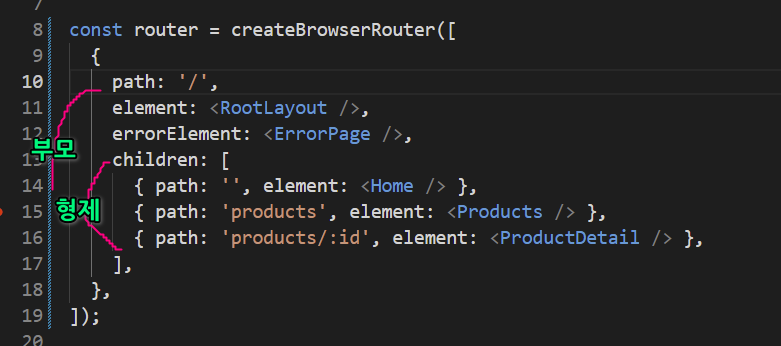{.shadow}
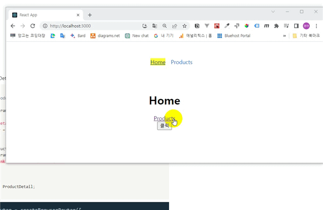{.shadow}

상품 상세 페이지에서 상품 페이지로 이동 하는 것이 아니라 바로 홈으로 이동한다.

이유는 상세페이지 와 상품 페이지는 형제 관계이기 때문이다

수정해보자

```jsx # src\pages\ProductDetail.js
...
<div><Link to=".." relative="path">Back</Link></div>
```

**relative 속성에 path 를 사용하면 path 단위로 이동이 가능하다**

#### 4.11.2. index 라우트

메인 컴포넌트에 설정할수 있는 index 속성을 사용해보자

```jsx # src\index.js
import { createBrowserRouter, RouterProvider } from 'react-router-dom';
import Home from './pages/Home';
import Products from './pages/Products';
import ProductDetail from './pages/ProductDetail';
import RootLayout from './pages/Root';
import ErrorPage from './pages/Error';

const router = createBrowserRouter([
	{
		path: '/',
		element: <RootLayout />,
		errorElement: <ErrorPage />,
		children: [
			{ index: true, element: <Home /> },
			{ path: 'products', element: <Products /> },
			{ path: 'products/:id', element: <ProductDetail /> },
		],
	},
]);

const App = () => {
	return <RouterProvider router={router} />;
};
export default App;
```

이 키는 빈 path 대신 메인 컴포넌트를 지정할수 있는 속성이다. 선택사항임

```js #15 src/index.js
import { createBrowserRouter, RouterProvider } from 'react-router-dom';
import Home from './pages/Home';
import Products from './pages/Products';
import ProductDetail from './pages/ProductDetail';
import RootLayout from './pages/Root';
import ErrorPage from './pages/Error';

const router = createBrowserRouter([
	{
		path: '/',
		element: <RootLayout />,
		errorElement: <ErrorPage />,
		children: [
			{ index: true, element: <Home /> },
			{ path: 'products', element: <Products /> },
			{ path: 'products/:id', element: <ProductDetail /> },
		],
	},
]);

const App = () => {
	return <RouterProvider router={router} />;
};
export default App;
```

## 5. 라우터 실습

> 레시피앱의 라우터 설정은 앱 컴포넌트에서 할것이다.

### 5.1. index.js 작성

1. src/폴더 생성
   ```txt #
      폴더의구성
    components/ui요소
   		└─Item.js,Item.css,List.js,List.css,Title.js,Title.css
    layout/페이지
      └─Root.js,Category.js, Home.js, Navi.js, Recipe.js 파일을 생성한다
   ```
1. 아래와 같이 수정한다.

   ```js # src/index.js
   import ReactDOM from 'react-dom/client';
   import { createBrowserRouter, RouterProvider } from 'react-router-dom';
   import './index.css';

   import Root from './layout/Root';
   import Home from './layout/Home';
   import Recipe from './layout/Recipe';
   import Category from './layout/Category';

   const router = createBrowserRouter([
   	{
   		path: '/',
   		element: <Root />,
   		children: [
   			{
   				index: true,
   				element: <Home />,
   			},
   			{
   				path: 'recipe/:id',
   				element: <Recipe />,
   			},
   			{
   				path: 'category/:category',
   				element: <Category />,
   			},
   		],
   	},
   ]);

   const root = ReactDOM.createRoot(document.querySelector('#root'));
   root.render(<RouterProvider router={router} />);
   ```

### 5.2. App 작성

1. useContext 를 사용하여 전역 데이터를 설정한다.
   App컴포넌트에서 응답받는 데이터는 모든 하위 컴포넌트에 필요하므로 전역적으로 관리 되어야 한다.
   ==- [!badge variant='info' size='s' text='참고'] useContext 란?

   :::comment_box
   [!ref target='blank' text='useContext' icon='link'](https://react.dev/reference/react/useContext)
   리액트에서 데이터는 단방향 하향식이다.
   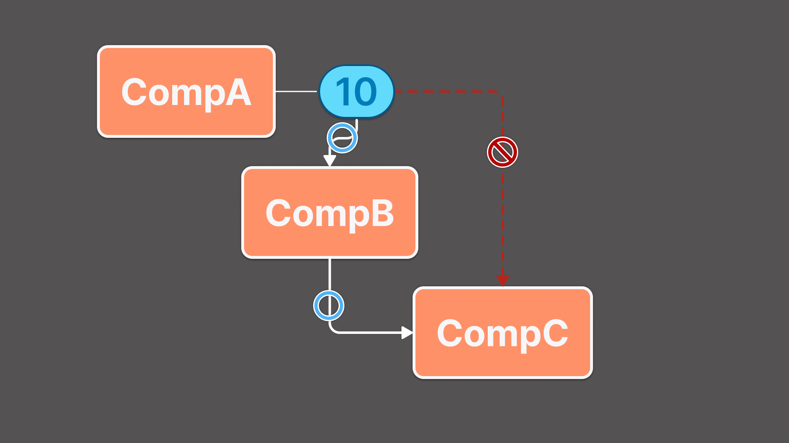{.shadow}
   이미지와 같이 자손 컴포넌트에서 조상 컴포넌트의 데이터를 사용해야 할 경우 부모 컴포넌트를 통해 전달받아야 한다.
   이 경우 불필요한 코드가 늘어나게 되는데 이 현상을 props drilling 이라고 한다.
   이런 props drilling 현상은 코더에게 멀미를 유발하게 되므로 전역적으로 사용하는 데이터의 경우 다양한 방식으로 처리할수 있다.
   그중 하나가 useContext 이다.
   useContext는 리액트에서 제공하는 훅으로 자주 사용하는 값을 전역데이터로 최상위 컴포넌트에 저장해 놓으면 된다. 그러면 필요한 하위 컴포넌트에서 전역값에 직접 접근하여 사용할수 있다.
   :::

   ===
   App 컴포넌트는 전역데이터를 저장하고 전달하는 역할을 한다.

   ```js #7,8,16-54,64,6,1,4,68 src/App.js
   import { useState, useEffect, createContext } from 'react';
   import axios from 'axios';

   const DataContext = createContext();

   function App({ children }) {
   	const [loading, setLoading] = useState(true);
   	const [data, setData] = useState([]);

   	const getDB = async () => {
   		try {
   			const { data } = await axios.get('http://openapi.foodsafetykorea.go.kr/api/내서비스키/COOKRCP01/json/1/100');
   			const {
   				COOKRCP01: { row },
   			} = data;
   			const initData = row.map(({ RCP_SEQ, RCP_NM, RCP_WAY2, RCP_PAT2, INFO_WGT, INFO_ENG, INFO_CAR, INFO_PRO, INFO_FAT, INFO_NA, HASH_TAG, ATT_FILE_NO_MK, ATT_FILE_NO_MAIN, RCP_PARTS_DTLS, MANUAL01, MANUAL02, MANUAL03, MANUAL04, MANUAL05, MANUAL06, MANUAL07, MANUAL08, MANUAL09, MANUAL10, MANUAL_IMG01, MANUAL_IMG02, MANUAL_IMG03, MANUAL_IMG04, MANUAL_IMG05, MANUAL_IMG06, MANUAL_IMG07, MANUAL_IMG08, MANUAL_IMG09, MANUAL_IMG10, RCP_NA_TIP }) => ({
   				RCP_SEQ,
   				RCP_NM,
   				RCP_WAY2,
   				RCP_PAT2,
   				INFO_WGT,
   				INFO_ENG,
   				INFO_CAR,
   				INFO_PRO,
   				INFO_FAT,
   				INFO_NA,
   				HASH_TAG,
   				ATT_FILE_NO_MK,
   				ATT_FILE_NO_MAIN,
   				RCP_PARTS_DTLS,
   				MANUAL01,
   				MANUAL02,
   				MANUAL03,
   				MANUAL04,
   				MANUAL05,
   				MANUAL06,
   				MANUAL07,
   				MANUAL08,
   				MANUAL09,
   				MANUAL10,
   				MANUAL_IMG01,
   				MANUAL_IMG02,
   				MANUAL_IMG03,
   				MANUAL_IMG04,
   				MANUAL_IMG05,
   				MANUAL_IMG06,
   				MANUAL_IMG07,
   				MANUAL_IMG08,
   				MANUAL_IMG09,
   				MANUAL_IMG10,
   				RCP_NA_TIP,
   			}));
   			setData(initData);
   			setLoading(false);
   		} catch (error) {
   			console.error(error);
   		}
   	};

   	useEffect(() => {
   		getDB();
   	}, []);

   	return <DataContext.Provider value={{ data, loading }}>{children}</DataContext.Provider>;
   }

   export default App;
   export { DataContext };
   ```

   서버에서 받아올 데이터의 속성은 api 문서를 참고하여 작성하였다.
   MANUAL_IMG1~10 과 같이 일련번호로 관리되는 형식은 반복문을 사용하면 효율적으로 관리할수 있다.

### 5.3. layout/Root 작성

1. 모든 페이지의 루트페이지 이다.

   ```js # layout/Root.js
   import { Outlet } from 'react-router-dom';
   import App from '../App';
   import Navi from './Navi';

   function Root() {
   	return (
   		<App>
   			<Navi />
   			<Outlet />
   		</App>
   	);
   }

   export default Root;
   ```

### 5.4. layout/Home 작성

1. 메인화면 페이지 이다
   useContext 훅으로 App 컴포넌트의 데이터를 사용한다.

   ```js #  layout/Home
   import { Fragment, useContext } from 'react';
   import Title from '../components/Title';
   import List from '../components/List';
   import { DataContext } from '../App';

   const Home = () => {
   	const { data, loading } = useContext(DataContext);

   	if (loading) {
   		return <h1>데이터 로드 중 입니다.</h1>;
   	}

   	if (!data || data.length === 0) {
   		return <h1>데이터 준비 중 입니다.</h1>;
   	}

   	const categories = [...new Set(data.map((data) => data.RCP_WAY2))];

   	return (
   		<>
   			{categories.map((category) => (
   				<Fragment key={category}>
   					<Title title={category} />
   					<List data={data.filter((item) => item.RCP_WAY2 === category)} />
   				</Fragment>
   			))}
   		</>
   	);
   };

   export default Home;
   ```

### 5.5. layout/Navi 작성

1. 하단 탭바 역할을 할 컴포넌트 이다.
   App 에서 전달하는 데이터를 카테고리 별로 필터링 한후 링크한다.

   ```js # layout/Navi
   import { useContext } from 'react';
   import { Link } from 'react-router-dom';
   import { DataContext } from '../App';

   const Navi = () => {
   	const { data, loading } = useContext(DataContext);

   	if (loading) {
   		return <h1>데이터 로드 중 입니다.</h1>;
   	}

   	const categories = [...new Set(data.map((item) => item.RCP_WAY2))];

   	return (
   		<nav>
   			<ul>
   				{categories.map((category) => (
   					<li key={category}>
   						<Link to={`category/${category}`}>{category}</Link>
   					</li>
   				))}
   			</ul>
   		</nav>
   	);
   };

   export default Navi;
   ```

### 5.6. layout/Category 작성

1. 레시피 카테고리별 컴포넌트이다.
   이 컴포넌트는 Navi 컴포넌트와 링크된다.

   ```js # layout/Category
   import { useContext } from 'react';
   import { useParams, Link } from 'react-router-dom';
   import { DataContext } from '../App';
   import Title from '../components/Title';
   import List from '../components/List';
   const Category = () => {
   	const { data, loading } = useContext(DataContext);
   	const { category } = useParams();

   	if (loading) {
   		return <h1>데이터 로드 중 입니다.</h1>;
   	}

   	const filteredData = data.filter((item) => item.RCP_WAY2 === category);

   	return (
   		<>
   			<Title title={category} />
   			<List data={filteredData} />
   		</>
   	);
   };

   export default Category;
   ```

2. Navi 컴포넌트를 카테고리로 이동하도록 링크한다

   ```js # layout/Navi
   import { useContext } from 'react';
   import { Link } from 'react-router-dom';
   import { DataContext } from '../App';

   const Navi = () => {
   	const { data, loading } = useContext(DataContext);

   	if (loading) {
   		return <h1>데이터 로드 중 입니다.</h1>;
   	}

   	const categories = [...new Set(data.map((item) => item.RCP_WAY2))];

   	return (
   		<nav>
   			<ul>
   				{categories.map((category) => (
   					<li key={category}>
   						<Link to={`/category/${category}`}>{category}</Link>
   					</li>
   				))}
   			</ul>
   		</nav>
   	);
   };

   export default Navi;
   ```

### layout/Recipe 작성

> 이번에는 레시피 이미지를 클릭하면 개별 레시피 정보를 보여주는 동적 링크를 작성해본다
> App 컴포넌트의 데이터 구조 부터 수정해야 하므로 집중하여 코딩한다

1. App.js

   ```js #16-22  App.js
   import { useState, useEffect, createContext } from 'react';
   import axios from 'axios';

   const DataContext = createContext();

   const App = ({ children }) => {
   	const [loading, setLoading] = useState(true);
   	const [data, setData] = useState([]);

   	const getDB = async () => {
   		try {
   			const { data } = await axios.get('http://openapi.foodsafetykorea.go.kr/api/내서비스키/COOKRCP01/json/1/100');
   			const {
   				COOKRCP01: { row },
   			} = data;
   			const initData = row.map((item) => ({
   				...item,
   				instructions: Array.from({ length: 20 }, (_, i) => ({
   					manual: item[`MANUAL${String(i + 1).padStart(2, '0')}`],
   					manualImg: item[`MANUAL_IMG${String(i + 1).padStart(2, '0')}`],
   				})).filter((inst) => inst.manual),
   			}));
   			setData(initData);
   			setLoading(false);
   		} catch (error) {
   			console.error(error);
   		}
   	};

   	useEffect(() => {
   		getDB();
   	}, []);

   	return <DataContext.Provider value={{ data, loading }}>{children}</DataContext.Provider>;
   };

   export default App;
   export { DataContext };
   ```

2. List.js

   ```js #
   import { Link } from 'react-router-dom';
   import { useContext } from 'react';
   import { DataContext } from '../App';

   import './List.css';

   const List = () => {
   	const { data, loading } = useContext(DataContext);

   	if (loading) {
   		return <h1>데이터 로드 중 입니다.</h1>;
   	}
   	return (
   		<div className='group'>
   			{data.map(({ RCP_SEQ, RCP_NM, ATT_FILE_NO_MAIN, RCP_WAY2 }) => (
   				<Link key={RCP_SEQ} to={`/recipe/${RCP_SEQ}`}>
   					<div className='list'>
   						
   						<div className='list-txt-wrap'>
   							<div className='list-txt-title'>{RCP_NM}</div>
   							<div className='list-txt-way'>{RCP_WAY2}</div>
   						</div>
   					</div>
   				</Link>
   			))}
   		</div>
   	);
   };

   export default List;
   ```

3. Recipe.js

   ```js # layout/Recipe.js
   import { useContext } from 'react';
   import { useParams } from 'react-router-dom';
   import { DataContext } from '../App';
   import Title from '../components/Title';

   const Recipe = () => {
   	const { data, loading } = useContext(DataContext);
   	const { id } = useParams();
   	const recipe = data ? data.find((item) => item.RCP_SEQ === id) : null;

   	if (loading) {
   		return <h1>데이터 로드 중 입니다.</h1>;
   	}

   	if (!recipe) {
   		return <h1>찾으시는 레시피가 없습니다.</h1>;
   	}

   	const { RCP_NM, ATT_FILE_NO_MK, RCP_PARTS_DTLS, INFO_ENG, INFO_CAR, INFO_PRO, INFO_FAT, INFO_NA, RCP_NA_TIP } = recipe;

   	const manuals = Array.from({ length: 20 }, (_, i) => ({
   		desc: recipe[`MANUAL${String(i + 1).padStart(2, '0')}`],
   		img: recipe[`MANUAL_IMG${String(i + 1).padStart(2, '0')}`],
   	})).filter((manual) => manual.desc);

   	const source = RCP_PARTS_DTLS
   		? RCP_PARTS_DTLS.split('●')
   				.map((el) =>
   					el
   						.split(':')
   						.map((el) => el.trim())
   						.filter(Boolean)
   				)
   				.filter((el) => el.length)
   		: [];

   	return (
   		<div className='detail'>
   			
   			<Title h1={RCP_NM} />
   			<div className='detail_info'>
   				<Title h3='재료' />
   				{source.map((el, idx) => (
   					<div className='txt' key={idx}>
   						<span className='title'>{el[0]}</span>
   						<span className='content'>{el[1]}</span>
   					</div>
   				))}
   			</div>
   			<div className='detail_info'>
   				<Title h3='조리 방법' />
   				{manuals.map((manual, index) =>
   					manual.desc ? (
   						<div className='desc_list' key={index}>
   							<span className='txt'>{manual.desc.slice(0, -1)}</span>
   							
   						</div>
   					) : null
   				)}
   			</div>
   			<div className='detail_info'>
   				<Title h3='영양정보' />
   				<div className='table'>
   					<div className='row'>
   						<span className='col'>열 량:</span> <span className='col'>{INFO_ENG} kal</span>
   					</div>
   					<div className='row'>
   						<span className='col'>탄 수 화 물:</span> <span className='col'>{INFO_CAR} g</span>
   					</div>
   					<div className='row'>
   						<span className='col'>단 백 질:</span> <span className='col'>{INFO_PRO} g</span>
   					</div>
   					<div className='row'>
   						<span className='col'>지 방:</span> <span className='col'>{INFO_FAT} g</span>
   					</div>
   					<div className='row'>
   						<span className='col'>나 트 륨:</span> <span className='col'>{INFO_NA} g</span>
   					</div>
   					<div className='tip'>
   						<span className='col'>저감 조리법 TIP:</span> <span className='col'>{RCP_NA_TIP}</span>
   					</div>
   				</div>
   			</div>
   		</div>
   	);
   };

   export default Recipe;
   ```

## 6. 완료파일

[!button variant='success' icon='download' text='완료 파일' target='blank'](./assets/08/08_fin.zip)
