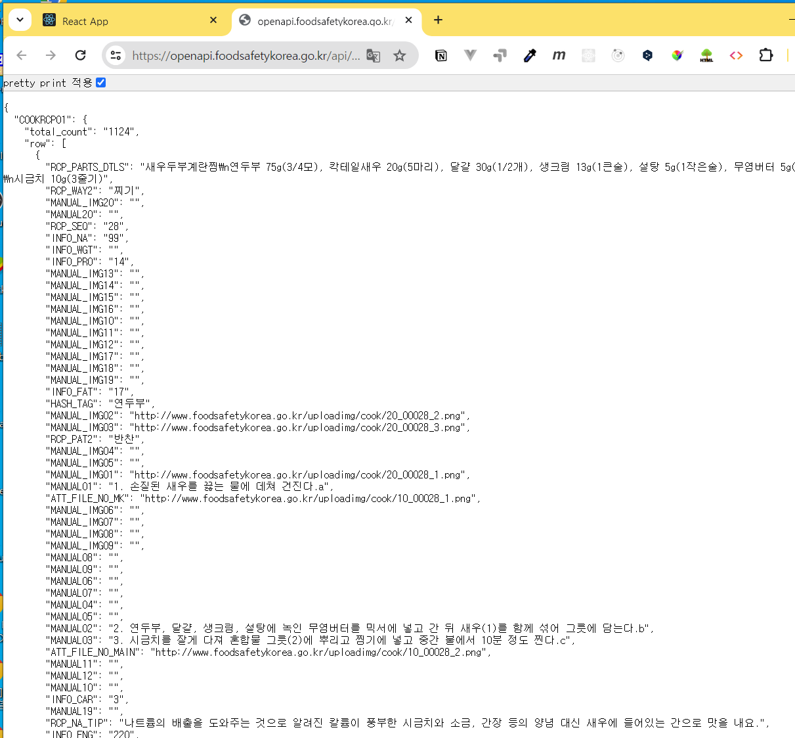
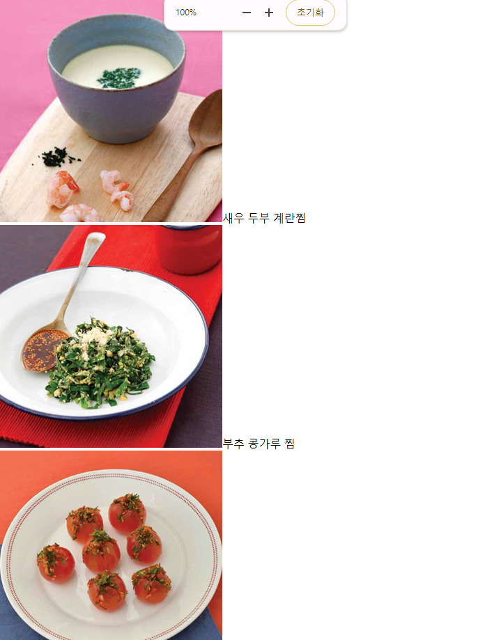
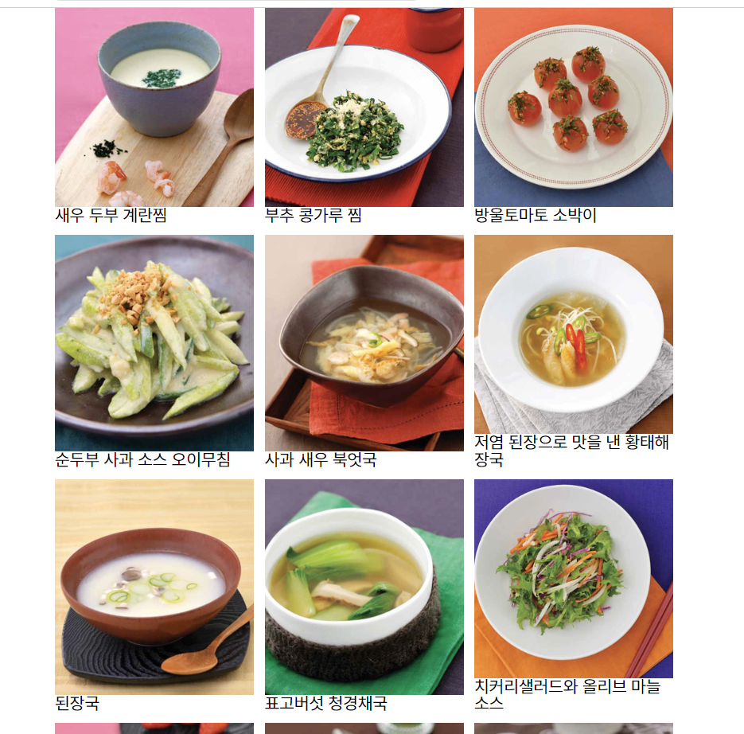
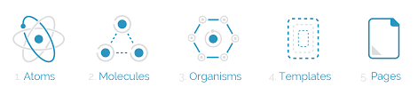
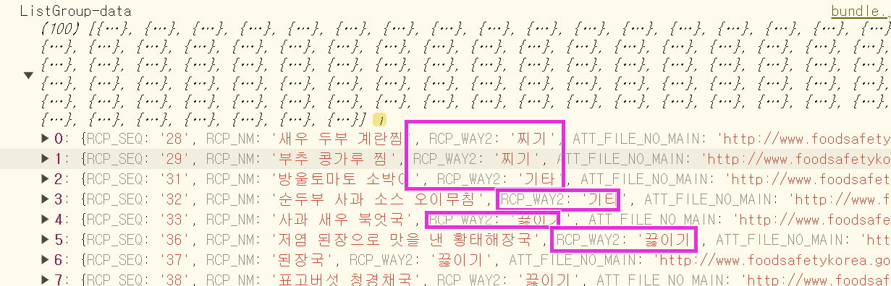

### 목차 <!-- omit in toc -->

- [1. 시작파일](#1-시작파일)
- [2. 연관링크](#2-연관링크)
- [3. 메인화면 만들기](#3-메인화면-만들기)
  - [3.1. 폴더정리](#31-폴더정리)
  - [3.2. List 컴포넌트 만들기](#32-list-컴포넌트-만들기)
    - [3.2.1. 레시피 데이터 다시 살펴보기](#321-레시피-데이터-다시-살펴보기)
    - [3.2.2. 데이터 가공](#322-데이터-가공)
  - [3.3. 데이터전달하기](#33-데이터전달하기)
  - [3.4. 스타일링하기](#34-스타일링하기)
- [4. 카테고리 나누기](#4-카테고리-나누기)
  - [4.1. 컴포넌트 구조만들기](#41-컴포넌트-구조만들기)
  - [4.2. ListGroup 에서 필터링하기](#42-listgroup-에서-필터링하기)
- [5. 완료파일](#5-완료파일)

---

## 1. 시작파일

+++ 파일다운로드
만약 이전 파일이 없을 경우 아래의 파일을 다운로드 하여 진행한다
[!button variant='success' icon='download' text='시작 파일' target='blank'](./assets/08/start.zip)
+++ 파일활용방법

1.  다운로드 받은 start.zip 파일의 압축을 푼다
2.  새 리액트 앱을 설치한다. 리액트 앱 설치를 모를경우 아래 링크를 참고한다.
    [!ref target='blank' text='리액트 설치안내' icon='link'](../리액트좀해라/1.md)
3.  리액트 앱의 설치가 왼료 되었으면 1번의 파일압축을 푼다
4.  압축을 풀게 되면 start/src 폴더가 있다.
5.  2번의 src폴더에 4번의 src 폴더를 덮어 씌운다.
    
6.  2번의 폴더를 루트로 선택하여 vscode를 연다.
7.  vscode 의 터미널에 npm start 를 입력하여 앱을 실행한다.

+++

## 2. 연관링크

| 종류          | 🔗링크                                                             |
| ------------- | ------------------------------------------------------------------ |
| 공공API사이트 | [공공데이터포털](https://www.data.go.kr/)                          |
| 공공API사이트 | [문화데이터광장](https://www.culture.go.kr/data/main/main.do#main) |
| 공공API사이트 | [공간정보오픈플랫폼](https://www.vworld.kr/dev/v4api.do)           |
| 공공API사이트 | [금융감독원](https://opendart.fss.or.kr/)                          |
| 공공API사이트 | [네이버](https://developers.naver.com/products/intro/plan/plan.md) |
| 공공API사이트 | [카카오](https://developers.kakao.com/tool)                        |
| 공공API사이트 | [서울시](https://data.seoul.go.kr/together/guide/useGuide.do)      |
| 공공API사이트 | [경기도](https://data.gg.go.kr/portal/mainPage.do)                 |

## 3. 메인화면 만들기

### 3.1. 폴더정리

1. src폴더에는 아래의 파일만 남기고 모두 삭제한다.
   ```txt # src/
   index.css
   App.js
   index.js
   ```

### 3.2. List 컴포넌트 만들기

1. src/components 폴더 생성
2. components/List.js 파일 생성
3. List.js에 아래의 코드 작성
4. src 폴더에 components 폴더를 생성하고 List.js 파일을 새로 만들고 다음과 같이 컴포넌트의 기본 골격을 작성해 보자.

   ```jsx # src/components/List.js
   import React from 'react';

   const List = () => {
   	return (
   		<>
   			<div>List</div>
   		</>
   	);
   };
   export default List;
   ```

#### 3.2.1. 레시피 데이터 다시 살펴보기

:::my-box-blue
[Console] 탭에 출력된 내용은 확인하기 불편하니까 http://openapi.foodsafetykorea.go.kr/api/내서비스키/COOKRCP01/json/1/30 에 접속해서 우리가 사용할 데이터를 다시 확인해 보자.
{.shadow}

- https://www.foodsafetykorea.go.kr/api/newDatasetDetail.do 에서 응답하는 데이터중 필요한 것만 추출하여 컴포넌트를 생성할것이다.
- 아래는 식품안전나라에서 제공하는 레시피DB 의 요청/응답정보 안내이다

  | 1   | RCP_SEQ          | 일련번호             |
  | --- | ---------------- | -------------------- |
  | 2   | RCP_NM           | 메뉴명               |
  | 3   | RCP_WAY2         | 조리방법             |
  | 4   | RCP_PAT2         | 요리종류             |
  | 5   | INFO_WGT         | 중량(1인분)          |
  | 6   | INFO_ENG         | 열량                 |
  | 7   | INFO_CAR         | 탄수화물             |
  | 8   | INFO_PRO         | 단백질               |
  | 9   | INFO_FAT         | 지방                 |
  | 10  | INFO_NA          | 나트륨               |
  | 11  | HASH_TAG         | 해쉬태그             |
  | 12  | ATT_FILE_NO_MAIN | 이미지경로(소)       |
  | 13  | ATT_FILE_NO_MK   | 이미지경로(대)       |
  | 14  | RCP_PARTS_DTLS   | 재료정보             |
  | 15  | MANUAL01         | 만드는법\_01         |
  | 16  | MANUAL_IMG01     | 만드는법\_이미지\_01 |
  | 17  | MANUAL02         | 만드는법\_02         |
  | 18  | MANUAL_IMG02     | 만드는법\_이미지\_02 |
  | 19  | MANUAL03         | 만드는법\_03         |
  | 20  | MANUAL_IMG03     | 만드는법\_이미지\_03 |
  | 21  | MANUAL04         | 만드는법\_04         |
  | 22  | MANUAL_IMG04     | 만드는법\_이미지\_04 |
  | 23  | MANUAL05         | 만드는법\_05         |
  | 24  | MANUAL_IMG05     | 만드는법\_이미지\_05 |
  | 25  | MANUAL06         | 만드는법\_06         |
  | 26  | MANUAL_IMG06     | 만드는법\_이미지\_06 |
  | 27  | MANUAL07         | 만드는법\_07         |
  | 28  | MANUAL_IMG07     | 만드는법\_이미지\_07 |
  | 29  | MANUAL08         | 만드는법\_08         |
  | 30  | MANUAL_IMG08     | 만드는법\_이미지\_08 |
  | 31  | MANUAL09         | 만드는법\_09         |
  | 32  | MANUAL_IMG09     | 만드는법\_이미지\_09 |
  | 33  | MANUAL10         | 만드는법\_10         |
  | 34  | MANUAL_IMG10     | 만드는법\_이미지\_10 |
  | 35  | MANUAL11         | 만드는법\_11         |
  | 36  | MANUAL_IMG11     | 만드는법\_이미지\_11 |
  | 37  | MANUAL12         | 만드는법\_12         |
  | 38  | MANUAL_IMG12     | 만드는법\_이미지\_12 |
  | 39  | MANUAL13         | 만드는법\_13         |
  | 40  | MANUAL_IMG13     | 만드는법\_이미지\_13 |
  | 41  | MANUAL14         | 만드는법\_14         |
  | 42  | MANUAL_IMG14     | 만드는법\_이미지\_14 |
  | 43  | MANUAL15         | 만드는법\_15         |
  | 44  | MANUAL_IMG15     | 만드는법\_이미지\_15 |
  | 45  | MANUAL16         | 만드는법\_16         |
  | 46  | MANUAL_IMG16     | 만드는법\_이미지\_16 |
  | 47  | MANUAL17         | 만드는법\_17         |
  | 48  | MANUAL_IMG17     | 만드는법\_이미지\_17 |
  | 49  | MANUAL18         | 만드는법\_18         |
  | 50  | MANUAL_IMG18     | 만드는법\_이미지\_18 |
  | 51  | MANUAL19         | 만드는법\_19         |
  | 52  | MANUAL_IMG19     | 만드는법\_이미지\_19 |
  | 53  | MANUAL20         | 만드는법\_20         |
  | 54  | MANUAL_IMG20     | 만드는법\_이미지\_20 |
  | 55  | RCP_NA_TIP       | 저감 조리법 TIP      |

:::

#### 3.2.2. 데이터 가공

1. 응답데이터를 살펴보면 `MANUAL` 이라는 접두사로 시작하는 키는 레시피 설명이며 `MANUAL_IMG01` 키가 20번 까지 있으며 대체로 `MANUAL_IMG06` 까지 데이터가 있는것으로 보인다. 이런식으로 필요한 데이터가 무엇인지 파악하자.
2. App.js에 응답 데이터중 사용할 데이터를 data 에 저장한다
   요청 주소의 파라미터를 수정하여 요청데이터 갯수를 늘린다.

   ```jsx #7 src/App.js
   import { useState, useEffect } from 'react';
   import axios from 'axios';
   function App() {
   	const [loading, setLoading] = useState({ state: true, data: [] });
   	const getDB = async () => {
   		try {
   			const { data } = await axios.get('http://openapi.foodsafetykorea.go.kr/api/서비스키/COOKRCP01/json/1/30');
   			const {
   				COOKRCP01: { row },
   			} = data;
   			setLoading({ state: false, data: row });
   			console.log(row);
   		} catch (error) {
   			console.error(error);
   		}
   	};
   	useEffect(() => {
   		getDB();
   	}, []);

   	return (
   		<div className='App'>
   			{loading.state ? (
   				<h1>로딩중입니다...</h1>
   			) : (
   				loading.data.map((el) => (
   					<div key={el.RCP_SEQ}>
   						<span style={{ color: 'red' }}>레시피명: {el.RCP_NM}</span>
   						<span>조리방법: {el.RCP_WAY2}</span>
   						<div>
   							<span>{el.MANUAL01}</span>
   							<span>{el.MANUAL02}</span>
   							<span>{el.MANUAL03}</span>
   						</div>
   					</div>
   				))
   			)}
   		</div>
   	);
   }

   export default App;
   ```

3. 응답데이터를 가공한다.
   우선 필요한 데이터는 메인화면에 표시할 `썸네일이미지,레시피명,아이디` 이고 API 문서에서 확인해보면
   `RCP_SEQ, RCP_NM, ATT_FILE_NO_MAIN` 의 키로 응답된다.
   `const initData = row.map(() => {});` 에 응답데이터를 분해 한다.

   ```jsx #8-13,18 src/App.js
   ...
   const getDB = async () => {
      try {
         const { data } = await axios.get('http://openapi.foodsafetykorea.go.kr/api/서비스키/COOKRCP01/json/1/30');
         const {
            COOKRCP01: { row },
         } = data;
         const initData = row.map(({ RCP_SEQ, RCP_NM, ATT_FILE_NO_MAIN }) => ({
            RCP_SEQ,
            RCP_NM,
            ATT_FILE_NO_MAIN,
         }));
         setLoading({ state: false, data: initData });
      } catch (error) {
         console.error(error);
      }
   };
       setLoading({ state: false, data: initData });
      } catch (error) {
         console.error(error);
      }
   };
   ...
   ```

### 3.3. 데이터전달하기

1. 컴포넌트 분리
   ||| :icon-code: src/App.js
   App컴포넌트에서 List컴포넌트로 데이터를 전달한다.
   기존의 data.map 코드를 삭제후 그자리에 List 컴포넌트 를 임포트한다.
   이때 컨테이너 역할을 할 inner와 블록역할을 할 group 요소로 래핑한다.
   그리고 props 를 내려준다.

   ```js #8-13 src/App.js
      import List from './components/List';
      ...
      return (
      <div className='App'>
         {loading.state ? (
            <h1>로딩중입니다...</h1>
         ) : (
            <div className='inner'>
               <div className='group'>
                  {loading.data.map((data) => <List key={data.RCP_SEQ} data={data} />)}
               </div>
            </div>
         )}
      </div>
   );
   ```

   ||| :icon-code: src/components/List.js
   List컴포넌트는 card 역할을 하게 될것이다.
   css파일을 연결하고 최상위 요소에 클래스 네임을 작성한후 이미지와 타이틀요소를 추가한다.
   콘솔로그로 부모컴포넌트가 전달하는 데이터의 구조를 확인한다.

   ```js #5-13 src/components/List.js
   import React from 'react';
   import './List.css';
   const List = (props) => {
   	console.log(props);
   	return (
   		<div className='list'>
   			
   			<h2>{''}</h2>
   		</div>
   	);
   };

   export default List;
   ```

   |||

1. List 컴포넌트에서 App에서 전달할 props를 내려받아 화면에 렌더링한다

   ```jsx # src/components/List.js
   const List = ({ data: { RCP_NM, ATT_FILE_NO_MAIN } }) => {
   	return (
   		<div className='list'>
   			
   			<h2>{RCP_NM}</h2>
   		</div>
   	);
   };
   ```

1. 아래와 같이 화면이 렌더링 된다.
   {.shadow .w50}

### 3.4. 스타일링하기

1. index.css 작성
   css파일이 많아져도 불편하므로 공통스타일은 index.css에 작성한다.

   ```css # src/index.css
      @import url(https://qwerewqwerew.github.io/source/style/reset.css);
      body {
         font-size: 1.6rem;
      }
      .inner {
         width: min(800px, 80%);
         margin: auto;
      }
      .group {
         display: flex;
         flex-wrap: wrap;
         gap: 1rem;
      }
   ```

2. List.css 작성

   ```css # src/components/List.css
      .list {
         display: flex;
         flex-direction: column;
         width: min(25%, 20rem);
      }
      img {
         width: 100%;
         height: 100%;
         object-fit: cover;
      }
      h3 {
         padding: 0.5vw 0 1vw;
         font-size: 2rem;
         font-weight: 500;
         overflow: hidden;
         text-overflow: ellipsis;
         white-space: nowrap;
      }
   ```

3. 아래와 같이 화면이 렌더 된다.
   {.shadow .w50}

## 4. 카테고리 나누기

:::my-box-blue

:icon-dependabot: 리액트의 디자인 패턴 {.h3 .blue}

리액트 앱의 규모가 커질수록 컴포넌트와 구성하는 모듈 파일의 갯수도 많아진다.
이때 효율적인 개발 및 유지보수를 위한 컴포넌트 파일의 구성방법에 대한 계획이 필요한데 이것을 디자인패턴 이라고 한다.
디자인 패턴은 여러 가지가 있으며, 프로젝트의 규모나 팀의 선호도에 따라 달라질 수 있고 때론 편의에 따라 몇가지를 혼합해서 사용하기도 한다.

보편적인 디자인패턴 몇 가지를 살펴보자.

#### • 기능별 (Feature-based) 구조 <!-- omit in toc -->

이 방식은 관련된 기능이나 컴포넌트를 함께 묶어서 관리한다.
'유저 프로필'과 관련된 컴포넌트, 상태 관리 로직, 스타일을 한 폴더 안에 두는 방식.

```
/src
/components
   /UserProfile
      UserProfile.jsx
      UserProfile.styles.js
      index.js
/hooks
   useUserProfile.js
```

#### • 파일 종류별 (File-type) 구조<!-- omit in toc -->

이 방식은 파일의 종류에 따라 폴더를 나누어 관리한다.
모든 컴포넌트는 `components` 폴더에, 모든 스타일 파일은 `styles` 폴더에 두는 방식.

```
/src
/components
   Header.jsx
   Footer.jsx
   UserProfile.jsx
/styles
   Header.css
   Footer.css
   UserProfile.css
/hooks
   useUserProfile.js
```

#### • 페이지별 (Page-based) 구조<!-- omit in toc -->

이 구조는 각 페이지를 기준으로 컴포넌트와 관련 파일들을 나누어 관리한다.
홈페이지와 관련된 컴포넌트를 `ListPage` 폴더에, 유저 프로필 페이지와 관련된 것을 `UserProfilePage` 폴더에 두는 방식.

```
/src
/pages
   /ListPage
      ListPage.jsx
      ListPage.styles.js
   /UserProfilePage
      UserProfilePage.jsx
      UserProfilePage.styles.js
```

#### • Atomic Design<!-- omit in toc -->

Atomic Design은 인터페이스를 작은 단위(원자)부터 큰 단위(페이지)까지 구성하는 방법론.
버튼이나 인풋 같은 가장 작은 단위를 `atoms`, 그것들을 조합한 카드나 리스트를 `molecules`, 그것들을 다시 조합한 섹션을 `organisms`, 그리고 그것들을 통해 구성된 템플릿과 페이지가 있습니다.
{.shadow}

```
/src
/components
   /atoms
      Button.jsx
      Input.jsx
   /molecules
      SearchForm.jsx
   /organisms
      Header.jsx
   /templates
      PageTemplate.jsx
   /pages
      ListPage.jsx
```

각 방식의 선택은 프로젝트의 특성과 팀원들의 선호에 따라 달라질 수 있으며, 때로는 이러한 방식들을 조합하여 사용하기도 한다. 중요한 것은 일관성을 유지하고 팀 내에서 명확한 규칙을 설정하는 것이다.

---

#### • 3줄요약 <!-- omit in toc -->

1.  프로젝트의 단위가 커질 수록 컴포넌트의 갯수도 많아지므로 효율적인 관리가 중요해진다.
2.  처음부터 컴포넌트를 어떤 기준으로 그룹화 할것인지를 정하고 규칙을 유지 하는 것이 중요하다.
3.  일반적으로 공동 작업자와 협의하여 컴포넌트를 구성하는 것이 바람직하다.

---

우리는 기능별 구조 형식을 베이스로 사용 할 것이다.{.h6 .blue}

:::

### 4.1. 컴포넌트 구조만들기

> [!button variant='primary' icon='play' text='데이터의 전체흐름 보기' target='blank'](https://www.figma.com/proto/YQBh6oI788L4E9lompHGut/%EB%A6%AC%EC%95%A1%ED%8A%B8?page-id=11%3A25&type=design&node-id=11-331&viewport=565%2C216%2C0.32&t=HFBX5asVmm689Jl4-1&scaling=min-zoom&mode=design)
>
> 리액트의 데이터 흐름은 단방향 으로 상위 컴포넌트에서 하위 컴포넌트로 전달되어야 하므로 최상위 컴포넌트인 App 에서 모든 레시피 데이터를 저장한후 하위 컴포넌트로 전달하도록 한다.
>
> :icon-dot-fill: 각 컴포넌트의 역할은 다음과 같다 {.h5}
>
> ```md
> /src─┬
>      ├──App.js (최상위 컴포넌트로 레시피 데이터를 ListGroup 으로 전달한다)
>      └──/components─┬
>                     ├── ListGroup.js
>                     |(App에서 모든 데이터를 전달받아 요리 종류별로 나눈후 하위 컴포넌트로 전달한다)
>                     ├── List.js
>                     |(카드 UI 컴포넌트로  ListGroup에서 전달하는 요리를 개별 출력한다. )
>                     └── Title.js
>                      (제목 UI 컴포넌트로 제목요소를 렌더링한다. )
> ```

1. App 컴포넌트로 이동하여 카테고리를 구별할수 있는 키를 추가로 요청한다.

   ```js # App.js
   	const getDB = async () => {
   	try {
   		const { data } = await axios.get('http://openapi.foodsafetykorea.go.kr/api/내서비스키/COOKRCP01/json/1/100');
   		const {
   			COOKRCP01: { row },
   		} = data;
   		const initData = row.map(({ RCP_SEQ, RCP_NM, RCP_WAY2, ATT_FILE_NO_MAIN }) => ({
   			RCP_SEQ,
   			RCP_NM,
   			RCP_WAY2,
   			ATT_FILE_NO_MAIN,
   		}));
   		setLoading({ state: false, data: initData });
   	} catch (error) {
   		console.error(error);
   	}
   };

   ```

1. component 폴더에 ListGroup.js 를 생성한다

   ```js # ListGroup.js
   const ListGroup = ({ data }) => {
     console.log(data);
   	);
   };
   export default ListGroup;
   ```

1. App 컴포넌트에서 ListGroup 을 임포트 한다
   List컴포넌트 임포트는 삭제한다.

   ```jsx # App.js
   import ListGroup from './components/ListGroup';
   ...
   <div className='App'>
      {loading ? (
         <h1>로딩중입니다...</h1>
      ) : (
         <div className='inner'>
            <ListGroup data={data}/>
         </div>
      )}
   </div>
   ```

### 4.2. ListGroup 에서 필터링하기

1. ListGroup 에 props 를 작성하여 전달받은 데이터를 확인해보자

   ```js # ListGroup.js
   const ListGroup = ({ data }) => {
     console.log("ListGroup-data", data);
   ...
   ```

   {.shadow}

2. data.RCP_WAY2 값이 같은것끼리 필터링한다.
   [:link:Set](https://developer.mozilla.org/ko/docs/Web/JavaScript/Reference/Global_Objects/Set)객체를 사용하여 중복값을 제거하고 새 배열에 저장한다.

   ```js #2-3 ListGroup.js
   const ListGroup = ({ data }) => {
      const categories = new Set(data.map((data) => data.RCP_WAY2));
      console.log('ListGroup-data', categories);
   ```

3. 변수 `categories` 를 기준으로 `data` 를 분리한다.
   {.shadow}

4. 타이틀을 컴포넌트를 생성한다.

   ```js # /components/Title.js
   const Title = () => {
   	return (
   		<>
   			<h2>Title</h2>
   		</>
   	);
   };
   export default Title;

   ```

5. 타이틀과 리스트 컴포넌트를 임포트하고 프롭스를 전달한다.
   아래의 주석문과 같이 구조를 작성한다.

   ```js # /components/ListGroup.js
   import Title from './Title';
   import List from './List';
   const ListGroup = ({ data }) => {
      const categories = [...new Set(data.map((data) => data.RCP_WAY2))];
      return (
          <>
          /* .group>Title/+List/ */
          </>
         );
   };
   export default ListGroup;
   ```

6. 필터링한 데이터를 하위 컴포넌트에 전달한다.

   ```js # ListGroup.js
   return (
   	<>
   		{categories.map((category) => (
   			<div key={category} className='group'>
   				<Title title={category} />
   				<List data={data.filter((item) => item.RCP_WAY2 === category)} />
   			</div>
   		))}
   	</>
   );
   ```

7. Title 컴포넌트 수정

   ```js # Title.js
   import "./Title.css";

   const Title = ({ title }) => {
   	return <h2 className="h2">{title}</h2>;
   };
   export default Title;

   ```

8. Title.css 작성

   ```css # Title.css
   .h2 {
      font-size: 4rem;
      font-weight: 800;
      color:#3e8a77;
      margin: 8rem auto 4rem;
   }

   ```

9. List 컴포넌트 수정

   ```js #
   import './List.css';

   const List = ({ data }) => {
      return (
         <div className='group'>
            {data.map(({ RCP_SEQ, RCP_NM, ATT_FILE_NO_MAIN, RCP_WAY2 }) => (
               <div key={RCP_SEQ} className='list'>
                  
                  <div className='list-txt-wrap'>
                     <div className='list-txt-title'>{RCP_NM}</div>
                     <div className='list-txt-way'>{RCP_WAY2}</div>
                  </div>
               </div>
            ))}
         </div>
      );
   };

   export default List;

   ```

10. List.css 작성

    ```css # List.css
    .list-txt-wrap {
       display: flex;
       justify-content: space-between;
       align-items: center;
       padding: 0.5vw 0 1vw;
    }
    .list-txt-title {
       font-size: max(2rem, 1vw);
       overflow: hidden;
       text-overflow: ellipsis;
       white-space: nowrap;
       color: #555;
    }
    .list-txt-way {
       font-size: 1.4rem;
       z-index: 99;
       margin-top: -6rem ;
       background: #555;
       color: #fff;
       padding: 4px;
       border-radius: 3px;
       white-space: nowrap;
    }
    ```


## 5. 완료파일

[!button variant='success' icon='download' text='완료 파일' target='blank'](./assets/08/08_fin.zip)

```

```
